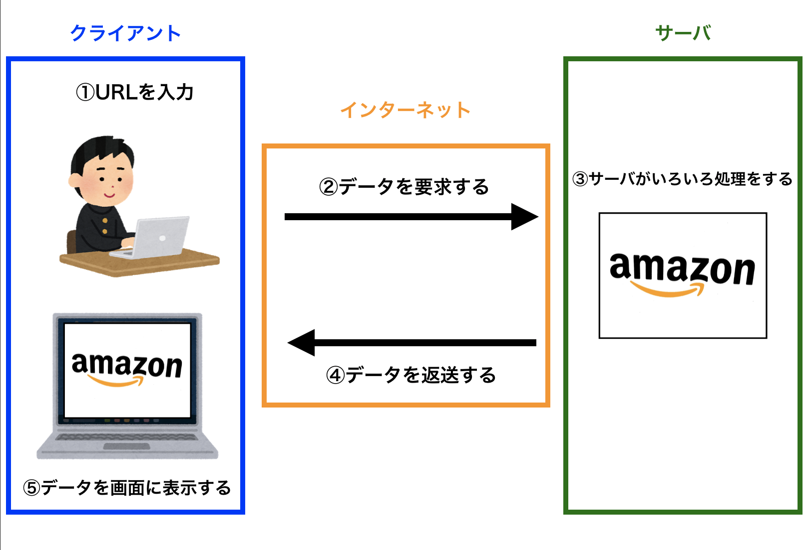
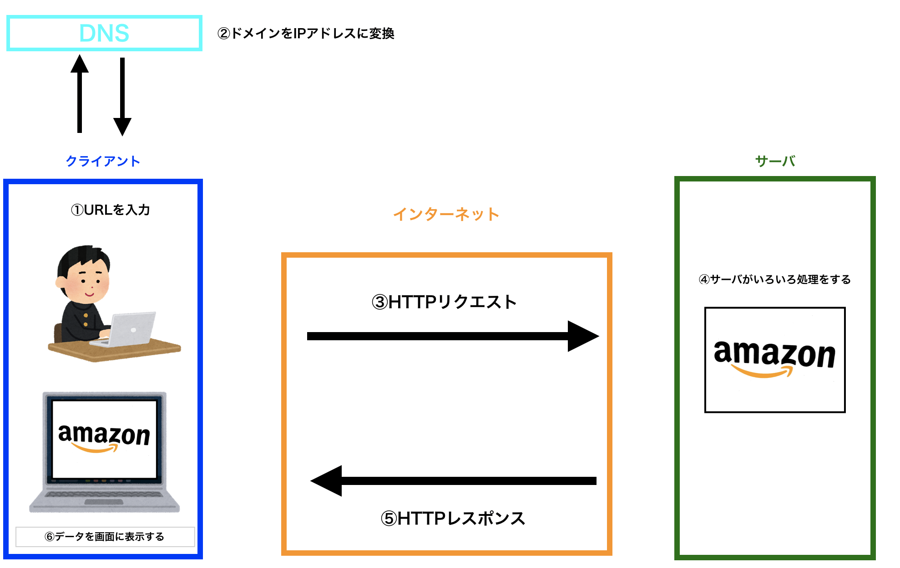

# Webページが表示される仕組み

## 導入
このカリキュラムでは、これからプログラミングを始める前に、  
プログラミングを学ぶことで作成できるようになるWebアプリ(Webページ)がどのように  
表示されているのかということを学びます。  

あまり詳細までは踏み込まず、全体像の理解を目的としています。  

ここでは、Amazonを例に、
**Webページが表示されるまでの流れ**、  
**使用される技術**について説明します。  

## AmazonのTOPページが表示されるまで  
`https://www.amazon.co.jp/`にアクセスすると、  
AmazonのTOPページが表示されます。  

この  
①URLの入力(アクセス)から  
②ページの表示  
の間に何が起こっているのか説明します。  
  

以下のようなことが行われています。  

簡単に説明すると、  
①クライアントでURLを入力して、  
②データを要求して、  
③サーバがいろいろ処理をして、  
④データを返送して、  
⑤クライアントがデータを画面に表示する。  
しています。  

画像に表示されている以下の項目を順番に説明していきます。  
- クライアント
- サーバ
- インターネット

## クライアント
クライアントとは、
**サーバに対して**
**○○のデータをください**と要求する  
**コンピュータ**のことです。  

また、**○○のデータをください**  
と要求すること(または要求自体)を   
**リクエスト(HTTPリクエスト)**  といいます。  
※詳しくは後述

コンピュータにはいろいろな種類があります。
みなさんが普段使用してる**スマートフォン**も  
プログラミングをするために使用する**パソコン**もコンピュータです。  

ここでは、それらがクライアントと呼ばれるコンピュータと理解してください。

## サーバ
サーバとは、  
**クライアントに対して**  
**クライアントから要求されたデータ**を返送する  
**コンピュータ**のことです。  

また、**クライアントから要求されたデータ**を  
**レスポンス(HTTPレスポンス)** といいます。  
※詳しくは後述

サーバもクライアントと同じコンピュータです。  
そのため、**みなさんが使用してるパソコンをサーバとしても使うことができます**
では何が違うのでしょうか？  

違いを説明する前にまずは**コンピュータ**について少し説明します。  
コンピュータは、**ハードウェア**と**ソフトウェア**から構成されます。  

### ハードウェア
ハードウェアとは物理的に触れることができる部分です。  
パソコンでいえばキーボード、画面、  
データを保存するためのハードディスクなどです。  

### ソフトウェア
ソフトウェアは物理的に触れることができない部分です。  
例えばWebページを開くために使用してるGoogle chromeなどのブラウザのことです。  

では、サーバとクライアントで何が違うのかというと、  
**ハードウェアの特徴が違います**  

例えば、スマートフォンは小さいので、   
**持ち運びしやすいハードウェア**といえます。  

パソコンはキーボードがついてるので、  
**文字入力がしやすいハードウェア**といえます。  

ではサーバはどうでしょう？  
見た目のイメージがつかない方はGoogleで「サーバ」と検索してみましょう。  

サーバは基本的に持ち運ぶ必要がないので、  
小さくする必要はありませんし、  
文字の入力にも使用しないので、キーボードも入りません。  

サーバの役割は、  
**クライアントから要求されたデータ**を返送することです。  
クライアントからの要求はいつくるかわかりません。  

例えばAmazonであれば、  
朝みる人もいれば、夜みる人もいます。  
1人だけが使用するわけはなく、  世界中の人が使います。   
個人で使用するパソコンと違い、壊れた場合は世界中の人に影響します。   
そのためサーバは、  
**24時間365日ずっと壊れず起動できるハードウェア**であることが期待されます。  

以上のように同じコンピュータですが、  
**使用する目的によってハードウェアの特徴がかわります。**  

## インターネット
先ほどの画像では、クライアントとサーバの間にインターネットがありました。  
**クライアントとサーバはインターネットを介してやりとりをしています。**
ここでは、**インターネットの概要**と、  
**インターネットを通じて、データのやりとりが行われる流れ**を説明します。  

### 概要  
インターネットとは、  
**複数のネットワークが相互接続したネットワークのこと**
です。

では、ネットワークとは何でしょうか。  
ネットワークとは  
**コンピュータが複数台繋がっていて、データのやりとりができる状態です。**

現在コンピュータは世界中のありとあらゆる場所にあります。  
多くの大学にはコンピュータ室があり、たくさんのコンピュータがあります。  
また、現在コンピュータを使用しない企業はほとんどないでしょう。  
それぞれの大学(企業)が、**「その大学(企業)自身のネットワーク」**  を持ってます。  
そのネットワークが日本中の別の大学(企業)や、家庭のネット、そして世界中に  
繋がっているのが**インターネット**です。

### 用語の説明
インターネットでのデータのやりとりが行われる流れを説明するためには、  
非常に多くの専門用語を使用します。  
そのため、最初に仕組みの説明に使用する以下の用語を説明します。  
- IP
- IPアドレス
- ドメイン
- DNS
- Web
- HTTP
- HTTPS
- リクエスト
- レスポンス

### IP
- IPとは**Internet Protocol**の略
- プロトコルとは、**規約**のこと  
- インターネットでデータのやりとりをするためのお約束

### IPアドレス
- IPアドレスとはインターネット上の住所のようなもの
- 0から255までの数字4つをドットで区切って表す。
  - 例: 192.168.0.1
- グローバルIPアドレスとプライベートIPアドレスがある
  - グローバルIPアドレス
    - 世界中で重複しないように管理
  - プライベートIPアドレス
    - 大学内、社内など個別のネットワーク内で重複しないように管理
  - グローバルIPアドレス = (電話の)外線 / プライベートIPアドレス = 内線のようなイメージ
    - 外線は重複してはいけないが、内線は別の会社と同じでも問題ない

### ドメイン
- IPアドレスと同じくインターネット上の住所のようなもの。
- IPアドレスは数字の羅列のため人間からみるとわかりにくい。
- IPアドレスに対して人間がみてもわかりやすい名前をつけたもの
  - 例:amazon.co.jp, Google.com etc
- IPアドレス = 緯度、経度 / ドメイン = 住所のようなイメージ

### DNS
- Domain Name Systemの略
- ドメインとIPアドレスを変換するシステム

### Web
- World Wide Webのこと
- インターネットを介してデータのやりとりをする
  - データ = HTMLファイル, CSSファイル etc

### HTTP
- HyperText Transfer Protocolの略
- Webの仕組みを利用してデータのやりとりをする時のお約束

### HTTPS
- やりとりが暗号化されたHTTP
- ブラウザのURLの先頭に`https`と表示される。

### リクエスト
- HTTPリクエストのこと
- クライアントからサーバに対して送られる要求
  - 例:
    - AmazonのTOPページのデータをください。
    - Facebookの友達一覧ページのデータをください。
- 8つのメソッドがある
- 主に使用されるのは`GET`と`POST`
  - GET
    - データを取得(GET)するときに使用するメソッド
      - 例: 
        - Amazonで商品の一覧ページを取得するとき
        - Googleで検索結果の一覧ページを取得するとき
  - POST
    - データを送信(POST)するときに使用するメソッド
      - 例:
        - Instgramで画像を送信(投稿)するとき
        - Twitterで文字を送信(ツイート)するとき

### レスポンス
- HTTPレスポンスのこと
- サーバからクライアントに対して送られる
- リクエストに対しての返答
- リクエストが成功したかどうかを表すステータスコードがある
  - 2xx: リクエストが成功した
  - 4xx: (クライアントが原因で)リクエストが失敗
    - 例: 
      - 404 Not found 存在しないページを要求するリクエスト
  - 5xx: (サーバが原因で)リクエストが失敗
    - 例:
      - 500 Internal server error 何らかの原因でサーバが処理を返せない
- レスポンスで返されるデータの中身はHTMLやCSSのファイル

### データのやりとりが行われる流れ
最初の図では単純化するためにDNSを抜いてましたが、  
実際には以下のような順番でやりとりが行われています。  

1. URLを入力 例:amazon.co.jpと入力
2. DNSがamazon.co.jpに対応するIPアドレスを調べて変換
3. amazon.co.jpに対応するIPアドレスに対してHTTPリクエストを送信
    - 例: プログラミング関連の本の一覧ページをください。
4. サーバがリクエストの内容に沿った処理を行う
5. クライアントに対してHTTPレスポンスを送る
    - 例: プログラミング関連の本のデータ(HTML, CSSなど)
6. 5で送られたきたHTMLなどを画面に表示する

## まとめ
このカリキュラムでは、Webページが表示される仕組みを極力単純化して説明しています。  
実際にはさらに複雑なことを行なっていますが、  
細部の知識を習得するよりも全体像を把握することがはるかに需要です。  

まずはWebページが表示される仕組みを以下の用語を使用して
説明できるところを目指しましょう。
- クライアント
- サーバ
- リクエスト
- レスポンス    
