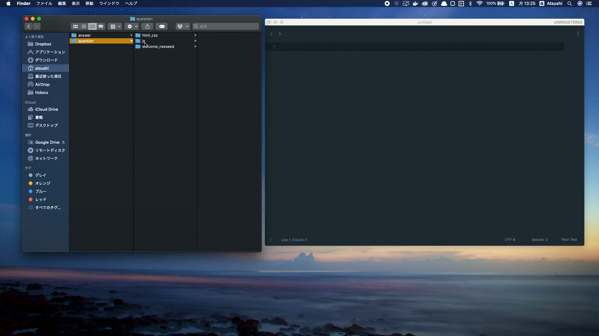
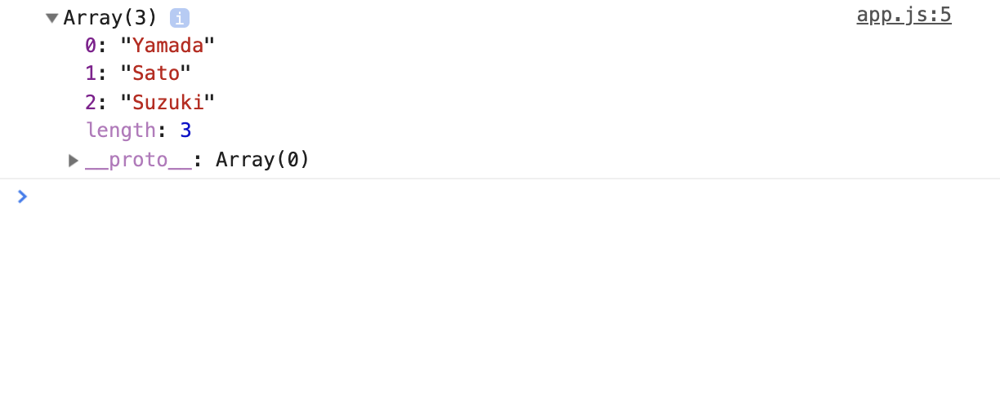
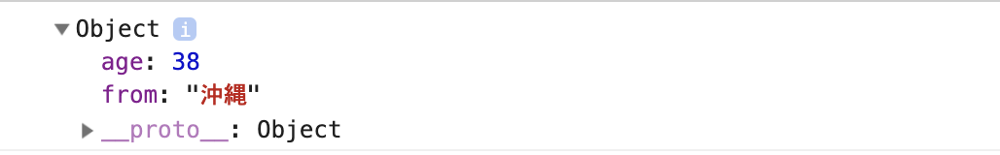
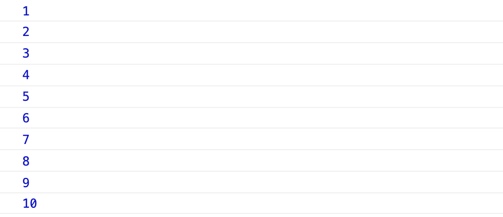
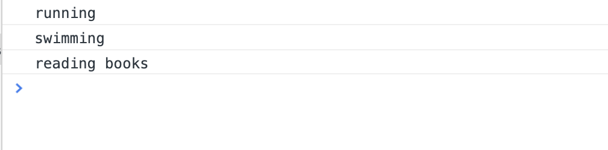

## JavaScript基本構文

### 学ぶこと
このカリキュラムではJavaScriptの基本的な書き方を学びます。

基本文法は学んでも実際にこれが
何の役に立つのかイメージしづらいですが、  
これがベースになります。
最初はあまり深く考えず、
「こういうことができるのか。」
くらいの理解で大丈夫です。

### 始め方
このカリキュラムで紹介する構文の記述は必須ではありませんが、
理解を深めるために記述することを推奨してます。

`question/js/basic`が基本構文のフォルダです。  
`question/js/basic/app.js`にサンプルとして記述しているコードを書きましょう。  
結果は`question/js/basic/index.html`をgoogle chromeのdeveloper toolの
consoleパネルで確認します。

#### ファイルの変更手順
1. Sublime Textに変更対象のフォルダ(`question/js/`)をドラック&ドロップして開く
2. basicフォルダ内の`app.js`を編集する。


#### 変更内容確認手順
1. Google chromeで`question/js/basic/index.html`を開く
2. 右クリック→検証をクリック
3. 表示されたメニュー(developer tool)のconsoleパネルを開く


#### コンソールログとは
JavaScriptでプログラミングする際にデータの
チェックなどで使用できる構文です。  
この基本構文の結果の確認も基本的にコンソールログで行います。

JavaScriptのファイルに`console.log()`と記述すると、  
()の内容がchromeのdeveloper toolのconsoleパネルに表示されます。

app.jsファイルに以下の内容を記述後、
index.htmlをブラウザで開いてください。
```JavaScript
console.log('ここの文字が表示されます。');
```

developer toolを起動し,consoleパネルを開いて、
以下の内容が表示されていればOKです。
developer toolは画面を右クリックして検証ボタンをクリックすることで開けます。


#### コメントアウト
入力されてる文字をプログラムとして実行されないようにすることです。

プログラミングの勉強をしていると、
たくさんのコードを書きますが、  
復習する際に、コードの内容を思い出せないことがあります。

通常JavaScriptなどのプログラムが書かれているファイルに
関係ない文字を入力するとエラーになりますが、  
コメントアウトにすることで、メモなどのコードに関係ない文字を残すことができます。

JavaScriptでは行の先頭に`//`をつけるとコメントアウトになります。
また、複数行をコメントにしたい場合は、`/*  */` でコメントにしたい行を囲みます。

```JavaScript
// ここはコメントアウトなので処理されない

/*
 通常コメントアウトはコードの処理内容を書かないが、
 勉強の際はあとで読み返してわかるように
 コメントアウトはどんどんメモに使いましょう。
 */
```
### 基本構文

#### 文字列連結
+記号を使って文字と文字を結合できます。
文字列は必ず`'(シングルクォーテーション)`または`"(ダブルクォーテーション)`で囲む必要があります。

```JavaScript
console.log('Nex' + 'Seed'); //結果 NexSeed 
```

#### 四則演算
四則演算を行う演算子が用意されています。

|演算子|内容|例|
|:--:|:--:|:--:|
|`+`|加算|3 + 6|
|`-`|減算|5 - 2|
|`*`|乗算|5 * 3|
|`/`|除算|8 / 2|
|`%`|剰余(余り)|7 % 3|

```JavaScript
console.log(3 + 6);  //結果 9 
console.log(5 - 2);  //結果 3
console.log(5 * 3);  //結果 15
console.log(8 / 2);  //結果 4
console.log(7 % 3);  //結果 1
```

#### 変数
変数とはデータを入れるための箱のようなものです。
箱の名前を変数名と言います。<br>
変数を使用する場合、`let 変数名 = 値`のように記述します。
プログラミングの世界では`=`は左右が等しいという意味ではなく、
**右の値を左に代入する**という意味になります。<br>
変数を使用する理由は、**何を表すデータかわかりやすくする**、
**システムの修正に対応しやすくする**などがあります。
変数は以下のように使用します。
変数は文字列とは異なり、<br>
**`'(シングルクォーテーション)`や`"(ダブルクォーテーション)`で囲む必要はありません。**<br>
囲んでしまうと、文字列として認識されてしまいます。

```JavaScript
let place = 'Cebu';
console.log(place); //結果 Cebu
console.log('place'); //結果 place
```

ここでは以下の2つの処理をしています。
1. placeという変数を定義して、cebuという文字を代入する。
2. placeという変数をconsoleに表示する。

##### 再代入
一度定義した変数の内容を後から変更することを**再代入**と言います。<br>
以下のように一度定義した変数に再度 `変数名 = 値` を実行することで変数の内容が変更できます。

```JavaScript
let name = 'talk talk';
console.log(name); //結果 talk talk

name = 'NexSeed';
console.log(name);  //結果 NexSeed
```

#### テンプレートリテラル
テンプレートリテラルとは、**文字列と、変数を組み合わせて使用する際に、
簡潔に書ける構文**です。<br>
通常、文字列はシングルクォーテーションで囲み、<br>
変数はシングルクォーテーションで囲まないため、<br>
文字列と変数を組み合わせて表示する場合、以下のようになります。

```JavaScript
let schoolName = 'NexSeed';
console.log('私の所属先は、' + schoolName + 'です');
```

上記でも正しいのですが、**テンプレートリテラル**を使用すると
以下のように簡潔に書くことができます。

```JavaScript
console.log(`私の所属先は、${schoolName}です`);
```

書き方は以下の通りです。
1. 全体を `(バッククォート) で囲む。
2. 変数を **${}** で囲む。


#### 配列
配列は、数値や文字列などと同じくデータ型の1つです<br>
複数の値をまとめて管理することができます。<br>
イメージとしては**タンス**のようなもので、
1つの引き出しに1つの値が入っています。

##### 配列の作り方
配列の作り方は以下の通りです。
```JavaScript
// [値1, 値2..];
// ['Yamada', 'Sato', 'Suzuki'];
```

使用する時は、作成した配列を変数に代入することが多いです。
```JavaScript
//変数student_listに配列を代入
let student_list = ['Yamada', 'Sato', 'Suzuki']; 

//student listを表示
console.log(student_list);
```

出力結果


##### 配列の中身の表示
配列はタンスのようなものというのは前述の通りです。<br>
上の例では、配列(タンス)の中身全てが表示されていますが、<br>
特定の引き出しの中身だけ取り出したい場合もあります。
実は、引き出しには0から順番に番号が振られています。


変数`student_list`から`Sato`を取り出したい場合、以下のようになります。
```JavaScript
console.log(student_list[1]);
```

##### 配列に値を追加
配列に新たに値を追加したい場合は以下のようにします。
```JavaScript
student_list.push('Takahashi');
```

ここでは扱いませんが、配列の値を削除したり、<br>
変更することも可能です。

#### 連想配列
連想配列も配列と同じくタンスのようなものです。<br>
では、何が違うのかというと、配列の場合、引き出しには0から順番に番号が振られていたのに対し、<br>
連想配列では、引き出しに対して自分で好きな名前を設定することができます。<br>
引き出しに名前がついてるため、中身に何が入ってるか推測しやすくなる点がメリットです。

##### 連想配列の作り方
連想配列の作り方は以下の通りです。
```JavaScript
// {キー1: 値1, キー2: 値2}
// { age: 38, from: '沖縄'};
```

使用する時は、配列同様、変数に代入することが多いです。
```JavaScript
//変数userに連想配列を代入
let user = { age: 38, from: '沖縄'};

console.log(user);
```

出力結果


##### 連想配列の中身の表示
連想配列はタンスです。また引き出しには名前がついています。<br>
連想配列から任意の値を取り出したい時には、この名前を使います。

変数`user`から`沖縄`を取り出したい場合、以下のようになります。
連想配列の値を取り出す場合、以下の2つの書き方があります。

```JavaScript
console.log(user['from']); //結果 沖縄
console.log(user.from); //結果 沖縄
```

##### 連想配列に値を追加
連想配列に新たに値を追加したい場合は以下のようにします。
```JavaScript
//連想配列userにhobbyという引き出しを作成し、swimを追加
user.hobby = 'swim';

console.log(user.hobby); //結果 swim
```

連想配列も通常の配列同様、値の削除なども可能です。

---

### 条件分岐
プログラムは記述した順に上から下へ実行されていきますが、条件によって処理を分けたい場合があります。
例えば、変数の値が10より大きかったらAの処理を行い、10より小さかったらBの処理を行うといった場合です。

このように条件に従って処理を分岐させるために使われるのが**if文**や、**Switch文**です。

#### if文

##### 書き方
```JavaScript
if (条件式) {
     条件式が正しいときに実行される処理;
}
```

```JavaScript
let int = 5;
//もし、変数intが3より大きい場合、
if (int > 3) {
	//変数 int が3より大きいため実行される
    console.log(`${int}は3より大きいです。`);
}
```

##### 比較演算子
if文では、条件式の内容が正しい(真, TRUE)か誤っている(偽, FALSE)かによって処理を分けます。  
条件式には「xxxと等しい」とか「xxxよりも大きい」などのように条件を記述することになりますが、この条件式の中で使用されるのが**比較演算子**です。

よく使われる比較演算子は次のとおりです。

|演算子|記述例|意味|
|:--:|:--:|:--|
|==|a == b|aとbの値が等しい|
|===|a === b|aとbの値が等しく、型も等しい|
|!=|a!=b|aとbの値が等しくない|
|!==|a !== b|aとbの値、もしくは型が等しくない|
|>|a > b|bよりaが大きい|
|>=|a >= b|bよりaが大きい、もしくは等しい|
|<|a < b|bよりaが小さい|
|<=|a <= b|bよりaが小さい、もしくは等しい|

##### 論理演算子
比較演算子では単独の条件式を記述することができますが、もう少し複雑に「xxxかつyyy」や「xxxもしくはyyy」のように、条件式を組み合わせてより複雑な条件式を利用したい場合があります。
このような場合に使用するのが論理演算子です。

よく使われる論理演算子は次のとおりです。

|演算子|記述例|意味|
|:--:|:--:|:--|
|&&|a && b|aかつbである（論理積）|
|\|\||a \|\| b|aまたはbである（論理和）|

論理積(AND)は、演算子「&&」の左辺と右辺の条件式が共に真の場合のみ、全体の式の評価が真となります。  
論理和(OR)は、演算子「||」の左辺と右辺の少なくともどちらか一つの条件式が真の場合に、全体の式の評価が真となります。
```JavaScript
let int2 = 23;
if (int2 >= 20 && int2 < 30) {
    console.log('20代です');
}
```


##### else
if文では、もし○○の場合、Aという処理を実行する、**それ以外の場合は**Bという処理を実行する。<br>
といった記述も可能です。
そういった場合に使用するのが**else**です。

**書き方**
```JavaScript
if (条件式) {
     条件式が正しいときに実行される処理
} else {
	条件式が正しくないときに実行される処理
}
```

```JavaScript
let int3 = 5;
if (int3 >= 10) {
    console.log(int3 + 'は10以上です')
} else {
	//int3 は 10より小さい(if文の条件が正しくない)ため、elseの中の処理が実行される
    console.log(`${int3}は10未満です。`);
}
```

##### else if
ここまでは1つの条件式で真か偽かを判別していましたが、複数の条件式を組み合わせることも可能です。<br>
そういった場合に使用するのが**else if**です。
```JavaScript
if (条件式A) {
	条件式Aが真の時に、ここの処理が実行される
} else if (条件式B) {
	条件式Aは偽であるが、条件式Bが真の時に、ここの処理が実行される
} else {
	全ての条件式が偽の時に、ここの処理が実行される
}
```

```JavaScript
let int4 = 5;
if (int4 >= 10) {
    console.log(int4 + 'は10以上です')
} else if (int4 > 3) {
    console.log(`${int4}は3より大きいです。`);
} else {
    console.log(`${int4}は3以下です。`);
}
```

else ifは1つではなく何個でも書くことができます。
また、if文(else if)は上から順番に条件を確認していきますが、<br>
正しい条件が見つかった場合、それに対応する処理を実行してif文は終了します。<br>
そのため以下の例では、②、③共に正しい条件ですが、実行されるのは②のみです。

```JavaScript
let int5 = 8;
if (int5 >= 10) {// ①
    console.log(int5 + 'は10以上です')
} else if (int5 > 7) {// ②
    console.log(`${int5}は7より大きいです。`);
} else if (int5 > 3) {// ③
    console.log(`${int5}は3より大きいです。`);
} else {
    console.log(`${int5}は3以下です。`);
}
```


#### Switch文
変数の値が、Aならこの処理、Bならこの処理、Cならこの処理、など色々な値と順次比較して一致する場合毎に処理を記述する場合があります。if文を使うと次のように記述できます。
```JavaScript
let str = 'A';

if (str == 'A') {
	// 処理
} else if (str == 'B') {
	// 処理
} else if (str == 'C') {
	// 処理
} else if (str == 'D') {
	// 処理
} else if (str == 'E') {
	// 処理
} else {
	// 処理
}
```

これはこれで間違いではないのですが、このような用途の場合にはswitch文を使うと便利です。
switch文の構文は次の通りです。

```JavaScript
switch (式) {
	case 値1:
		式が値1と等しい場合の処理;
		break;
	case 値2:
		式が値2と等しい場合の処理;
		break;
	case 値3:
		式が値3と等しい場合の処理;
		break;
	default:
		式がいずれの値とも等しくない場合の処理;
		break;
}
```

switch文では式の値を評価し、caseの後に記述された値と順次比較していきます。  
もし一致する値があった場合には、その後に記述された処理を順次処理していき、breakに達したら終了します。
if文の場合にはブロックを使ってどこからどこまでの処理を実行するのかが分かるようになっていましたが、switch文ではcase毎にブロックは使用されず、breakに達するまで順次処理を実行していきます。  
defaultの後の処理は、式がcaseの後に記述されたいずれの値にも一致しなかった時に実行される処理を記述します。

先程のif文をswitch文に書き直すと次のようになります。

```JavaScript
let str２ = 'A';

switch (str２) {
	case 'A':
		// 処理
		break;
	case 'B':
		// 処理
		break;
	case 'C':
		// 処理
		break;
	case 'D':
		// 処理
		break;
	case 'E':
		// 処理
		break;
	default:
		// 処理
		break;
}
```

```JavaScript
let gender = 'male';

switch (gender) {
    case 'male':
        console.log('男性です');
        break;
    case 'female':
        console.log('女性です');
        break;
    default:
        console.log('?');
        break;
```

---

### 繰り返し
Webサービスを作っていると、
同じ処理を何度も繰り返したいことがよくあります。
例えば、AmazonのようなECサイトで商品の一覧を表示する場合、
FacebookのようなSNSで投稿の一覧を表示する場合などです。
このような処理では**商品(投稿)を表示する**という処理を
画面に表示されてる一覧の数だけ繰り返します。
ここでは、その繰り返し処理の中でもよく使用する
代表的な構文を4つ紹介します。
この段階では実際にどうやってWebサービスに使用するのか、
イメージが難しいかと思いますが、それで問題ありません。
まずは、**繰り返し文はこういう書き方をする**くらいの
認識で大丈夫です。


#### for
まずはfor文です。
for文は主に**繰り返す回数が決まっているとき**に使用します。
構文は以下の通りです。
```JavaScript
for( 初期化式, 条件式, 変化式) {
	処理
}
```

- **初期化式** とは、for文の処理が開始される時に一度だけ実行され、通常は条件式の中で使用される変数などの初期化を行う式を記述します。
- **条件式** とは、繰り返しを継続するかどうかの判定に用います。
  条件式の評価が真(TRUE)であればブロック内の処理を実行します。偽(FALSE)ならばfor文を終了します。
- **変化式** とは、条件式の中で使用される変数などを、繰り返しが1回行われるたびに変化させるための式を記述します。
※この初期化式の中で定義している変数はfor文の{}の中でしか使用できません。
このように変数の使用できる範囲のことを**スコープ**といいます。

```JavaScript
/*
	1から10までの数字を表示するプログラム
	変数iに1を代入する(初期化式)
	iが10以下の間だけ繰り返す(条件式)
	iを1回ごとに+1する(変化式)
*/
for (let i = 1; i <= 10; i++) {
    console.log(i);
}
```

出力結果



#### while
while文は主に**繰り返す回数が決まっていない**時に使用します。
構文は以下の通りです。
```JavaScript
while (条件式) {
	処理
}
```
- **条件式**の意味はfor文と同じです。

```JavaScript
/*
	1から10までの数字を表示するプログラム
	変数jに1を代入する
	jが10以下の間だけ繰り返す(条件式)
	jを毎回+1する
*/
let j = 1;
while (j <= 10) {
    console.log(j);
    j++;
}
```

出力結果


上の処理はfor文のサンプルをwhile文で書いたものです。<br>
繰り返す回数が決まっていない場合に主に使用すると記述しましたが、
繰り返し回数が決まっている場合も使用できます。

#### for of
for ofは配列の要素の数だけ繰り返す構文です。<br>
配列の要素を全て画面に表示したい場合などに使用します。<br>
構文は以下の通りです。
```JavaScript
for (変数 of 配列) {
	処理
}
```
**配列**には繰り返し処理をしたい配列を記述します。<br>
for ofでは、繰り返す度に**変数**に、配列の**値**が
1つずつ順番に代入されます。<br>
配列というタンスの引き出しの中身を1つずつ取り出すイメージです。<br>

この変数の名前は何でも良いです。<br>
説明だけだとわかりづらいと思うので以下のコードで確認してみましょう。

```JavaScript
// 変数hobbiesに配列を代入
let hobbies = ['running', 'swimming', 'reading books'];

//hobbiesの中の値を全て表示する処理
for (let value of hobbies) {
    console.log(value);
}
```

出力結果


#### for in
for inは連想配列の要素の数だけ繰り返す構文です。
構文は以下の通りです。
```JavaScript
for (変数 in 連想配列) {
	処理
}
```
for inでは、繰り返し毎に**変数**に、連想配列の**key**が
1つずつ順番に代入されます。
この変数の名前は何でも良いです。
説明だけだとわかりづらいと思うので以下のコードで確認してみましょう。

```JavaScript
//変数 pricesに右の連想配列を代入
let prices = {
    'apple': 150,
    'banana': 200,
    'grape': 300,
 }

// pricesの中身を key is value pesoという形式で表示するプログラム
for (let key in prices) {
    console.log(key + ' is ' + prices[key] + ' peso');
}
```

出力結果


#### 繰り返しの中断、スキップ
繰り返し処理をする際に、
特定の条件の場合は、繰り返し処理を中止したい、
または、特定の条件の場合、処理をスキップして次に進みたい、といった場合があります。
そういった場合に使用するのが**break**と**continue**です。
breakでは処理の中止、continueでは処理をスキップします。

##### 書き方
##### break
```JavaScript
//1 - 100までの数字を順番に足して、合計が1000を超える数値を画面に表示するプログラム
//合計が1000を超えたあとの繰り返しは不要なため、breakで繰り返し処理を中止。
let result = 0;
for (let i = 1; i <= 100; i++) {
    result += i;

    if (result > 1000) {
        console.log(`合計値が1000を超えるのは${i}の時`);
        break;
    }
}
```

##### continue
```JavaScript
//1 - 30までの数値で、3の倍数ではないものを表示するプログラム
//3の倍数の時だけ処理が不要なため、breckでスキップする。
for (let i = 1; i <= 30; i++) {
    if (i % 3 !== 0) {
        continue;
    }
    console.log(i);
}
```

---

### まとめ
以上で基本構文は終了です。<br>
最初に書いた通り、これだけでは、実際のWebサービスのどういった場面で使用されるか、<br>
イメージがつかないと思いますが、<br>
このカリキュラムで学んだ内容がベースになるため、<br>
しっかりと理解できるまで復習しましょう！