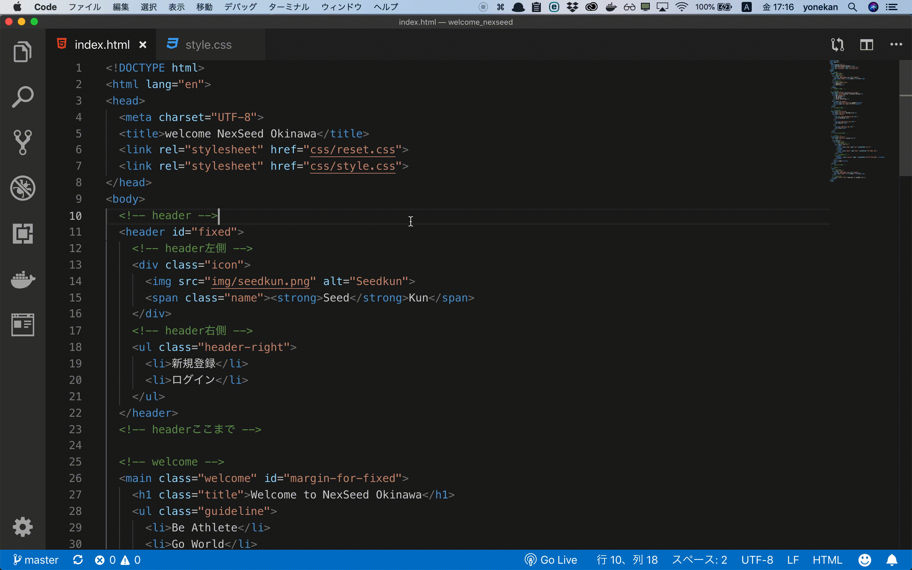
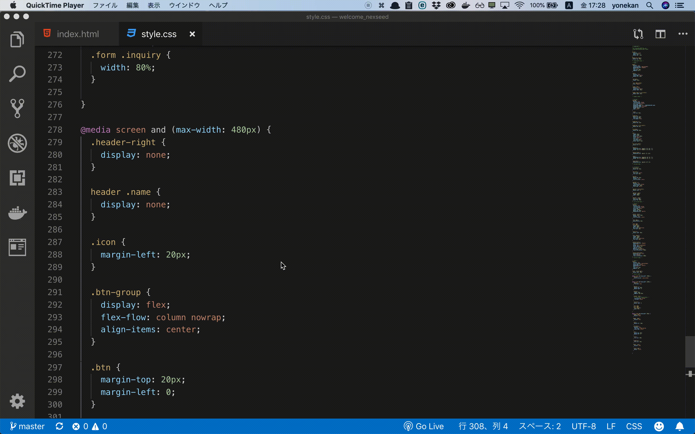
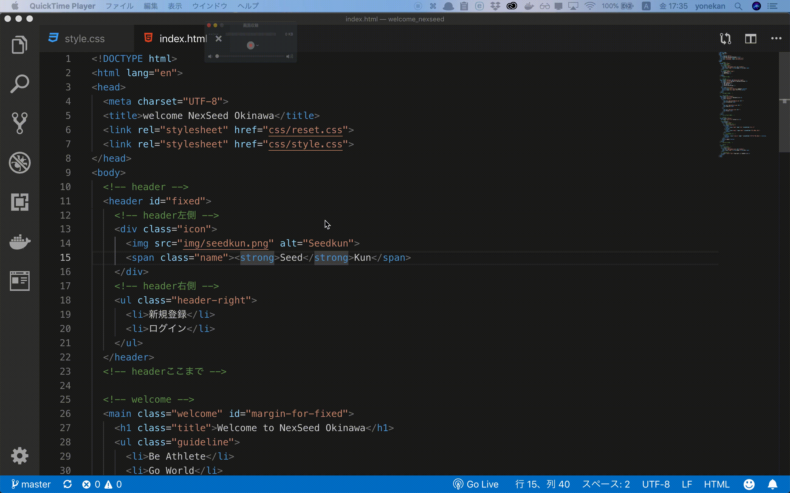
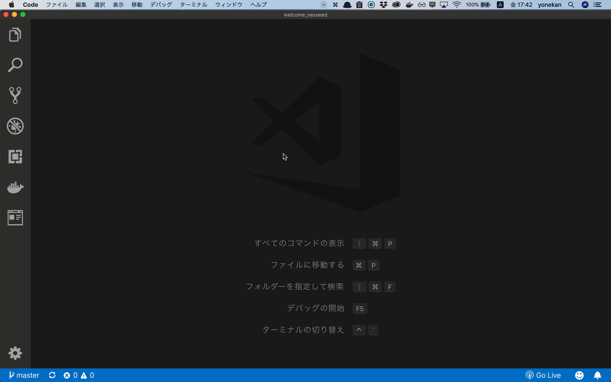
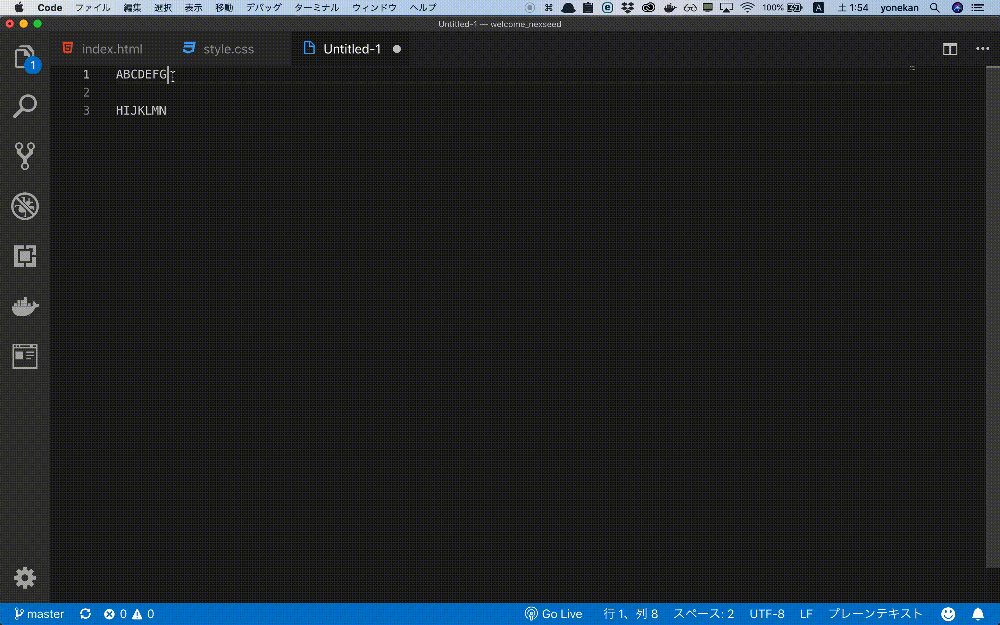

# Visual Studio Codeの便利なショートカット一覧

## 目次
### ウィンドウ・エディタ操作系
- [新しいウィンドウを開く](#newWindow)
- [ウィンドウを閉じる](#closeWindow)
- [エディタを閉じる](#closeEditor)
- [エディタを分割する](#divideEditor)

### ファイル操作系
- [新しいファイルを作成](#newFile)
- [保存](#save)
- [ファイル名からファイルを開く](#quickOpen)

### 編集系
- [コピー＆貼り付け　（選択範囲）](#copy_paste)
- [コピー＆貼り付け　（行）](#copy_paste_row)
- [行コピー](#copy_row)
- [切り取り　（選択範囲）](#cut)
- [切り取り　（行）](#cut_row)
- [次の同じ値を選択に追加](#multiSelect)
- [選択値と同じ値を全て選択](#allSelect)

## ウィンドウ・エディタ操作系

## 
1. 新しいウィンドウを開く

    |PC|キー|
    |---|---|
    |Windows|Ctrl + Shift + N|
    |Mac|Ctrl + Shift + N|

    

実行例

      
	  

 

## 
2. ウィンドウを閉じる

    |PC|キー|
    |---|---|
    |Windows|Ctrl + Shift + W|
    |Mac|Ctrl + Shift + W|

    

実行例

      
	  

 

## 
3. エディタを閉じる

    |PC|キー|
    |---|---|
    |Windows|Ctrl + W|
    |Mac|Ctrl + W|

    

実行例

      
	  

## 
4. エディタを分割する

    |PC|キー|
    |---|---|
    |Windows|Ctrl + \|
    |Mac|Ctrl + \|

    

実行例

      
	  

## ファイル操作系

## 
1. 新しいファイルを作成

    |PC|キー|
    |---|---|
    |Windows|Ctrl + \|
    |Mac|Ctrl + \|

    

実行例

      
	  

## 
2. 保存

    |PC|キー|
    |---|---|
    |Windows|Ctrl + S|
    |Mac|Ctrl + S|

## 
3. ファイル名からファイルを開く

    |PC|キー|
    |---|---|
    |Windows|Ctrl + P|
    |Mac|Ctrl + P|

    

実行例

      
	  

# 編集系

## 
1. コピー＆貼り付け　（選択範囲）

    コピー
    
    |PC|キー|
    |---|---|
    |Windows|Ctrl + C|
    |Mac|Ctrl + C|

    貼り付け
    
    |PC|キー|
    |---|---|
    |Windows|Ctrl + V|
    |Mac|Ctrl + V|

    

実行例

      
	  

## 
2. コピー＆貼り付け　（行）

    コピー
    
    |PC|キー|
    |---|---|
    |Windows|Ctrl + C|
    |Mac|Ctrl + C|

    貼り付け
    
    |PC|キー|
    |---|---|
    |Windows|Ctrl + V|
    |Mac|Ctrl + V|

    

実行例

      
	  

## 
3. 行コピー

    |PC|キー|
    |---|---|
    |Windows|Ctrl + Alt + ↓|
    |Mac|Ctrl + option + ↓|

    

実行例

      
	  

## 
4. 切り取り　（選択範囲）

    |PC|キー|
    |---|---|
    |Windows|Ctrl + X|
    |Mac|Ctrl + X|

    

実行例

      
	  

## 
5. 切り取り　（行）

    |PC|キー|
    |---|---|
    |Windows|Ctrl + X|
    |Mac|Ctrl + X|

    

実行例

      
	  

## 
6. 次の同じ値を選択に追加

    |PC|キー|
    |---|---|
    |Windows|Ctrl + D|
    |Mac|Ctrl + D|

    

実行例

      
	  

## 
7. 選択値と同じ値を全て選択

    |PC|キー|
    |---|---|
    |Windows|Ctrl + F2|
    |Mac|Ctrl + F2|

    

実行例

      
	  

	  
	  
