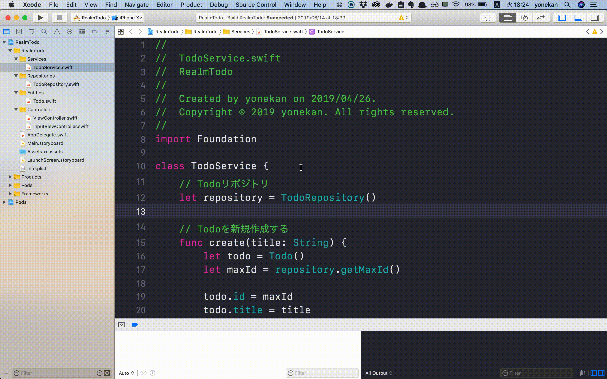
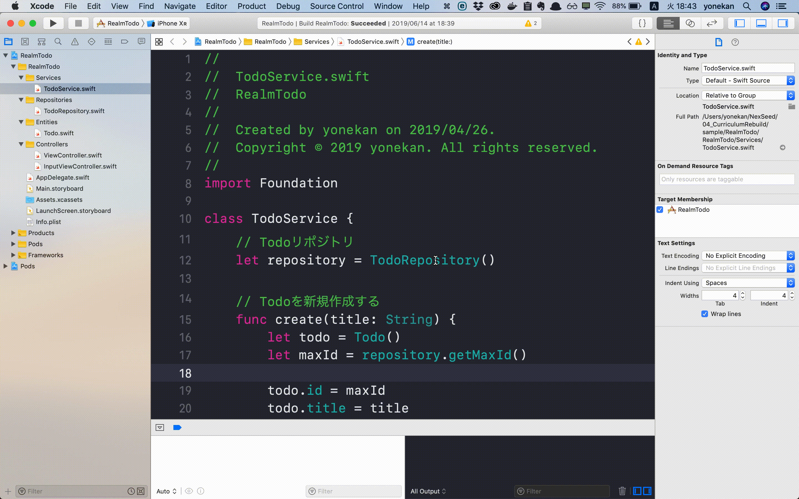
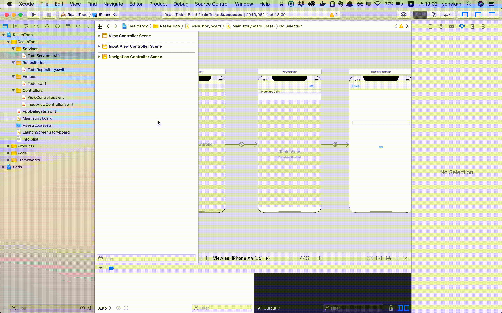

# Xcodeの便利なショートカット一覧

## 目次
### ウィンドウ・エディタ操作系
- [新しいXcodeプロジェクトを開く](#newWindow)
- [ウィンドウを閉じる](#closeWindow)
- [Welcom to Xcode(起動画面)の表示](#closeEditor)
- [エディタを分割する](#divideEditor)

## ウィンドウ・エディタ操作系

## 
1. 新しいXcodeプロジェクトを開く

    |PC|キー|
    |---|---|
    |Mac|Command + Shift + N|

    

実行例

      
	  

## 
2. ウィンドウを閉じる

    |PC|キー|
    |---|---|
    |Mac|Command + W|

    

実行例

      
	  

3. Welcom to Xcode(起動画面)の表示

    |PC|キー|
    |---|---|
    |Mac|Command + Shift + 1|

    

実行例

      
	  

4. 左ペイン表示/非表示

    |PC|キー|
    |---|---|
    |Mac|Command + 0|

    

実行例

      
	  

5. 右ペイン表示/非表示

    |PC|キー|
    |---|---|
    |Mac|Command + option + 0|

    

実行例

      
	  

6. デバッグエリア表示/非表示

    |PC|キー|
    |---|---|
    |Mac|Command + Shift + Y|

    

実行例

      
	  

### ファイル操作系

7. 名前を入力してファイルを開く

    |PC|キー|
    |---|---|
    |Mac|Command + Shift + o|

    

実行例

      
	  

8. 名前を入力してファイルを開く

    |PC|キー|
    |---|---|
    |Mac|Command + Shift + o|

    

実行例

      
	  

