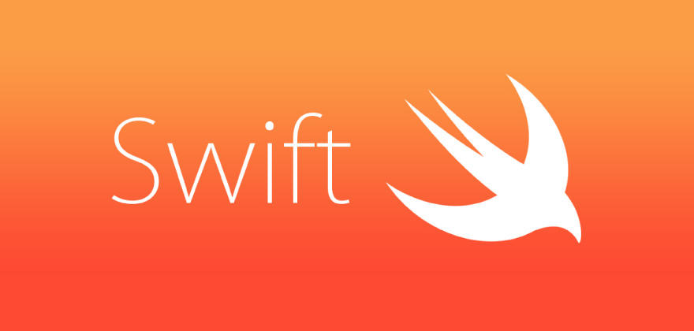

# Swiftとは

## このカリキュラムの目標
1. Swiftがどんなものかを知る

## 導入
iOS CourseではiOSアプリ開発から申請までをSwiftというプログラミング言語を使用して学習していきます。   
今や世界中で見かけるiPhone/iPad。
自分が開発したiOSアプリが色んな人にダウンロードされ、知らない人の生活の一部になっている、そんなiOSアプリを開発していきましょう！

### Swift（プログラミング言語）
> 2014年にWWDCで発表された Appleオリジナルのプログラミング言語 Swiftとは英語で「迅速」 「素早い」などの意味がある他、Swiftのマークである「アマツバメ」という意味もあります。

### Swiftの歴史
4年間のApple社内での開発を経てWWDC2014にてSwift発表される  
2015年9月 Swift2.0 ,iOS9,Xcode7リリース  
2016年9月 Swift3.0 ,iOS10,Xcode8リリース  
2017年9月 Swift4.0 ,iOS11,Xcode9リリース  
Swift2から3への変更は大きなもので、3か4への変更はプロパティ名の変更など。  
2018年9月にはiOS12,Xcode10がリリースされる見込み

### なぜ「Swift」という名前なのか?
それは次のSwiftの4つの特徴が理由として挙げられます。

### Swiftの4つの特徴
#### 「モダン」
> クロージャやタプル、ジェネリックプログラミング、Optional型の採用などが挙げられる。

#### 「安全」
> 静的な型チェック、変数の初期化の強制、数値型のオーバーフローの検査、自動参照カウントによるメモリ管理などが挙げられる。 また、if文のブレースの省略禁止など既存のプログラミング言語において記述ミスによるバグが発生しやすかった部分を文法的に解決している。

### 「高速」
> Swiftは名前の通り、高速な動作を実現しています。これまでの言語よりも処理速度が大幅に高速化しており、Objective-Cよりも最大で2.6倍、Python 2.7よりも最大で8.4倍の高速処理が可能です。（ある条件下において） またSwiftの開発環境としてXcodeがあります。XcodeはIDEというシステムを使用しており開発が一つの画面で出来るメリットがあります。

> *IDE = Integrated Development Environment = 統合開発環境

#### 「インタラクティブ」
> インタラクティブというのは対話、双方向という意味で、Swiftはコンパイラ言語でありながらインタプリタとしてスクリプトを実行できる双方向性を持っている事を指します。専門用語が多くてよく分からない方もいるかもしれませんので、簡潔にまとめると、本来ならコード生成→実行の手順を必要とする言語でありながら、コード生成と同時にコード実行も行ってくれる優れものという事になります。 

さらにSwiftは、iOS、macOS、Apple TV、Apple Watchのアプリを開発することが可能です。 