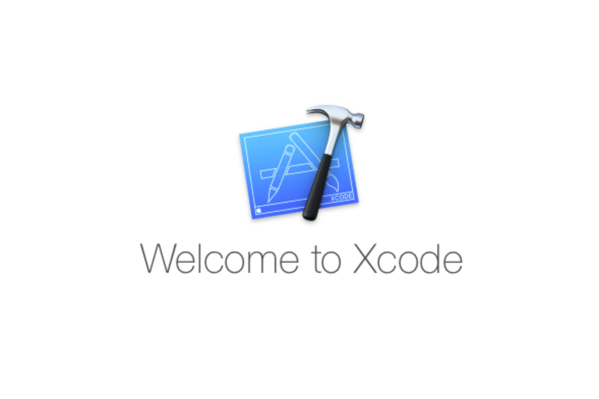
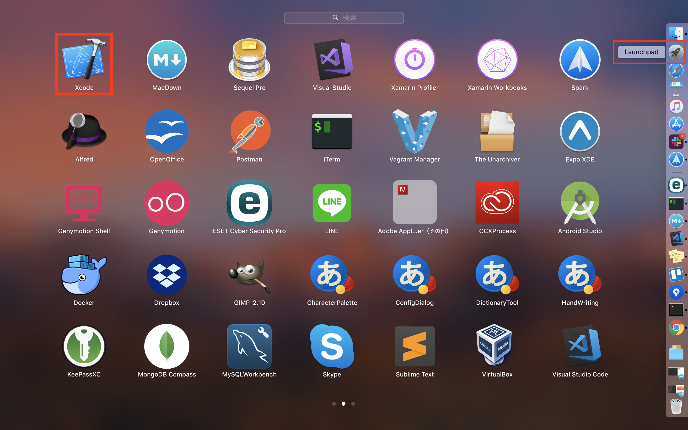
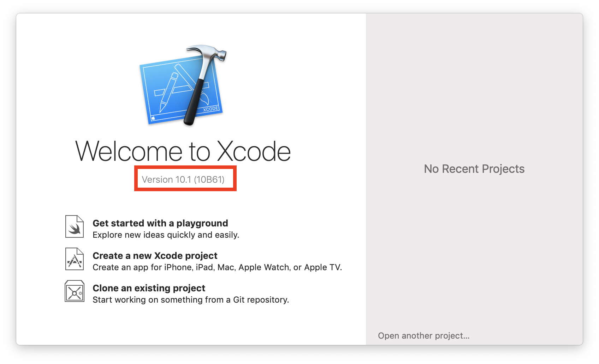
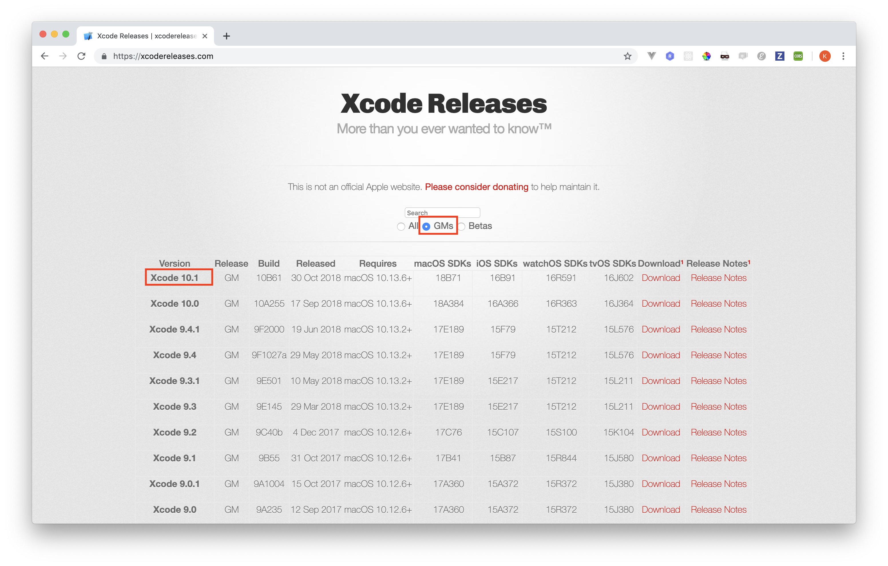

# Xcodeとは

## このカリキュラムの目標
1. Xcodeをインストールする
2. Xcodeがどんなものかを知る

### Xcodeをインストール
1. App Storeを開いてください。
2. 検索ボックスに「Xcode」と入力して検索してください。
3. 検索結果に「Xcode」が表示されると思います。「インストール」ボタンをクリックしてインストールしてください。

> インストールが完了したら、Xcodeが起動することを確認してください。  
> **既にインストールされている方でもバージョンが最新になってることを確認してください。**

#### 注意事項
途中で電源が切れるのを防ぐため、PCの充電をつないだ状態で行うことをオススメします。  
また、完了後は必ずインストールしたものが起動することを確認してください。  
Xcodeのインストールは少し通信が重くなるため、時間に余裕があるときにインストールすることをお勧めします。  
**万が一、インストールが完了していなかった場合、授業が数日受講できない可能性がありますので、ご注意ください。**

### Xcodeの最新バージョン確認方法
1. Xcodeを開いてください。
	
	
2. Welcome To Xcodeの下にあるVersionを確認してください。
	
	
3. 以下のリンクのページを開き、GMsチェックボックスをオンにしてください。  
「2」で確認したVersionとXcode Releaseページに表示されているトップのVersionが同じであればOKです。
	
	
> Xcodeのバージョンによっては、MacOSのアップデートが必要になる場合があります。  
> **OSアップデートでデータが無くなることが稀にあります。事前にバックアップを取ると安心です。**  
> ご心配な場合はこちらにお越しになってから講師にご相談ください。

### Xcodeとは
> XcodeはiOSアプリを作るためのIDE 

#### IDEとは  
統合開発環境のこと。昔はエディター、デバッガー、テスターなどバラバラのツールを使ってテストを行っていました。それらのツールをどんどんツールを統合していき、とても便利な統合開発環境というものが出来ました。Xcodeは統合開発環境の1つ。

