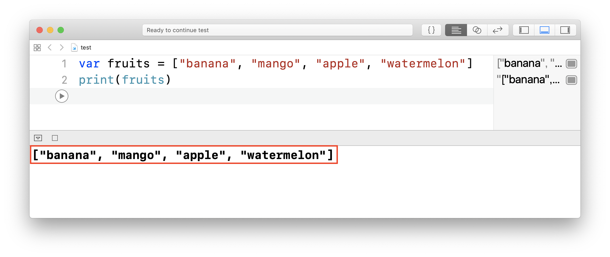

# 配列


## このカリキュラムの目標
1. 配列を理解する

## 導入
変数は箱であるという話をしました。  
配列も同じように皆さんの身近にあるものに例えることができます。

### 配列とは
配列とは、**タンス**のことです。  
もう少し詳しく説明すると、変数の場合値を1つ1つ個別に扱っていました。  
それに対し、配列ではデータをひとまとめにして管理することができます。

#### 配列の作り方
配列はこのように作ります。

```
var 配列名 = [値, 値, 値]
```

> タンスの1つの引き出しに、値が1つ入っていると考えてください。

##### 配列を作ってみよう
それでは一緒に変数を作ってみましょう。   
以下のような配列を作っていきたいと思います。

変数名：fruits
値：banana, mango, apple, watermelon

プログラミングコードは以下のようになります。

```
var fruits = ["banana", "mango", "apple", "watermelon"]
```

##### 作った変数を出力してみよう
fruitsという変数を作成しました。  
先ほど作った変数の中身をprintを使って出力してみましょう。

```
print(fruits)
```

出力結果



#### 配列の中身を取り出してみよう
配列はタンスです。また引き出しには値が1つ入っています。  
では、どうすれば引き出しの中の値を取り出せるのでしょうか。  
実は、引き出しには**0**から順番に番号が振られています。

#### 値の取り出し方

```
配列名[取り出したい要素の番号]
```

変数fruitsから「banana」また、「apple」を取り出したい場合、は以下のようになります。

```
var banana = fruits[0]
var apple = fruits[2]
```

> 配列は先頭から順番に**0**から番号が振られています。

#### 配列の値の追加
配列に値を追加する場合は以下のように書きます。

```
配列名.append(追加する要素)
```

例  
先ほど作成した変数fruitsに「orange」を追加する場合、以下のようになります。

```
fruits.append("orange")
```

#### 配列の値の更新
配列の値を更新する場合は以下のように書きます。

```
配列名[更新したい要素の番号] = 更新データ
```

例  
先ほど作成した変数fruitsの「banana」を「BANANA」に更新する場合、以下のようになります。

```
fruits[0] = "BANANA"
```

#### 配列の値の削除
配列の値を削除する場合は以下のように書きます。

```
配列名.remove(at: 削除したい要素の番号)
```

例  
先ほど作成した変数fruitsの「mango」を削除する場合、以下のようになります。

```
fruits.remove(at: 1)
```

### 練習問題