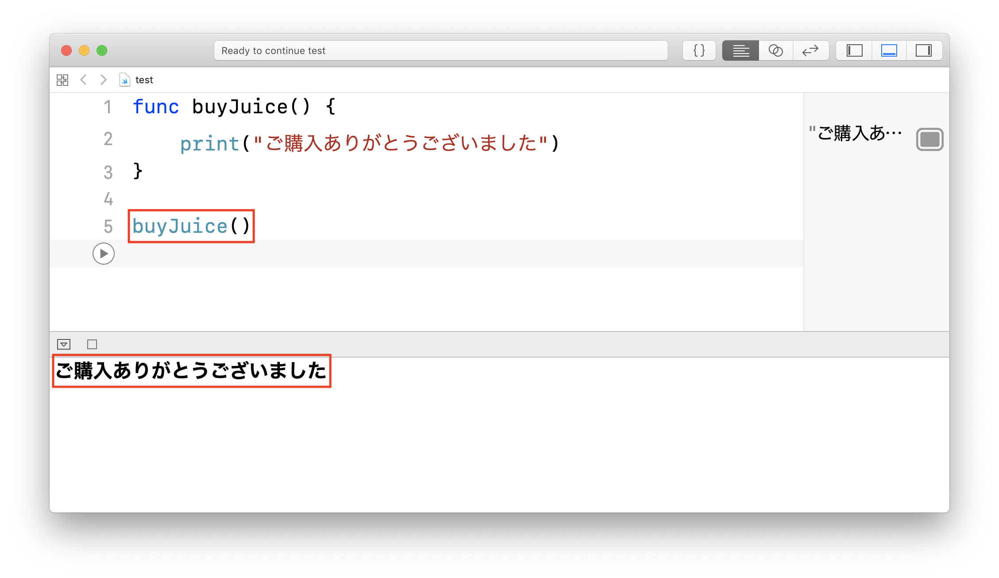
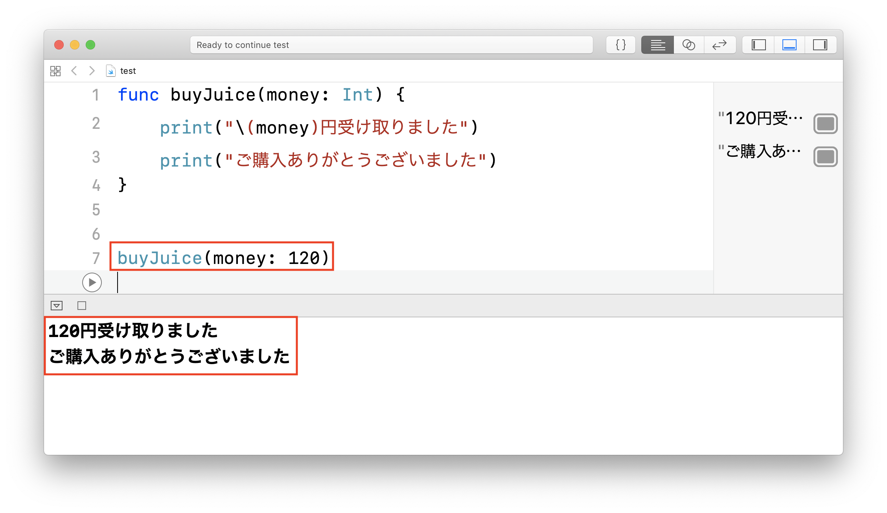
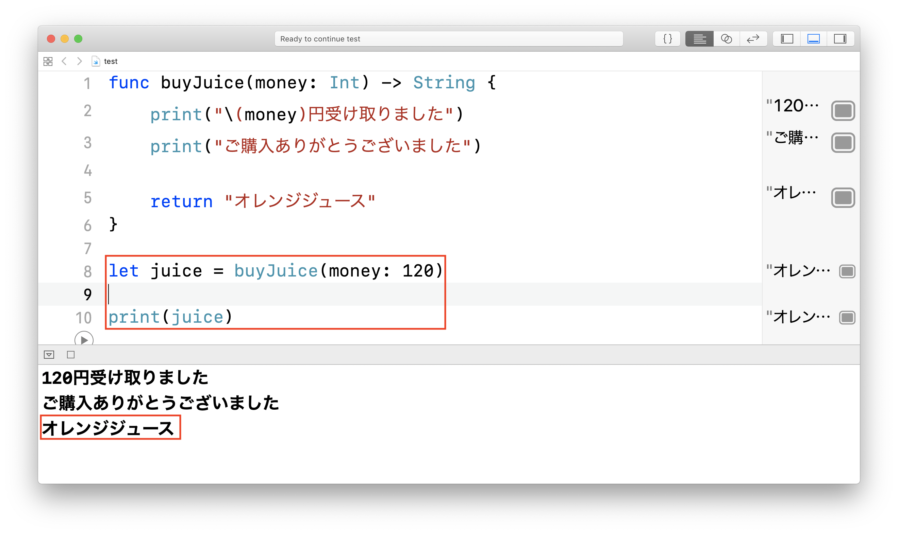

# 関数

## このカリキュラムの目標
1. 関数を理解する
2. 関数を作れるようになる

## 導入
プログラムというのは、無数の関数で出来上がっています。  
その関数の使い方と、作り方を見ていきましょう。

### 関数とは
皆さん自動販売機を知っていると思います。  
自動販売機でジュースが買いたい場合、お金を入れて、ジュースを選ぶだけでジュースが買えます。   
でも、自動販売機の中では皆さんが知らないだけでお釣りの計算や商品を出したり様々な処理が行われています。  
関数も自動販売機に似ていて、何かを渡すと色々な処理をして、何かを返してくれるものです。

#### 関数の作り方
もっとも簡単な関数の作り方は以下のようになります。

```
func 関数名() {
    処理内容
}
```

例  
「ご購入ありがとうございました」と出力する関数を作成してみましょう。

```
func buyJuice() {
    print("ご購入ありがとうございました")
}
```

上記で作った関数を実行してみましょう。  
関数名で実行することができます。

```
buyJuice()
```

実行結果



#### 引数あり関数
さて、先ほど作成した関数buyJuiceにはお金を渡していません。 
自動販売機にお金を渡すように、関数でも何かを渡して処理をすることができます。  
関数に渡す値を引数といいます。これから引数あり関数の作り方を見ていきましょう。

```
func 関数名(引数名: 引数の型) {
	処理内容
}
```

例  
上記で作成した関数buyJuiceにお金を渡して、  
「〇〇円受け取りました」、「ご購入ありがとうございました」と出力する関数を作成してみましょう。

```
func buyJuice(money: Int) {
    print("\(money)円受け取りました")
    print("ご購入ありがとうございました")
}
```

上記で作った関数を実行してみましょう。  
関数名で実行することができ、引数には自分の好きな値を設定できます。

```
buyJuice(money: 120)
```

実行結果



##### 引数が複数ある関数
引数が複数ある関数を作りたい場合は、カンマ「,」で引数をつなげて書きます。

例  
名前、年齢、性別を引数にもらう関数は以下のようになります。

```
func introduce(name: String, age: Int, gender: String) {
    print("私の名前は\(name)です")
    print("年齢は\(age)で、性別は\(gender)です")
}
```

上記で作った関数を実行する場合は以下のようになります。

```
introduce(name: "太郎", age: 10, gender: "男")
```

#### 返り値あり関数
さて、先ほど作成した関数buyJuiceにはお金を渡しても何も返ってきません。  
自動販売機ではジュースが返ってくるように、関数でも処理の結果を返すことができます。  
関数が返す値を返り値といいます。これから返り値あり関数の作り方を見ていきましょう。

```
func 関数名() -> 返り値の型 {
	処理内容
	return 返り値
}
```

例  
上記で作成した関数buyJuiceを編集して、「オレンジジュース」という文字を返すようにしましょう。

```
func buyJuice(money: Int) -> String {
    print("\(money)円受け取りました")
    print("ご購入ありがとうございました")
    
    return "オレンジジュース"
}
```

上記で作った関数を実行してみましょう。  
また、返り値を受け取り、printで出力してみましょう。

```
let juice = buyJuice(money: 120)

print(juice)
```

実行結果
