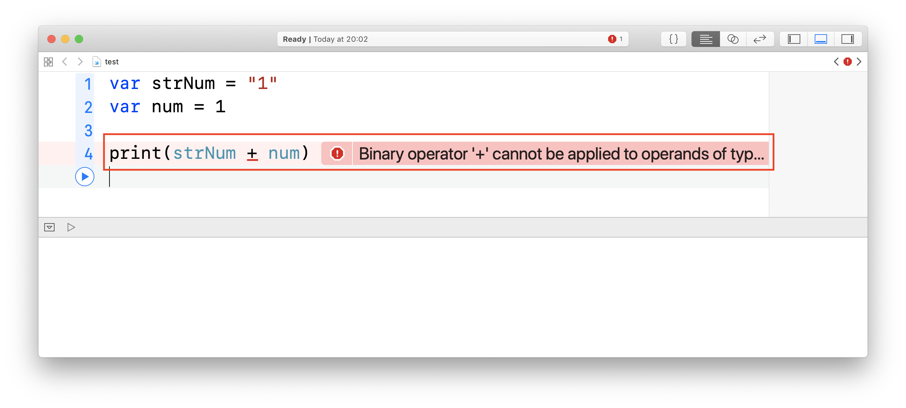

# 型

## このカリキュラムの目標
1. 型を理解する

## 導入
プログラムで扱うデータには、「文字列」や「整数」などのデータの型が存在します。

### 型の種類
Swiftで扱う基本的な型の種類はこちらになります。

|種類|型|例|
|---|---|---|
|文字列|String|"あいうえお"|
|整数|Int|1|
|浮動小数点型|Float, Double|3.14|
|真偽値|Bool|true|

### 型宣言の書き方
Swiftで変数を作る際、その変数に入れることのできる型を宣言することができます。  

```
var 変数名: 型名 = 値

// 例
var name: String = "NexSeed"
var age: Int = 20
var flg: Bool = true
```

### 型による制約
以下のように文字列の「1」と数値の「1」を用意してください。

```
var strNum = "1"
var num = 1
```

上記で作成した値を結合してみてください。エラーが出ると思います。



Swiftでは、データは厳密に型で分類されます。  
そして違う型同士は一緒に扱えないということを覚えておいてください。

### 型推論
Swiftでは明示的に型を書かなくても型を推論してくれます。

```
// 型推論
var name   = "Shinji Ikari" // 変数の型は推論によりString型になる 
var age    = 14             // 変数の型は推論によりInteger型になる 
var height = 141.5          // 変数の型は推論によりDouble型になる
```