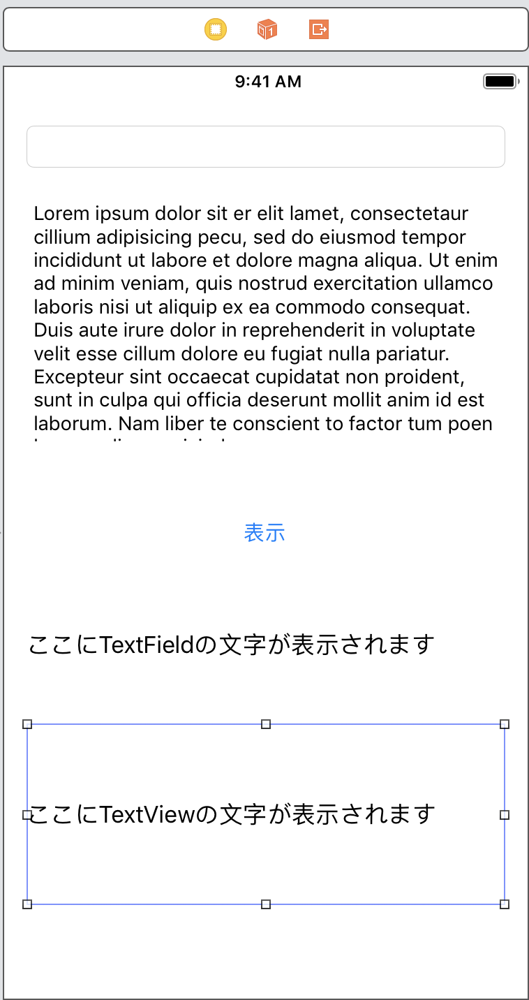
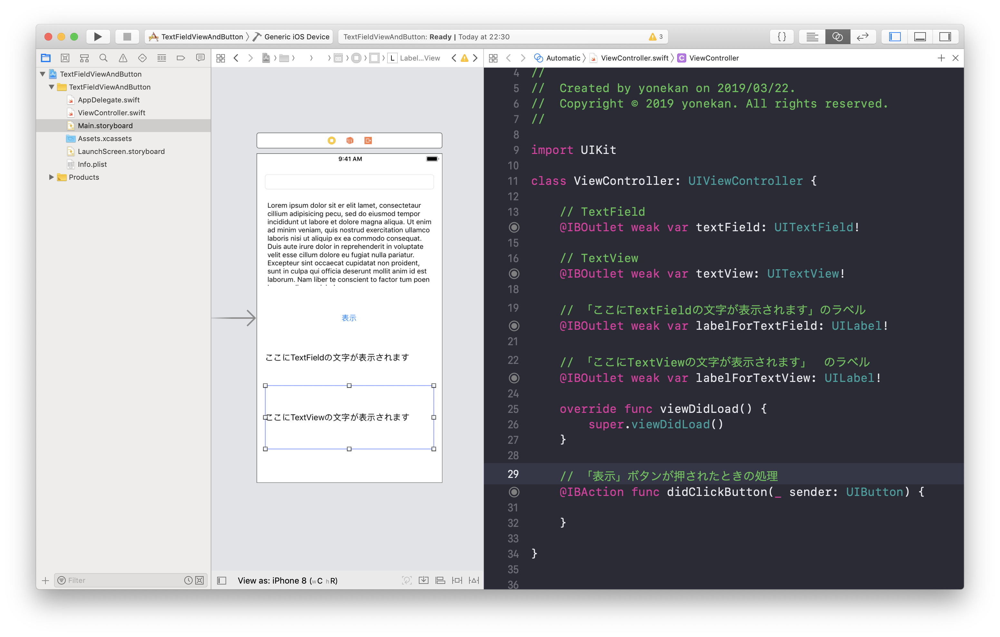
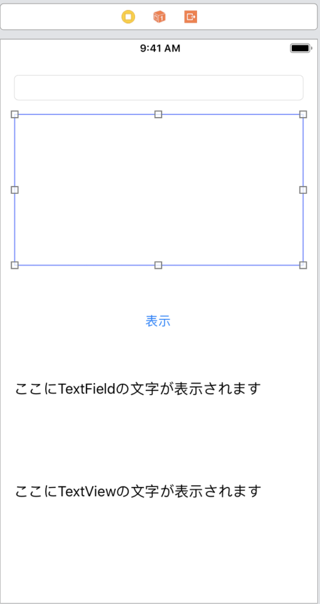
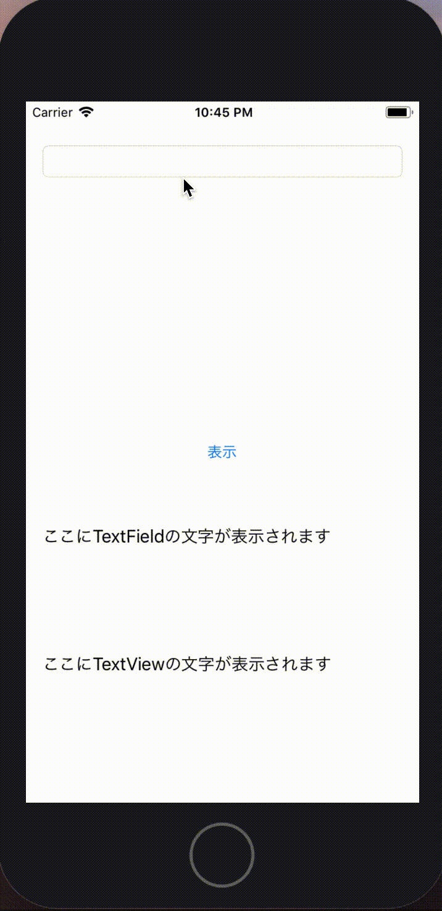

# TextField&TextViewLabel&Button

## 目標
	- TextField, TextView, Button, Labelが使えるようになうる

## 開発の流れ

1. 画面の部品を配置する
	- TextFieldの設置
	- TextViewの設置
	- Labelの設置
	- Buttonの設置
2. 配置した画面の部品をプログラムで扱えるよう設定する
3. 表示ボタンが押されたときのプログラムを書く

## 部品の説明

|部品名|概要|
|---|---|
| TextField |文字の入力ができる（1行）|
| TextView |文字の入力ができる（複数行）|
| Label |文字の表示欄|
| Button |ボタン。クリックすることができる|

## 開発しよう

1. プロジェクトを作成する  
	[01_はじめてのアプリ開発](./01_はじめてのアプリ開発.md)と同じように新規プロジェクトを作成する。  
	アプリ名：TextFieldViewAndButton
	
2. 画面の部品を配置する
	1. TextField, TextView, Button, Labelを以下のように配置する。

		

		> 参考  
		> [01_UILabel.md](./各パーツ/01_UILabel.md)  
		> [02_UIButton.md](./各パーツ/02_UIButton.md)  
		> [03_UITextField.md](./各パーツ/03_UITextField.md)  
		> [04_UITextView.md](./各パーツ/04_UITextView.md)


3. 配置した画面の部品をプログラムで扱えるよう設定する
	1. 配置したTextField, TextView, Button, LabelをViewController.swiftに接続する。

		|部品|接続時のName|
		|---|---|
		|UITextField|textField|
		|UITextView|textView|
		|UILabel（TextField用）|labelForTextField|
		|UILabel（TextView用）|labelForTextView|
		|UIButton|didClickButton|

		

4. TextViewのデフォルト値を削除する。
	1. 以下のようにする。

	

	> 参考  
	> [04_UITextView.md](./各パーツ/04_UITextView.md)

5. TextView用のLabelを複数行表示できるよう設定する。
	> 参考  
	> [04_UITextView.md](./各パーツ/04_UITextView.md)

6. 「表示」ボタンが押下された時、以下のようになるようdidClickButtonを修正してください。

	


	<details><summary>回答例</summary><div>
	
	```
	@IBAction func didClickButton(_ sender: UIButton) {
        labelForTextField.text = textField.text
        labelForTextView.text = textView.text
    }
	```
	</div></details>
