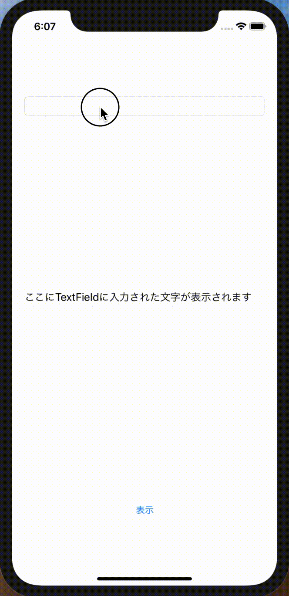
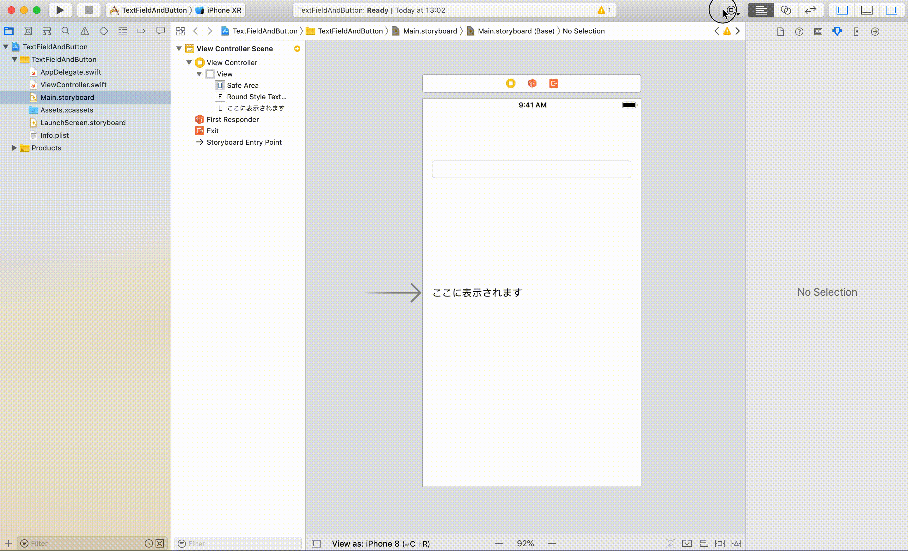
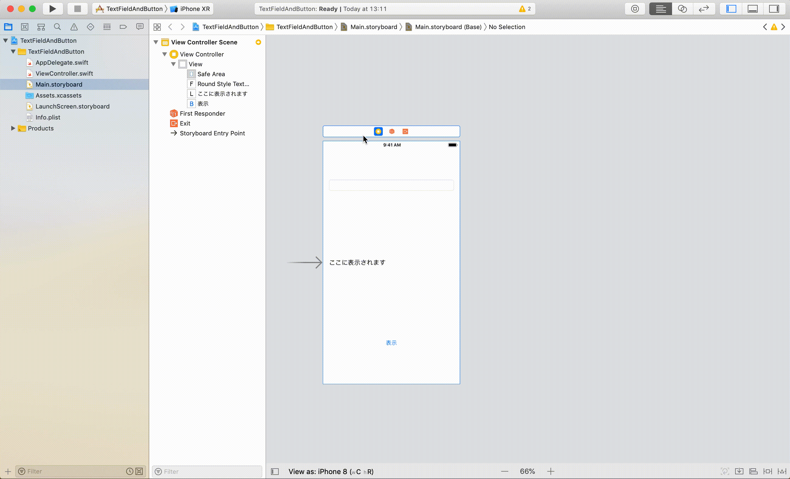
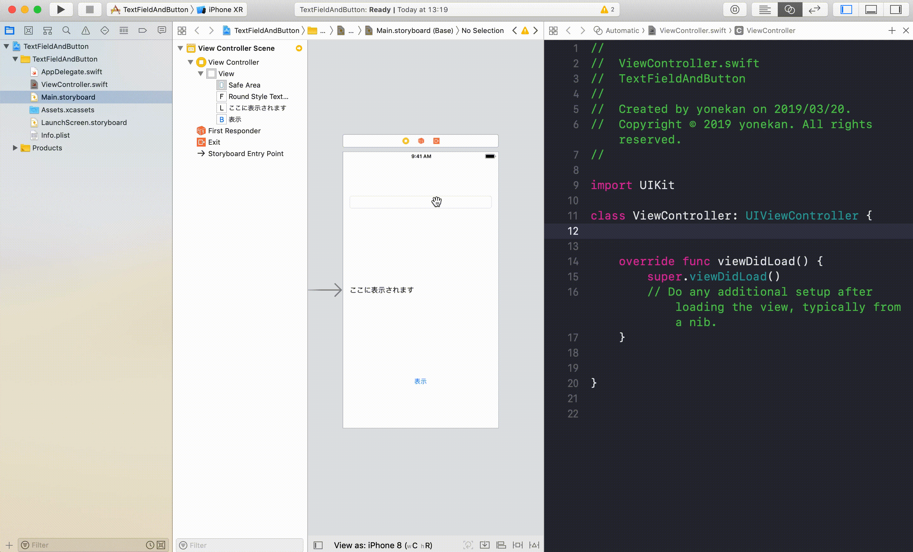
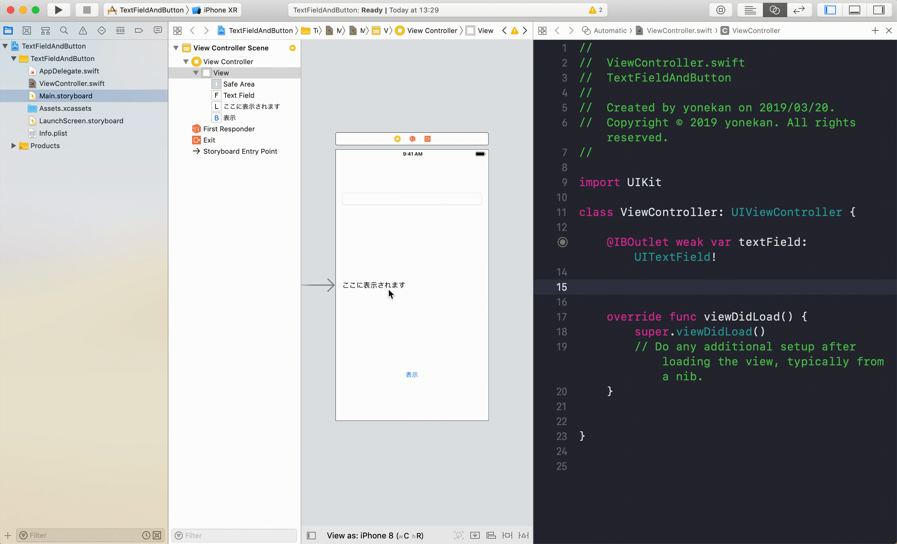
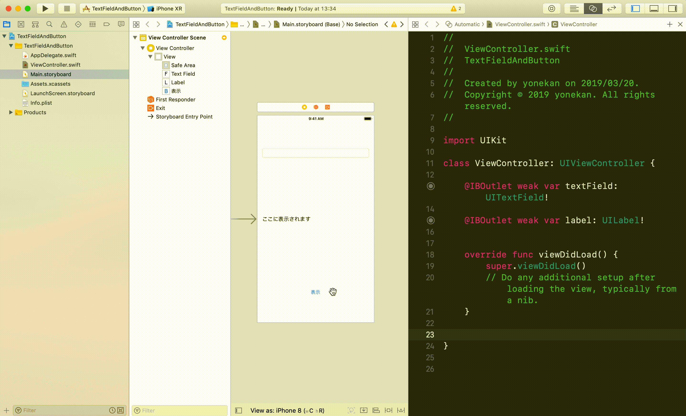

# UIパーツを使えるようになろう  
#  〜TextField＆Button編〜

## 目標
- 以下のアプリが作れるようになる
		

## 開発の流れ

1. 画面の部品を配置する
	- TextFieldの設置
	- Labelの設置
	- Buttonの設置
2. 配置した画面の部品をプログラムで扱えるよう設定する
3. 表示ボタンが押されたときのプログラムを書く

## 部品の説明

|部品名|概要|
|---|---|
| TextField |文字の入力欄。1行入力が可能|
| Label |文字の表示欄|
| Button |ボタン。クリックすることができる|

## 開発しよう

1. プロジェクトを作成する  
	[01_はじめてのアプリ開発](./01_はじめてのアプリ開発.md)と同じように新規プロジェクトを作成する。  
	アプリ名：TextFieldAndButton
	
2. 画面の部品を配置する
	1. TextFieldを配置する
		
		
	2. Labelを配置する。  
	配置後、左のビュー（ユーティリティ）のから4つ目のアイコン（アトリビューツインスペクタ）を選択し、Text欄を変更する
		
		
	3. Buttonを配置する。  
	配置後、Buttonの文言を修正する。
		

3. 配置した画面の部品をプログラムで扱えるよう設定する
	1. 画面と対になるプログラムファイルを開く。
		プログラムファイルを開きたい画面を選択し、右上の∞に似たアイコンをクリックする。
		ViewController.swiftが開かれれば成功です。

		

	2. TextFieldをViewController.swiftに接続する。
		Main.storyboradに配置したTextFieldを選択し、Ctrlキーを押しながら、ViewController.swiftにドラッグ＆ドロップする。
		接続のためのウィンドウが表示されたら、Name欄に「textField」と入力し、「Connect」を選択。

		

	3. TextFieldと同様にLabelもViewController.swiftに接続する。  
		接続のためのウィンドウが表示されたら、Name欄に「label」と入力し、「Connect」を選択。

		

	4. ButtonをViewController.swiftに接続する。  
		接続のためのウィンドウが表示されたら、Connection欄が「Action」、Name欄に「show」、Type欄に「UIButton」を入力し、「Connect」を選択。

		

4. 表示ボタンが押されたときのプログラムを書く