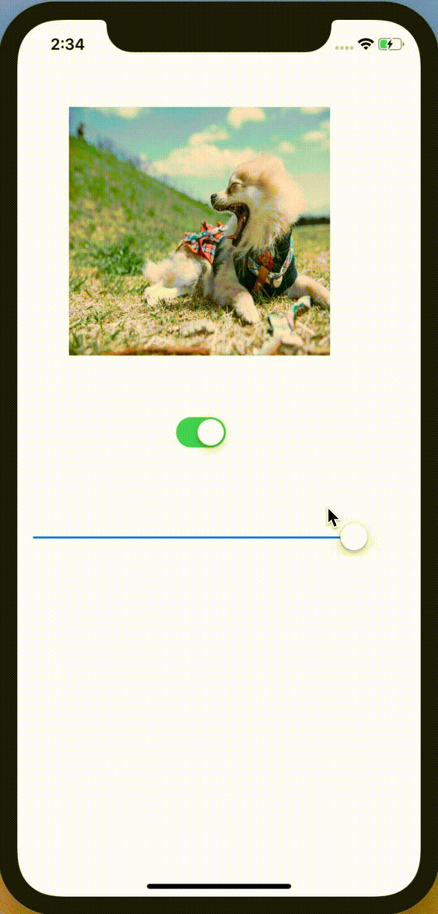
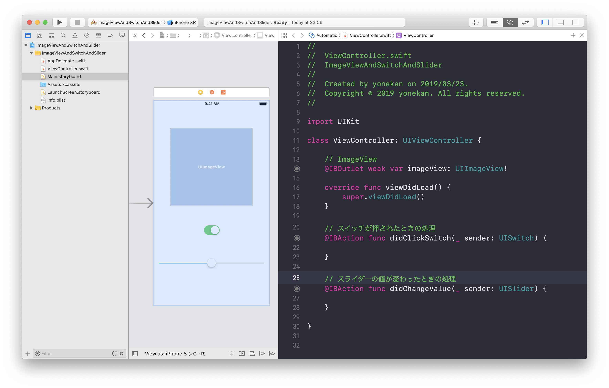

# ImageView&Switch&Slider

## 目標
- ImageView, Switch, Sliderが使えるようになる

## 作成するアプリ  


## 開発の流れ

1. 画面の部品を配置する
	- ImageViewの設置
	- Switchの設置
	- Sliderの設置
2. 配置した画面の部品をプログラムで扱えるよう設定する
3. ImageViewにデフォルト画像を設定する
4. Switchが押されたときのプログラムを書く
5. Sliderが押されたときのプログラムを書く
6. Sliderの初期値を設定する

## 部品の説明

|部品名|概要|
|---|---|
| UISwitch |オン・オフの切り替えができる|
| UISlider |スライダーによる値の設定ができる|
| UIImageView |画像を表示できる|

## 開発しよう

1. プロジェクトを作成する  
	[01_はじめてのアプリ開発](./01_はじめてのアプリ開発.md)と同じように新規プロジェクトを作成する。  
	アプリ名：ImageViewAndSwitchAndSlider
	
2. 画面の部品を配置する
	1. TextField, TextView, Button, Labelを以下のように配置する。

		

		> 参考  
		> [05_UISwitch.md](./各パーツ/05_UISwitch.md)  
		> [06_UISlider.md](./各パーツ/06_UISlider.md)  
		> [07_UIImageView.md](./各パーツ/07_UIImageView.md)  

3. 配置した画面の部品をプログラムで扱えるよう設定する
	1. 配置したImageView, Switch, SliderをViewController.swiftに接続する。

		|部品|接続時のName|
		|---|---|
		|UIImageView|imageView|
		|UITextView|didClickSwitch|
		|UISlider|didChangeValue|

		

4. ImageViewにデフォルト画像を設定する
	1. 以下のようにする。

	

	> 参考  
	> [07_UIImageView.md](./各パーツ/07_UIImageView.md)  

5. Switchが押されたときのプログラムを書く。  
	以下のような動きになるようプログラムを書いてください。

	

	> 参考  
	> [05_UISwitch.md](./各パーツ/05_UISwitch.md)  
	> [07_UIImageView.md](./各パーツ/07_UIImageView.md)  


	<details><summary>回答例</summary><div>
	
	```
	@IBAction func didClickSwitch(_ sender: UISwitch) {
	    if sender.isOn {
	        let dogImage = UIImage(named: "dog")
	        imageView.image = dogImage
	    } else {
	        let catImage = UIImage(named: "cat")
	        imageView.image = catImage
	    }
   }
	```
	</div></details>

6. Sliderが押されたときのプログラムを書く。  
  以下のような動きになるようプログラムを書いてください。

	

	> 参考  
	> [06_UISlider.md](./各パーツ/06_UISlider.md)  
	> [07_UIImageView.md](./各パーツ/07_UIImageView.md)  

	<details><summary>回答例</summary><div>
	
	```
	@IBAction func didChangeValue(_ sender: UISlider) {
        imageView.alpha = CGFloat(sender.value)
   }
	```

	> ```CGFloat(sender.value)```について
	> Swiftでは別の型同士は扱えないと習いました。[12_型とは.md](../01_Basic/12_型とは.md)   
	> imageView.alphaの型はCGFloatで、sender.valueの型はFloatです。  
	> ですので、  
	> ```imageView.alpha = sender.value```  
	> このように書くと別の型同士のためエラーが発生してしまいます。  
	> そこで、エラーを回避するために、  
	> ```CGFloat(sender.value)```  
	> というように書き、sender.valueの値を使って、新しくCGFloatのデータを作るという処理を書いています。

	</div></details>

7. Sliderの初期値を設定する。
  初期表示時、画像は不透明なのに対し、スライダーは0.5の値になっています。  
	スライダーの初期値を1に変更してください。

	

	<details><summary>ヒント1</summary><div>
	Sliderの値はvalueプロパティです。  
	プロパティを操作したい場合はOutletでつなぐ必要があります。
	</div></details>

	<details><summary>ヒント2</summary><div>
	ViewControllerにあるviewDidLoadメソッドは画面が表示される前に実行されます。
	</div></details>
	
	<details><summary>回答例</summary><div>
	
	```
	override func viewDidLoad() {
   		super.viewDidLoad()
        
   		slider.value = 1
   }
	```
	
	</div></details>