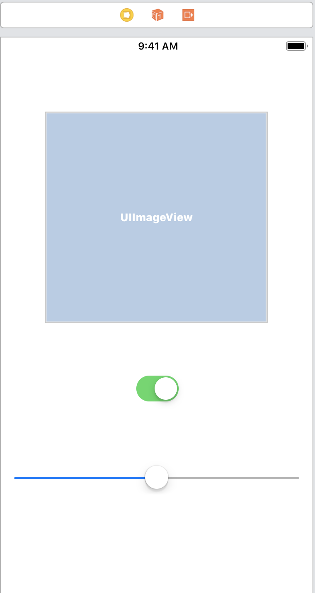
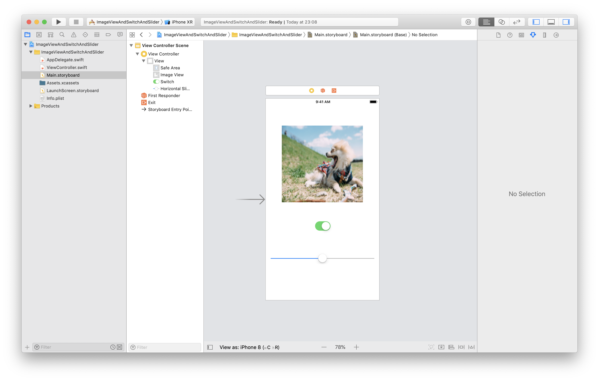

# ImageView&Switch&Slider

## 目標
- ImageView, Switch, Sliderが使えるようになる

## 開発の流れ

1. 画面の部品を配置する
	- ImageViewの設置
	- Switchの設置
	- Sliderの設置
2. 配置した画面の部品をプログラムで扱えるよう設定する
3. ImageViewにデフォルト画像を設定する
4. Switchが押されたときのプログラムを書く
5. Sliderが押されたときのプログラムを書く

## 部品の説明

|部品名|概要|
|---|---|
| UISwitch |オン・オフの切り替えができる|
| UISlider |スライダーによる値の設定ができる|
| UIImageView |画像を表示できる|

## 開発しよう

1. プロジェクトを作成する  
	[01_はじめてのアプリ開発](./01_はじめてのアプリ開発.md)と同じように新規プロジェクトを作成する。  
	アプリ名：ImageViewAndSwitchAndSlider
	
2. 画面の部品を配置する
	1. TextField, TextView, Button, Labelを以下のように配置する。

		

		> 参考  
		> [05_UISwitch.md](./各パーツ/05_UISwitch.md)  
		> [06_UISlider.md](./各パーツ/06_UISlider.md)  
		> [07_UIImageView.md](./各パーツ/07_UIImageView.md)  

3. 配置した画面の部品をプログラムで扱えるよう設定する
	1. 配置したImageView, Switch, SliderをViewController.swiftに接続する。

		|部品|接続時のName|
		|---|---|
		|UIImageView|imageView|
		|UITextView|didClickSwitch|
		|UISlider|didChangeValue|

		

4. ImageViewにデフォルト画像を設定する
	1. 以下のようにする。

	

	> 参考  
	> [07_UIImageView.md](./各パーツ/07_UIImageView.md)  

5. Switchが押されたときのプログラムを書く
	以下のような動きになるようプログラムを書いてください。

	

	> 参考  
	> [05_UISwitch.md](./各パーツ/05_UISwitch.md)  
	> [07_UIImageView.md](./各パーツ/07_UIImageView.md)  


	<details><summary>回答例</summary><div>
	
		```
		@IBAction func didClickSwitch(_ sender: UISwitch) {
        if sender.isOn {
            let dogImage = UIImage(named: "dog")
            imageView.image = dogImage
        } else {
            let catImage = UIImage(named: "cat")
            imageView.image = catImage
        }
    }
		```
	</div></details>

6. 「表示」ボタンが押下された時、以下のようになるようdidClickButtonを修正してください。

	


	<details><summary>回答例</summary><div>
	
	```
	@IBAction func didClickButton(_ sender: UIButton) {
        labelForTextField.text = textField.text
        labelForTextView.text = textView.text
    }
	```
	</div></details>
