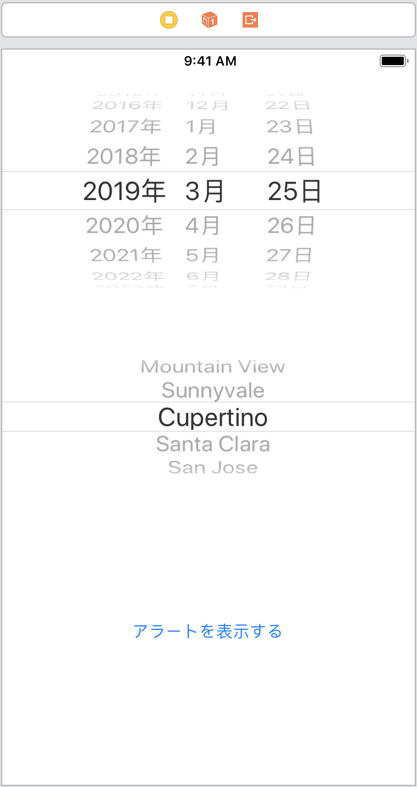
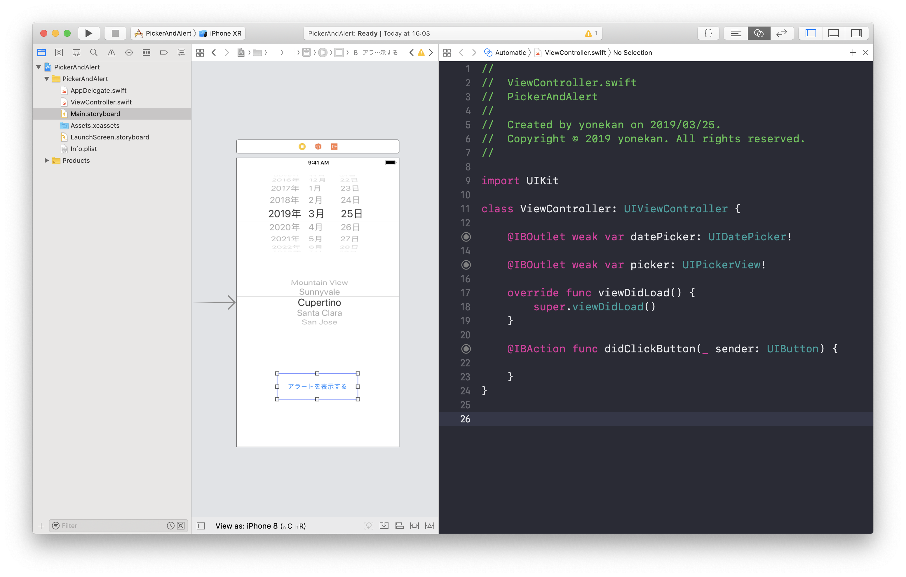
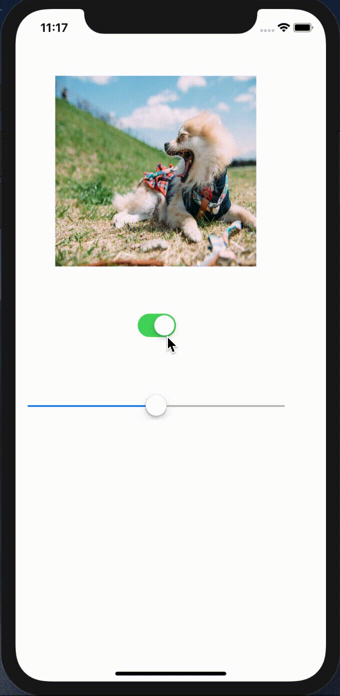
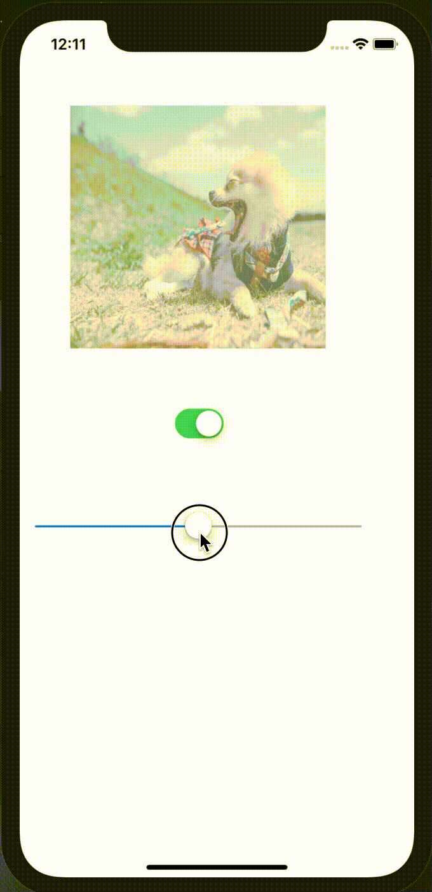
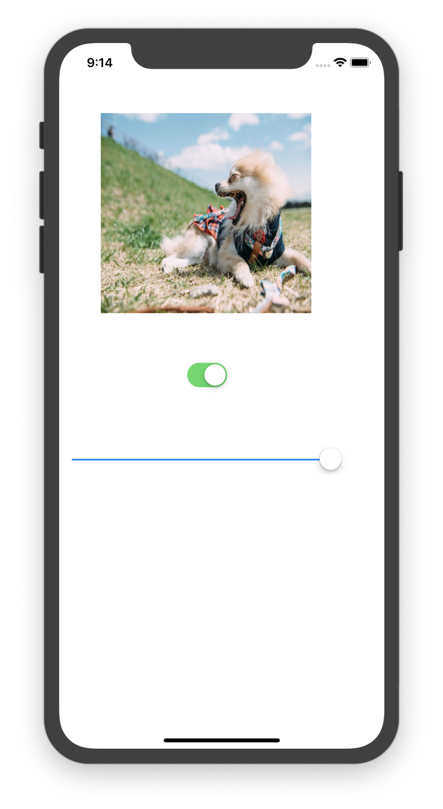

# PickerAndAlert

## 目標
- DatePicker, PickerView, Alertが使えるようになる

## 開発の流れ

1. 画面の部品を配置する
	- DatePickerの設置
	- PickerViewの設置
	- Buttonの設置
2. 配置した画面の部品をプログラムで扱えるよう設定する
3. PickerViewの設定をプログラムで書く
4. Alertのプログラムを書く

## 部品の説明

|部品名|概要|
|---|---|
| UIDatePicker |日付の選択ができる|
| UIPickerView |複数の選択肢から1つを選択できる|
| UIAlert |アラート表示ができる|

## 開発しよう

1. プロジェクトを作成する  
	[01_はじめてのアプリ開発](./01_はじめてのアプリ開発.md)と同じように新規プロジェクトを作成する。  
	アプリ名：PickerAndAlert
	
2. 画面の部品を配置する
	1. UIDatePicker, UIPickerView, UIButtonを以下のように配置する。

		

		> 参考  
		> [08_UIIDatePicker.md](./各パーツ/08_UIIDatePicker.md)  
		> [09_UIPickerView.md](./各パーツ/09_UIPickerView.md)  
		> [10_UIAlert.md](./各パーツ/10_UIAlert.md)  

3. 配置した画面の部品をプログラムで扱えるよう設定する
	1. 配置したUIDatePicker, UIPickerView, UIButtonをViewController.swiftに接続する。

		|部品|接続時のName|
		|---|---|
		|UIDatePicker|datePicker|
		|UIPickerView|picker|
		|UIButton|didClickButton|

		

4. PickerViewの設定をプログラムで書く
	1. PickerViewに以下の内容を表示する
	|内容|
	|---|
	|"北海道地方", "東北地方", "関東地方", "中部地方", "近畿地方", "中国地方", "四国地方", "九州・沖縄地方"|

	

	> 参考  
	> [07_UIImageView.md](./各パーツ/07_UIImageView.md)  

5. Switchが押されたときのプログラムを書く。  
	以下のような動きになるようプログラムを書いてください。

	

	> 参考  
	> [05_UISwitch.md](./各パーツ/05_UISwitch.md)  
	> [07_UIImageView.md](./各パーツ/07_UIImageView.md)  


	<details><summary>回答例</summary><div>
	
	```
	@IBAction func didClickSwitch(_ sender: UISwitch) {
	    if sender.isOn {
	        let dogImage = UIImage(named: "dog")
	        imageView.image = dogImage
	    } else {
	        let catImage = UIImage(named: "cat")
	        imageView.image = catImage
	    }
   }
	```
	</div></details>

6. Sliderが押されたときのプログラムを書く。  
  以下のような動きになるようプログラムを書いてください。

	

	> 参考  
	> [06_UISlider.md](./各パーツ/06_UISlider.md)  
	> [07_UIImageView.md](./各パーツ/07_UIImageView.md)  

	<details><summary>回答例</summary><div>
	
	```
	@IBAction func didChangeValue(_ sender: UISlider) {
        imageView.alpha = CGFloat(sender.value)
   }
	```

	> ```CGFloat(sender.value)```について
	> Swiftでは別の型同士は扱えないと習いました。[12_型とは.md](../01_Basic/12_型とは.md)   
	> imageView.alphaの型はCGFloatで、sender.valueの型はFloatです。  
	> ですので、  
	> ```imageView.alpha = sender.value```  
	> このように書くと別の型同士のためエラーが発生してしまいます。  
	> そこで、エラーを回避するために、  
	> ```CGFloat(sender.value)```  
	> というように書き、sender.valueの値を使って、新しくCGFloatのデータを作るという処理を書いています。

	</div></details>

7. Sliderの初期値を設定する。
  初期表示時、画像は不透明なのに対し、スライダーは0.5の値になっています。  
	スライダーの初期値を1に変更してください。

	

	<details><summary>ヒント1</summary><div>
	Sliderの値はvalueプロパティです。  
	プロパティを操作したい場合はOutletでつなぐ必要があります。
	</div></details>

	<details><summary>ヒント2</summary><div>
	ViewControllerにあるviewDidLoadメソッドは画面が表示される前に実行されます。
	</div></details>