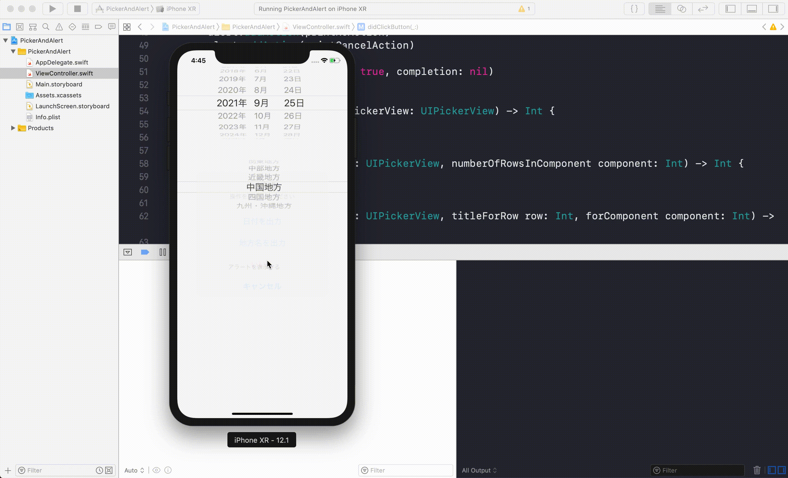
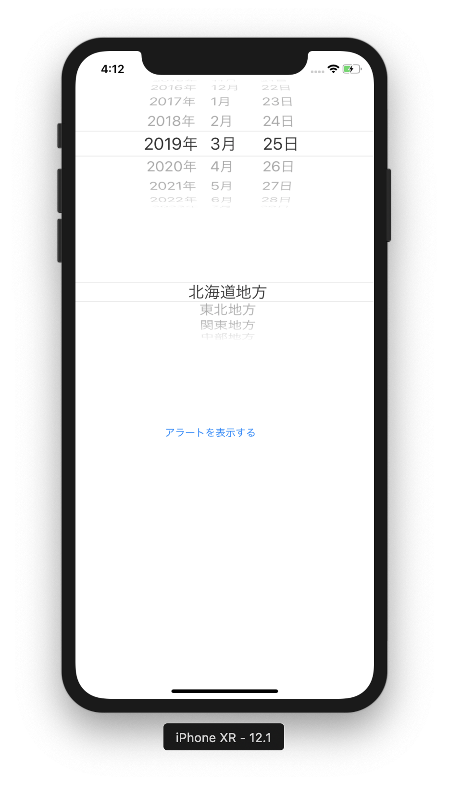

# PickerAndAlert

## 目標
- DatePicker, PickerView, Alertが使えるようになる

## 作成するアプリ  


## 開発の流れ

1. 画面の部品を配置する
	- DatePickerの設置
	- PickerViewの設置
	- Buttonの設置
2. 配置した画面の部品をプログラムで扱えるよう設定する
3. PickerViewの設定をプログラムで書く
4. Alertのプログラムを書く

## 部品の説明

|部品名|概要|
|---|---|
| UIDatePicker |日付の選択ができる|
| UIPickerView |複数の選択肢から1つを選択できる|
| UIAlert |アラート表示ができる|

## 開発しよう

1. プロジェクトを作成する  
	[01_はじめてのアプリ開発](./01_はじめてのアプリ開発.md)と同じように新規プロジェクトを作成する。  
	アプリ名：PickerAndAlert
	
2. 画面の部品を配置する
	1. UIDatePicker, UIPickerView, UIButtonを以下のように配置する。

		

		> 参考  
		> [08_UIIDatePicker.md](./各パーツ/08_UIIDatePicker.md)  
		> [09_UIPickerView.md](./各パーツ/09_UIPickerView.md)  
		> [10_UIAlert.md](./各パーツ/10_UIAlert.md)  

3. 配置した画面の部品をプログラムで扱えるよう設定する
	1. 配置したUIDatePicker, UIPickerView, UIButtonをViewController.swiftに接続する。

		|部品|接続時のName|
		|---|---|
		|UIDatePicker|datePicker|
		|UIPickerView|picker|
		|UIButton|didClickButton|

		

4. PickerViewの設定をプログラムで書く
	PickerViewに以下の内容を表示する
	
	|内容|"北海道地方", "東北地方", "関東地方", "中部地方", "近畿地方", "中国地方", "四国地方", "九州・沖縄地方"|
	|---|---|

	

	> 参考  
	> [09_UIPickerView.md](./各パーツ/09_UIPickerView.md)  

	<details><summary>回答例</summary><div>
	
	```
	class ViewController: UIViewController, UIPickerViewDelegate, UIPickerViewDataSource {
		
		@IBOutlet weak var datePicker: UIDatePicker!
		
		@IBOutlet weak var picker: UIPickerView!
		
		let regions = ["北海道地方", "東北地方", "関東地方", "中部地方", "近畿地方", "中国地方", "四国地方", "九州・沖縄地方"]
		
		override func viewDidLoad() {
			super.viewDidLoad()
				
			picker.dataSource = self
			picker.delegate = self
		}
		
		@IBAction func didClickButton(_ sender: UIButton) {
				
		}
		
		func numberOfComponents(in pickerView: UIPickerView) -> Int {
			return 1
		}
		
		func pickerView(_ pickerView: UIPickerView, numberOfRowsInComponent component: Int) -> Int {
			return regions.count
		}
		
		func pickerView(_ pickerView: UIPickerView, titleForRow row: Int, forComponent component: Int) -> String? {
			return regions[row]
		}
	}
	```
	</div></details>

5. Alertのプログラムを書く。  
	以下のような動きになるようプログラムを書いてください。

	

	> 参考  
	> [08_UIIDatePicker.md](./各パーツ/08_UIIDatePicker.md)  
	> [09_UIPickerView.md](./各パーツ/09_UIPickerView.md)  
	> [10_UIAlert.md](./各パーツ/10_UIAlert.md)  

	> PickerViewで選択されている要素の取得方法について  
	> ```let row = self.picker.selectedRow(inComponent: 0)```  
	> 上記のコードでrowにはPickerViewで選択されている要素の添字（インデックス）が取得できます。  
	> 例）東北地方が選べれていた場合、定数rowには1が代入されます。


	<details><summary>回答例</summary><div>
	
	```
	class ViewController: UIViewController, UIPickerViewDelegate, UIPickerViewDataSource {
		@IBOutlet weak var datePicker: UIDatePicker!
		
		@IBOutlet weak var picker: UIPickerView!
    
		let regions = ["北海道地方", "東北地方", "関東地方", "中部地方", "近畿地方", "中国地方", "四国地方", "九州・沖縄地方"]

		override func viewDidLoad() {
			super.viewDidLoad()
			picker.dataSource = self
			picker.delegate = self
		}

		@IBAction func didClickButton(_ sender: UIButton) {

			let alert = UIAlertController(title: "出力対象", message: "操作を選択してください", preferredStyle: .alert)

			let printDateAction = UIAlertAction(title: "日付を出力", style: .default) { (UIAlertAction) in
				print(self.datePicker.date)
			}
			
			let printRegionAction = UIAlertAction(title: "地方名を出力", style: .default) { (UIAlertAction) in
				let row = self.picker.selectedRow(inComponent: 0)
				print(self.regions[row])
			}
			
			let printNoAction = UIAlertAction(title: "いいえ", style: .destructive) { (UIAlertAction) in
				print("いいえが押されました")
			}
			
			let printCancelAction = UIAlertAction(title: "キャンセル", style: .cancel) { (UIAlertAction) in
				print("キャンセルが押されました")
			}

			alert.addAction(printDateAction)
			alert.addAction(printRegionAction)
			alert.addAction(printNoAction)
			alert.addAction(printCancelAction)

			present(alert, animated: true, completion: nil)
		}

		func numberOfComponents(in pickerView: UIPickerView) -> Int {
			return 1
		}

		func pickerView(_ pickerView: UIPickerView, numberOfRowsInComponent component: Int) -> Int {
			return regions.count
		}

		func pickerView(_ pickerView: UIPickerView, titleForRow row: Int, forComponent component: Int) -> String? {
			return regions[row]
		}
	}
	```
	</div></details>
