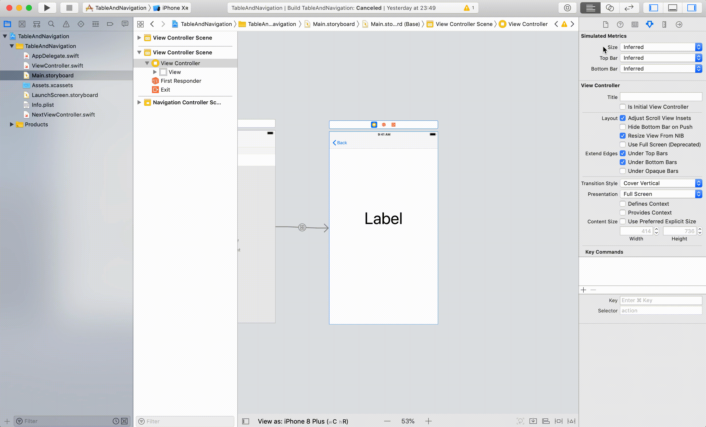
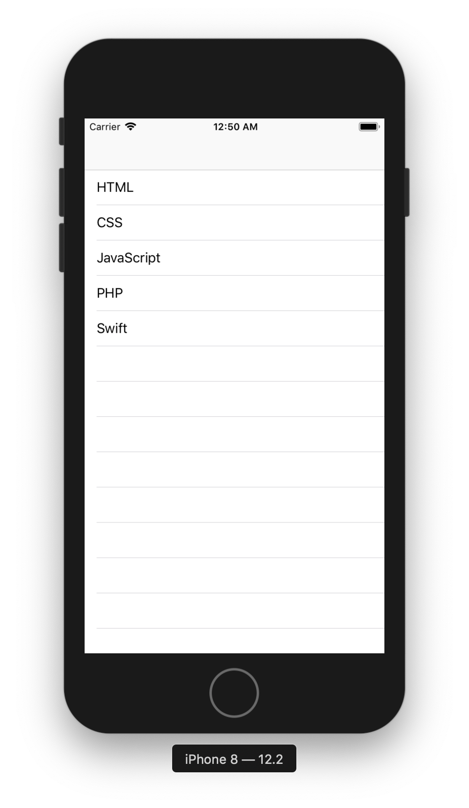
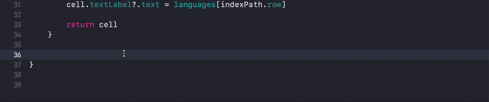
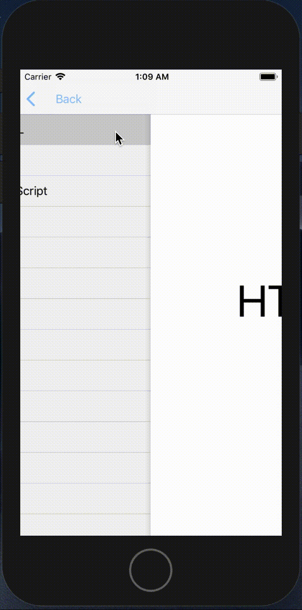

# TableAndNavigation

## 目標
- UITableView, UINavigationController, 画面遷移ができるようになる

## 開発の流れ

1. 画面の部品を配置する
	- UITableViewの設置
	- ViewController（次画面）の設置
	- UINavigationControllerの設置
2. TableViewの表示設定を行う
3. TableViewCellがクリックされた時の処理を書く
2. Top画面で画面遷移の処理を書く

## 開発しよう

1. プロジェクトを作成する  
	[01_はじめてのアプリ開発](../01_はじめてのアプリ開発.md)と同じように新規プロジェクトを作成する。  
	アプリ名：TableAndNavigation
	
2. 画面の部品を配置する
	1. 以下のようになるよう各部品を配置・設定する。
		

		> 参考  
		> [11_UITableView.md](./各パーツ/11_UITableView.md)  
		> [12_UINavigationController.md](./各パーツ/12_UINavigationController.md)  
		> [14_画面遷移.md](./各パーツ/14_画面遷移.md)  

		<details><summary>設定手順</summary><div>
		
		1. UINavigationControllerを配置する
			

		2. UITableViewを配置する
			

		3. UITableViewCellを配置する
			identifierに「cell」を設定する
			
			
		4. 次画面を配置する。同時にLabelも設置する
			
		
		5. Top画面から次画面への画面遷移の接続を行う
			identifierに「toNext」を設定する
			

		</div></details>

	2. 次画面のViewControllerを作成し、Main.storyboardで接続する。
		1. ViewControllerを作成する
			ファイル名は「NextViewController.swift」

			

		2. 作成したNextViewController.swiftをMain.storyboardで接続する。
			
		
	3. 配置した画面の部品をプログラムで扱えるよう設定する

		|コントローラ|部品|接続時の名前|
		|---|---|---|
		|ViewController|UITableView|tableView|
		|NextViewController|UILabel|label|
			
3. TableViewの表示設定を行う
	1. 以下のようになるよう各部品を配置・設定する。  
		
		
		<details><summary>回答例</summary><div>
	
		```
		class ViewController: UIViewController, UITableViewDelegate, UITableViewDataSource {
    
    		@IBOutlet weak var tableView: UITableView!
    
    		let languages = ["HTML", "CSS", "JavaScript", "PHP", "Swift"]
    
    		override func viewDidLoad() {
        		super.viewDidLoad()
        
        		tableView.delegate = self
        		tableView.dataSource = self
    		}

    		func tableView(_ tableView: UITableView, numberOfRowsInSection section: Int) -> Int {
        		return languages.count
    		}
    
    		func tableView(_ tableView: UITableView, cellForRowAt indexPath: IndexPath) -> UITableViewCell {
        		let cell = tableView.dequeueReusableCell(withIdentifier: "cell", for: indexPath)
        
        		cell.textLabel?.text = languages[indexPath.row]
        
        		return cell
    		}
		}
		```
		</div></details>

	4. TableViewCellがクリックされた時の処理を書く
		1. ViewControllerに ```func tableView(_ tableView: UITableView, didSelectRowAt indexPath: IndexPath)```メソッドを追記する。

			```
			func tableView(_ tableView: UITableView, didSelectRowAt indexPath: IndexPath) {
				<#code#>
			}
			```

			

		2. 画面で選択されたセルを値を取得する
			以下のように修正する。
			```
			func tableView(_ tableView: UITableView, didSelectRowAt indexPath: IndexPath) {
        let selectedValue = languages[indexPath.row]
    	}
			```

			> 引数indexPathのrowプロパティには何行目かの行番号が入っています。  
			> 1行目の場合にはindexPath.rowに0が入っています。  
			> rowプロパティの値を元に配列の要素を取得しています。

	5. NextViewControllerにテーブルで選択された値を受け取る変数を用意する。
		```@IBOutlet weak var label: UILabel!```の下に変数valueを用意する。  
		
		変数valueを追加後のNextViewController

		```
		class NextViewController: UIViewController {

				@IBOutlet weak var label: UILabel!
				
				var value = ""
				
				override func viewDidLoad() {
						super.viewDidLoad()
				}

		}
		```

	6. ViewControllerのセルがクリックされた時、NextViewControllerに遷移する処理を書く。

			以下のような動きになるようプログラムを書いてください。
			

			<details><summary>設定手順</summary><div>
		
			1. ViewControllerの設定
				1. セルがクリックされた時に、画面遷移する処理を追記する。
					```tableView(_ tableView: UITableView, didSelectRowAt indexPath: IndexPath)```に、  
					で画面遷移のメソッド```performSegue```を実行する。  
					引数withIdentifierには矢印の名前「toNext」、  
					引数senderには選択された文字を設定する。

					```
					func tableView(_ tableView: UITableView, didSelectRowAt indexPath: IndexPath) {
        		let selectedValue = languages[indexPath.row]
        		performSegue(withIdentifier: "toNext", sender: selectedValue)
    			}
					```

				2. 次画面に渡す値を次画面のViewControllerの特定のプロパティ（変数）に設定する。
					```prepare```メソッドを使って、画面の選択値をNextViewControllerの変数valueに設定する。

					```
					override func prepare(for segue: UIStoryboardSegue, sender: Any?) {
        		if segue.identifier == "toNext" {
            	let nextVC = segue.destination as! NextViewController
            	nextVC.value = sender as! String
        		}
    			}
					```

			2. NextViewControllerの設定
				1. 画面が表示される時、Label.textに変数valueの値を設定する。

				```
				override func viewDidLoad() {
        	super.viewDidLoad()
        
        	label.text = value
    		}
				```
			</div></details>