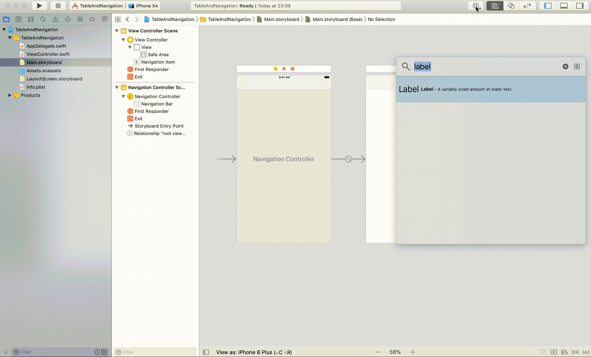
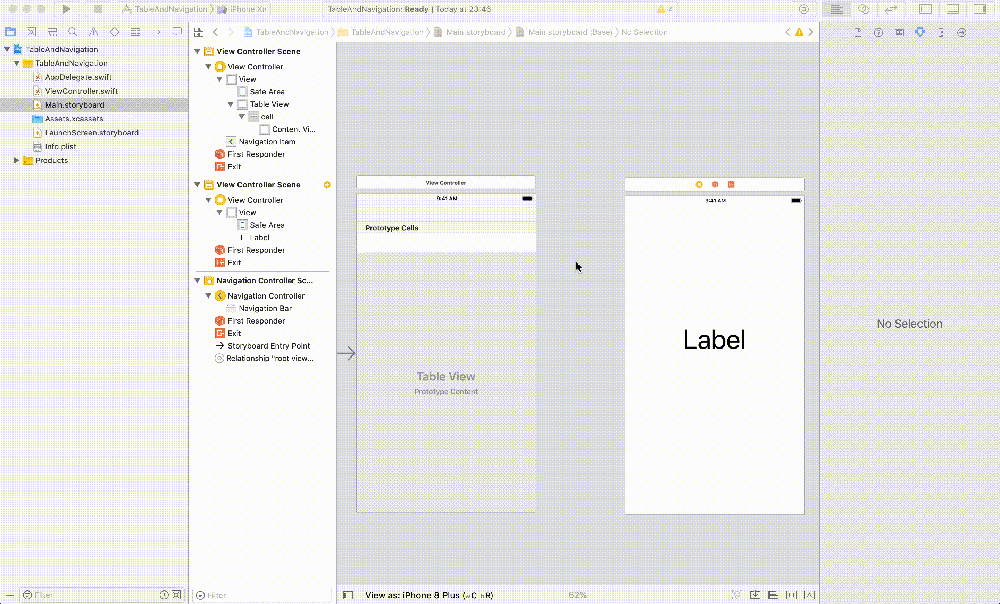

# TableAndNavigation

## 目標
- UITableView, UINavigationController, 画面遷移ができるようになる

## 開発の流れ

1. 画面の部品を配置する
	- UITableViewの設置
	- ViewController（次画面）の設置
	- UINavigationControllerの設置
2. TableViewの表示設定を行う
2. Top画面で画面遷移の処理を書く

## 開発しよう

1. プロジェクトを作成する  
	[01_はじめてのアプリ開発](../01_はじめてのアプリ開発.md)と同じように新規プロジェクトを作成する。  
	アプリ名：TableAndNavigation
	
2. 画面の部品を配置する
	1. 以下のようになるよう各部品を配置・設定する。
		

		> 参考  
		> [11_UITableView.md](./各パーツ/11_UITableView.md)  
		> [12_UINavigationController.md](./各パーツ/12_UINavigationController.md)  
		> [14_画面遷移.md](./各パーツ/14_画面遷移.md)  

		<details><summary>設定手順</summary><div>
		1. UINavigationControllerを配置する
			

		2. UITableViewを配置する
			

		3. UITableViewCellを配置する
			identifierに「cell」を設定する
			
			
		4. 次画面を配置する。同時にLabelも設置する
			
		
		5. Top画面から次画面への画面遷移の接続を行う
			identifierに「toNext」を設定する
			

		</div></details>

	2. 次画面のViewControllerを作成し、Main.storyboardで接続する。
		1. ViewControllerを作成する
			ファイル名は「NextViewController.swift」

			
			
	2. 配置した画面の部品をプログラムで扱えるよう設定する

		|コントローラ|部品|接続時の名前|
		|||
			
3. TableViewの表示設定を行う

		<details><summary>回答例</summary><div>
	
		```
		class ViewController: UIViewController, UITableViewDelegate, UITableViewDataSource {
    
    		@IBOutlet weak var tableView: UITableView!
    
    		let languages = ["HTML", "CSS", "JavaScript", "PHP", "Swift"]
    
    		override func viewDidLoad() {
        		super.viewDidLoad()
        
        		tableView.delegate = self
        		tableView.dataSource = self
    		}

    		func tableView(_ tableView: UITableView, numberOfRowsInSection section: Int) -> Int {
        		return languages.count
    		}
    
    		func tableView(_ tableView: UITableView, cellForRowAt indexPath: IndexPath) -> UITableViewCell {
        		let cell = tableView.dequeueReusableCell(withIdentifier: "tableViewCell", for: indexPath)
        
        		cell.textLabel?.text = languages[indexPath.row]
        
        		return cell
    		}
		}
		```
		</div></details>

	2. ViewControllerの設置
		以下のようになるようViewControllerを配置する。

		

3. 画面遷移の処理を書く
	1. TOP画面と次画面を接続する。
		TOP画面を選択し、Ctrlキーを押しながら、次画面までドラッグする。 
		接続時に表示されたウィンドウで、「show」を選択する

		

	2. 画面遷移の接続を表す矢印に識別子（名前）を設定する
		矢印を選択し、ユーティリティエリアの属性インスペクタを選択する。  
		identifierに「toNextVC」と入力する。

		

	3. TableViewのセルが選択された時の処理を追加する
		ViewController.swiftに以下のプログラムを追加してください。
		```
		func tableView(_ tableView: UITableView, didSelectRowAt indexPath: IndexPath) {
        <#code#>
    }
		```

		

	4. 画面で選択されたセルのプログラミング言語を取得するプログラムを追記する。
		```func tableView(_ tableView: UITableView, didSelectRowAt indexPath: IndexPath)```に以下のプログラムを追記してください。
		```
		let selectedLanguage = languages[indexPath.row]
		```

		修正後のdidSelectRowAt

		```
		func tableView(_ tableView: UITableView, didSelectRowAt indexPath: IndexPath) {
      let selectedLanguage = languages[indexPath.row]
    }
		```