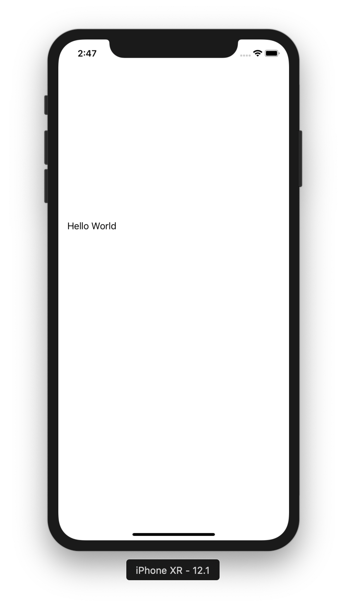
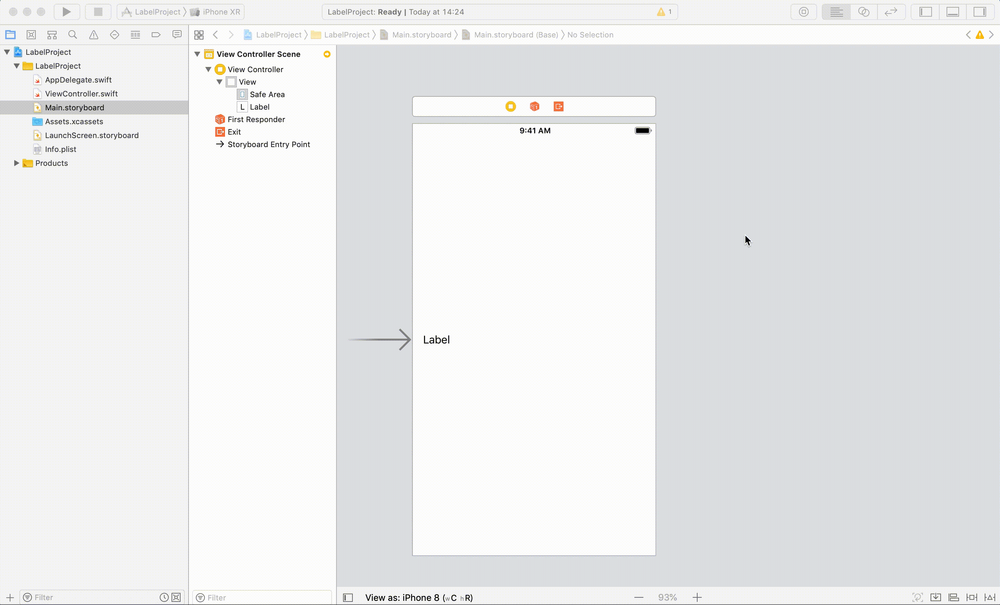
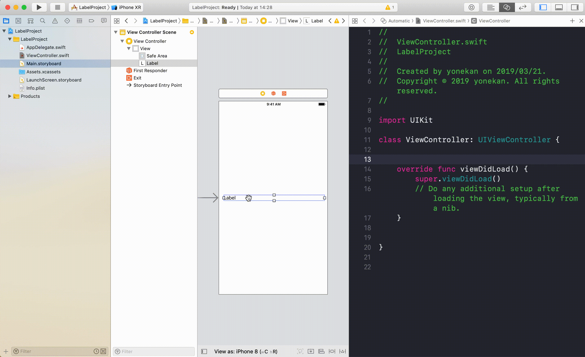

# UILabel  

## 目標
- UILabelが使えるようになる

## 作成するアプリ  


## 開発の流れ

1. 画面の部品を配置する
	- Labelの設置
2. 配置した画面の部品をプログラムで扱えるよう設定する
3. Labelの文字をプログラムで設定する

## 部品の説明

|部品名|概要|
|---|---|
| Label |文字の表示欄|

## 開発しよう

1. プロジェクトを作成する  
	[01_はじめてのアプリ開発](../01_はじめてのアプリ開発.md)と同じように新規プロジェクトを作成する。  
	アプリ名：LabelProject
	
2. 画面の部品を配置する
	1. Labelを配置する
		

3. 配置した画面の部品をプログラムで扱えるよう設定する
	1. 画面と対になるプログラムファイルを開く。
		プログラムファイルを開きたい画面を選択し、右上の∞に似たアイコンをクリックする。
		ViewController.swiftが開かれれば成功です。

		

	3. LabelをViewController.swiftに接続する。   
		Main.storyboardに配置したUILabelを選択し、Ctrlキーを押しながら、ViewController.swiftまでドラッグ＆ドロップする。  
		
		接続のためのウィンドウが表示されたら、Name欄に「label」と入力し、「Connect」を選択。

		

4. Labelの文字をプログラムで設定する  
  ViewController内のviewDidLoadメソッドに以下のプログラムを追記する。

	```
  	label.text = "Hello World"

	```

	viewDidLoadの完成形

	```
	override func viewDidLoad() {
		super.viewDidLoad()
		
		label.text = "Hello World"
  	}
	```
	
5. プロジェクトを実行する。  
以下のように実行されれば成功です。


## 解説

```
label.text = "Hello World"
```

上記のコードはlabelのtextプロパティに文字列の「Hello World」を設定しています。  
このtextプロパティが画面に表示されている文字の部分です。

Labelには他にもいくつかのプロパティが存在します。  
いくつか紹介するので、先ほどと同様viewDidLoad内に追記して画面で確認してみましょう。

```
// 文字の色を赤色に設定
label.textColor = .red

// 文字の背景色を黒色に設定
label.backgroundColor = .black

// 文字を中央揃えに設定
label.textAlignment = .center

// 文字のフォントサイズを30に設定
label.font = label.font.withSize(30)
```
