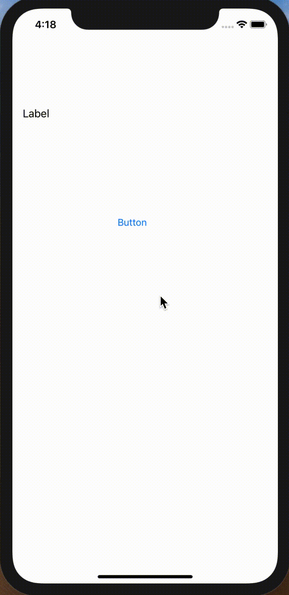

# UIButton

## 目標
- UIButtonが使えるようになうる

## 開発の流れ

1. 画面の部品を配置する
	- Buttonの設置
2. 配置した画面の部品をプログラムで扱えるよう設定する
3. Buttonが押された時の処理を書く

## 部品の説明

|部品名|概要|
|---|---|
| Button |クリックができる|

## 開発しよう

1. プロジェクトを作成する  
	[01_はじめてのアプリ開発](../01_はじめてのアプリ開発.md)と同じように新規プロジェクトを作成する。  
	アプリ名：ButtonProject
	
2. 画面の部品を配置する
	1. LabelとButtonを配置する
		

3. 配置した画面の部品をプログラムで扱えるよう設定する
	1. 画面と対になるプログラムファイルを開く。
		プログラムファイルを開きたい画面を選択し、右上の∞に似たアイコンをクリックする。
		ViewController.swiftが開かれれば成功です。
		
		

	3. LabelをViewController.swiftに接続する。  
		接続のためのウィンドウが表示されたら、Name欄に「label」と入力し、「Connect」を選択。
		
		


	4. ButtonをViewController.swiftに接続する。
	接続のためのウィンドウが表示されたら、Connection欄で「Action」を選択し、Name欄に「didClickButton」、Type欄に「UIButton」と入力し、「Connect」を選択。

	


4. Buttonが押された時の処理を書く  
  ViewController内のdidClickButtonメソッドに以下のプログラムを追記する。

	``` 
	label.text = "ボタンが押されました" 
	```
  
	didClickButtonの完成形

	```
	@IBAction func didClickButton(_ sender: UIButton) {
        label.text = "ボタンが押されました" 
	}
	```
	
5. プロジェクトを実行する。
	以下のように実行されれば成功です。
	

## 解説

### ConnectionのIBOutletとIBActionの違いとは？

|Connection|説明|
|---|---|
|IBOutlet|ラベルの文字を変えたり、色を変えるなどのプロパティに対して操作する場合に使う|
|IBAction|「ボタンがクリックされた時に〇〇をする」などのように処理を書きたい時に使用する|