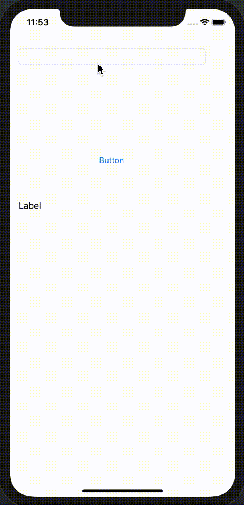
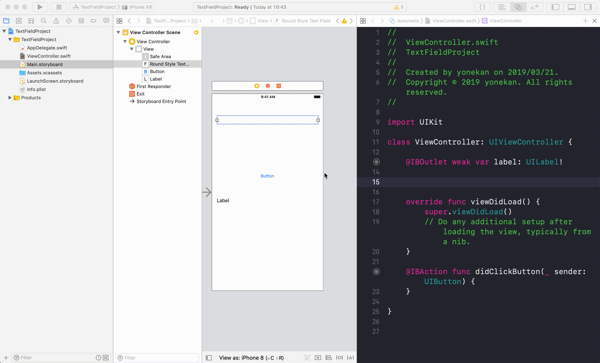

# UITextField

## 目標
- UITextFieldが使えるようになる

## 作成するアプリ  


## 開発の流れ

1. 画面の部品を配置する
	- UITextField, Button, Labelの設置
2. 配置した画面の部品をプログラムで扱えるよう設定する
3. Buttonが押された時の処理を書く

## 部品の説明

|部品名|概要|
|---|---|
| UITextField |文字の入力ができる（1行）|

## 開発しよう

1. プロジェクトを作成する  
	[01_はじめてのアプリ開発](../01_はじめてのアプリ開発.md)と同じように新規プロジェクトを作成する。  
	アプリ名：TextFieldProject
	
2. 画面の部品を配置する
	1. UITextField, Button, Labelを配置する
		

3. 配置した画面の部品をプログラムで扱えるよう設定する
	1. 画面と対になるプログラムファイルを開く。  
		プログラムファイルを開きたい画面を選択し、右上の∞に似たアイコンをクリックする。
		ViewController.swiftが開かれれば成功です。
		
		

	2. LabelをViewController.swiftに接続する。  
		接続のためのウィンドウが表示されたら、Name欄に「label」と入力し、「Connect」を選択。
		
		


	3. ButtonをViewController.swiftに接続する。  
	接続のためのウィンドウが表示されたら、Connection欄で「Action」を選択し、Name欄に「didClickButton」、Type欄に「UIButton」と入力し、「Connect」を選択。

	

  	4. TextFieldをViewController.swiftに接続する。  
	接続のためのウィンドウが表示されたら、Connection欄で「Outlet」を選択し、Name欄に「textField」と入力し、「Connect」を選択。

	


4. Buttonが押された時の処理を書く  
  ViewController内のdidClickButtonメソッドに以下のプログラムを追記する。

	``` 
	label.text = textField.text 
	```
  
	didClickButtonの完成形

	```
	@IBAction func didClickButton(_ sender: UIButton) {
        label.text = textField.text  
	}
	```
	
5. プロジェクトを実行する。  
	以下のように実行されれば成功です。  
	

## 解説

``` 
label.text = textField.text 
```

上記のコードはlabelの文字に、画面で入力された値を設定しています。
TextFieldに入力された値は、TextFieldのtextプロパティに保存されています。
