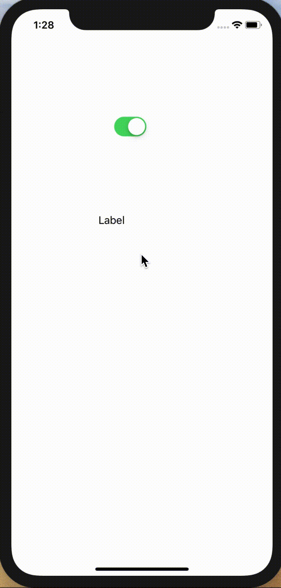

# UISwitch

## 目標
- UISwitchが使えるようになる

## 開発の流れ

1. 画面の部品を配置する
	- UISwitchの設置
2. 配置した画面の部品をプログラムで扱えるよう設定する
3. UISwitchが押された時の処理を書く

## 部品の説明

|部品名|概要|
|---|---|
| UISwitch |オン・オフの切り替えができる|

## 開発しよう

1. プロジェクトを作成する  
	[01_はじめてのアプリ開発](../01_はじめてのアプリ開発.md)と同じように新規プロジェクトを作成する。  
	アプリ名：SwitchProject
	
2. 画面の部品を配置する
	1. Switch, Labelを配置する
		

3. 配置した画面の部品をプログラムで扱えるよう設定する
	1. 画面と対になるプログラムファイルを開く。  
		プログラムファイルを開きたい画面を選択し、右上の∞に似たアイコンをクリックする。
		ViewController.swiftが開かれれば成功です。

	2. LabelをViewController.swiftに接続する。  
		接続のためのウィンドウが表示されたら、Name欄に「label」と入力し、「Connect」を選択。
		
		

	3. SwitchをViewController.swiftに接続する。  
	接続のためのウィンドウが表示されたら、Connection欄で「Action」を選択し、Name欄に「didClickSwitch」、Type欄に「UISwitch」と入力し、「Connect」を選択。

		

4. Switchが押された時の処理を書く  
  ViewController内のdidClickSwitchメソッドに以下のプログラムを追記する。

	``` 
	if sender.isOn {
		label.text = "オンです"
	} else {
		label.text = "オフです"
	}
	```
  
	didClickSwitchの完成形

	```
	@IBAction func didClickSwitch(_ sender: UISwitch) {
		if sender.isOn {
				label.text = "オンです"
		} else {
				label.text = "オフです"
		}
	}
	```

5. プロジェクトを実行する。  
	以下のように実行されれば成功です。  
	

## 解説

### Switchについて
``` 
if sender.isOn {
	label.text = "オンです"
} else {
	label.text = "オフです"
}
```

isOnメソッドはSwitchがオンの場合にtrue, オフの場合にfalseを返すメソッドです。  
このメソッドを使って、オン・オフそれぞれの場合にLabelの文字を変更しています。
