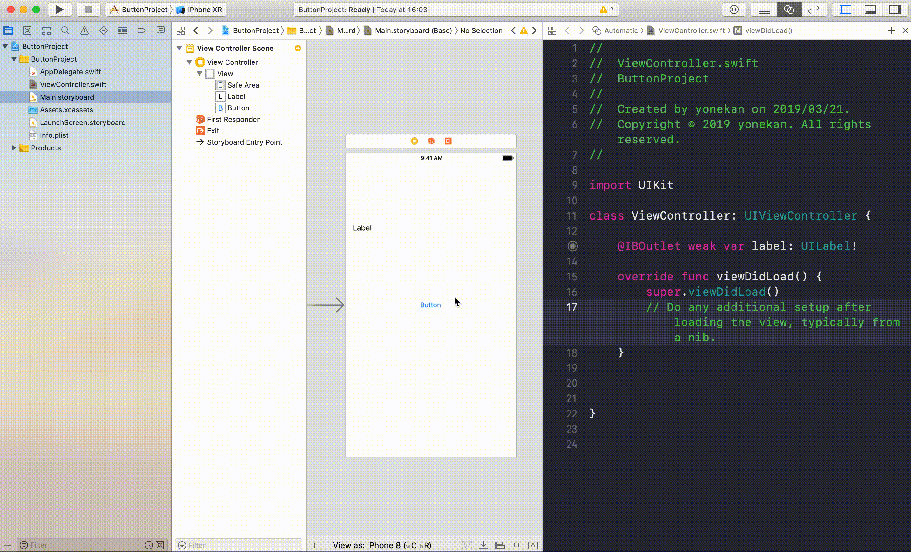
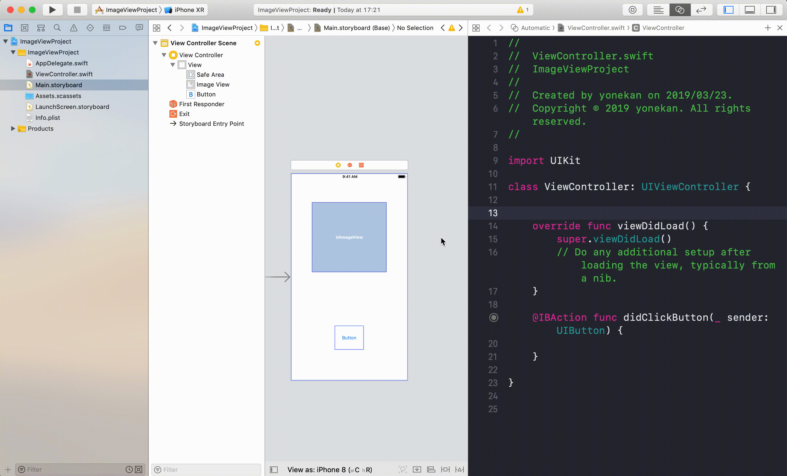
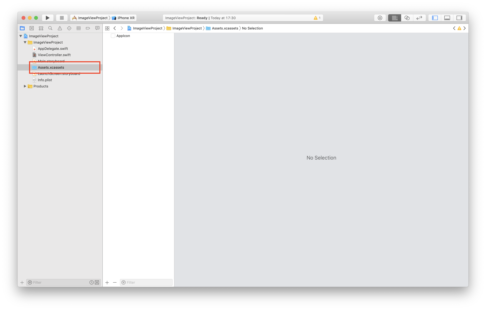
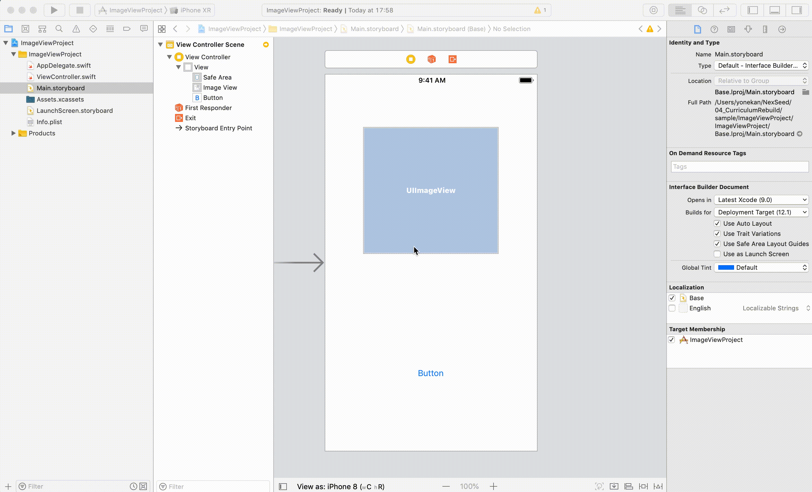
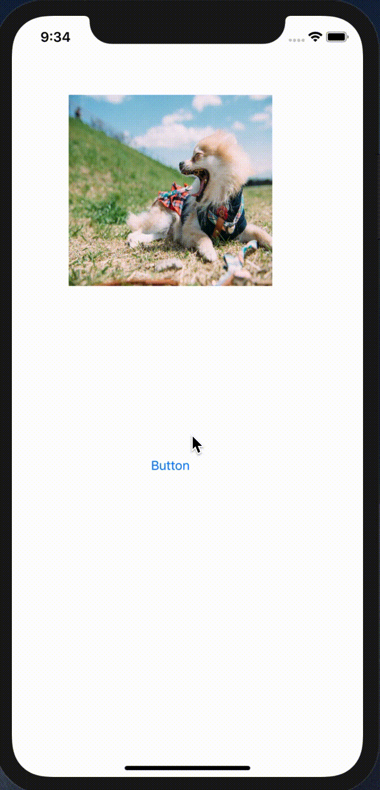

# UIImageView

## 目標
- UIImageViewが使えるようになうる

## 開発の流れ

1. 画面の部品を配置する
	- UIImageView, UIButtonの設置
2. 配置した画面の部品をプログラムで扱えるよう設定する
3. プロジェクトに画像を追加する
4. UIButtonが変更された時の処理を書く

## 部品の説明

|部品名|概要|
|---|---|
| UIImageView |画像を表示できる|

## 開発しよう

1. プロジェクトを作成する  
	[01_はじめてのアプリ開発](../s01_はじめてのアプリ開発.md)と同じように新規プロジェクトを作成する。  
	アプリ名：ImageViewProject
	
2. 画面の部品を配置する
	1. UIImageView, Buttonを配置する
		

3. 配置した画面の部品をプログラムで扱えるよう設定する
	1. 画面と対になるプログラムファイルを開く。  
		プログラムファイルを開きたい画面を選択し、右上の∞に似たアイコンをクリックする。  
		ViewController.swiftが開かれれば成功です。

	2. ButtonをViewController.swiftに接続する。  
	接続のためのウィンドウが表示されたら、Connection欄で「Action」を選択し、Name欄に「didClickButton」、Type欄に「UIButton」と入力し、「Connect」を選択。

	

	3. SwitchをViewController.swiftに接続する。  
	接続のためのウィンドウが表示されたら、Connection欄で「Outlet」を選択し、Name欄に「imageView」を入力し、「Connect」を選択。

		

4. ImageViewに画像を追加する。
	1. ナビゲーターエリアから「Assets.xcassets」を選択する。

		

	2. [配布](./配布)フォルダから「cat.jpg」、「dog.jpg」をダウンロードする。

	3. ダウンロードした「cat.jpg」、「dog.jpg」をAssets.xcassetsに追加する。
			

	4. ImageViewに画像を表示する。  
		ImageViewを選択し、ユーティリティエリア内の属性インスペクタを選択する。  
		Image欄に「dog」と入力する。
			

5. Buttonが押された時の処理を書く  
  ViewController内のdidClickButtonメソッドに以下のプログラムを追記する。

	``` 
	let catImage = UIImage(named: "cat")  
	imageView.image = catImage  
	```
  
	didClickButtonの完成形

	```
	@IBAction func didClickButton(_ sender: UIButton) {
		let catImage = UIImage(named: "cat")
		imageView.image = catImage  
	}
	```

6. プロジェクトを実行する。
	以下のように実行されれば成功です。
	

## 解説

### ImageVIewについて

``` 
let catImage = UIImage(named: "cat")
imageView.image = catImage  
```

1行目の部分で、画像名が「cat」の画像を探し、結果を定数catImageに保存しています。  
そして、その画像をImageViewのimageプロパティに設定しています。  
その結果、画面の画像が犬から猫に変わっています。

ImageViewにはimage以外にもプロパティが存在します。
画像の透明度の設定にはalphaプロパティを使用します。
0（透明）から1（不透明）の間で透明度を設定できます。
didClickButtonメソッドを以下のように修正して実行してみてください。

```
@IBAction func didClickButton(_ sender: UIButton) {
	let catImage = UIImage(named: "cat")
	imageView.image = catImage  
	imageView.alpha = 0.1
}
```