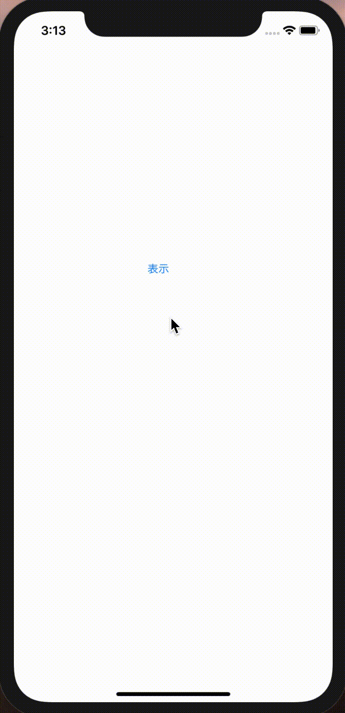
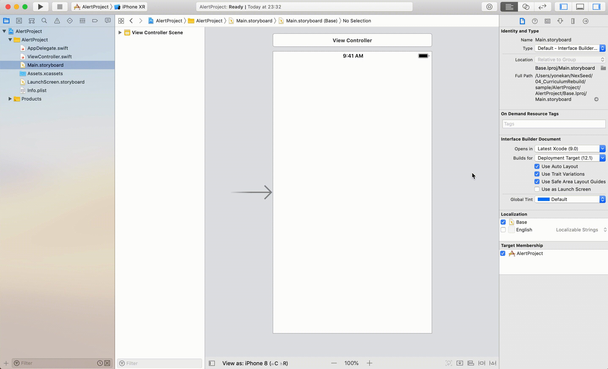
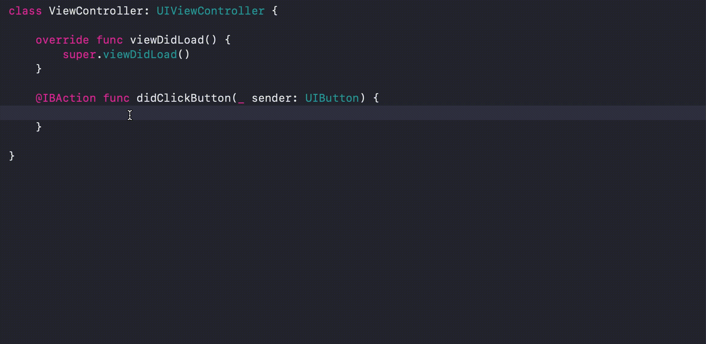
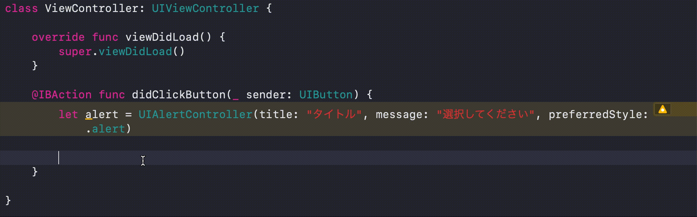
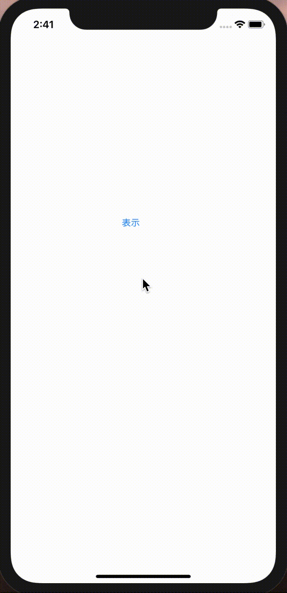
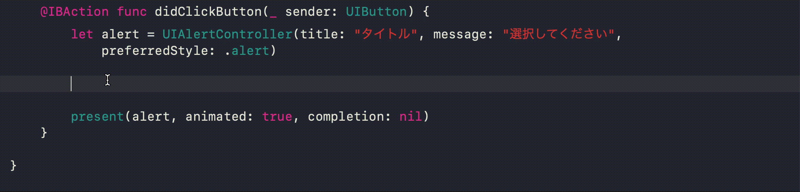
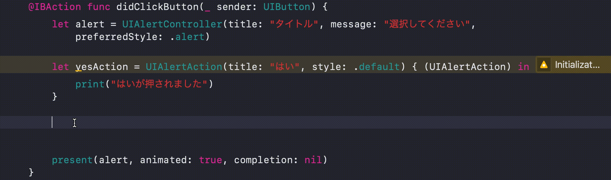
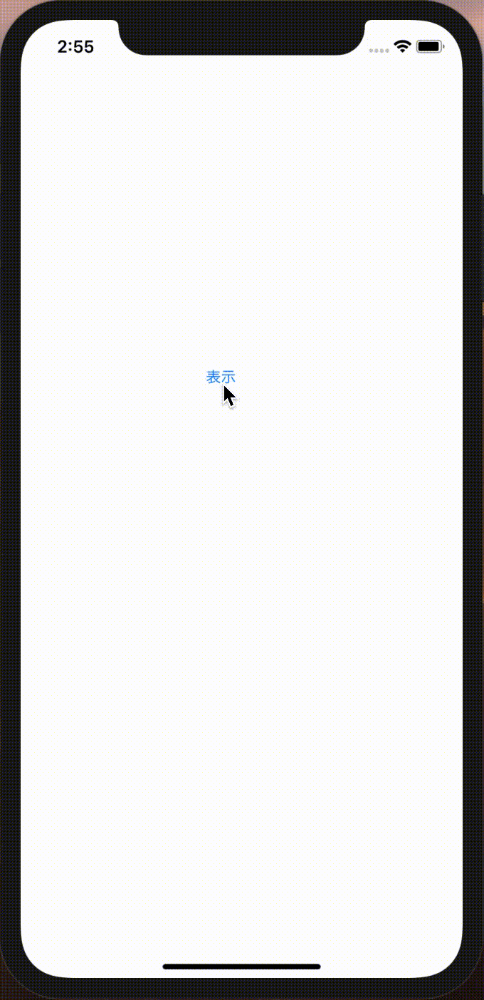
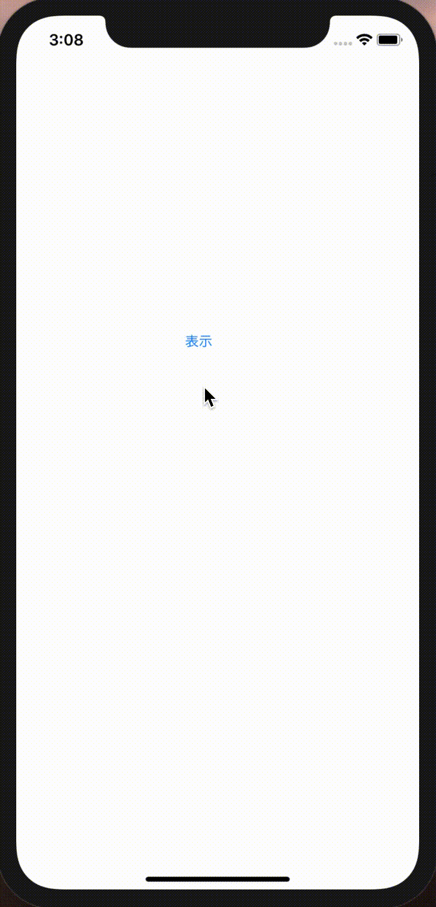

# UIAlert

## 目標
- UIAlertが使えるようになる

## 作成するアプリ  


## 開発の流れ

1. 画面の部品を配置する
	- Buttonの設置
2. 配置した画面の部品をプログラムで扱えるよう設定する
3. UIAlertの設定を書く

## 部品の説明

|部品名|概要|
|---|---|
| UIAlert |アラート表示ができる|

## 開発しよう

1. プロジェクトを作成する  
	[01_はじめてのアプリ開発](../01_はじめてのアプリ開発.md)と同じように新規プロジェクトを作成する。  
	アプリ名：AlertProject
	
2. 画面の部品を配置する
	1. UIButtonを配置する
	

3. 配置した画面の部品をプログラムで扱えるよう設定する
	1. 画面と対になるプログラムファイルを開く。  
		プログラムファイルを開きたい画面を選択し、右上の∞に似たアイコンをクリックする。  
		ViewController.swiftが開かれれば成功です。

	2. ButtonをViewController.swiftに接続する。  
	接続のためのウィンドウが表示されたら、Connection欄で「Action」を選択し、Name欄に「didClickButton」、Type欄に「UIButton」と入力し、「Connect」を選択。

	

4. didClickButtonメソッド内にUIAlertの設定を書く
	1. Alertの画面を作成する。

		```
		let alert = UIAlertController(title: "タイトル", message: "選択してください", preferredStyle: .alert)
		```

		

	2. 作成したAlert画面を表示する。

		```
		present(alert, animated: true, completion: nil)
		```

		

	3. 実行してみる。  
		以下のように実行されればOKです。  
		
	
	4. 通常の選択肢を作成し、追加する。

		1. 通常の選択肢を作成する

			```
			let yesAction = UIAlertAction(title: "はい", style: .default) { (UIAlertAction) in
				print("はいが押されました")
			}
			```

			

		2. 作成した選択肢をアラート画面に追加する

			```
			alert.addAction(yesAction)
			```

			

		3. 実行してみる。  
			以下のように実行されればOKです。  

			
			
	5. 否定の選択肢を作成し、追加する。
		1. 否定の選択肢を作成する

			```
			let noAction = UIAlertAction(title: "いいえ", style: .destructive) { (UIAlertAction) in
				print("いいえが押されました")
			}
			```

		2. 作成した選択肢をアラート画面に追加する

			```
			alert.addAction(noAction)
			```

			<details><summary>ここまでで出来上がったdidClickButton</summary><div>

			```
			@IBAction func didClickButton(_ sender: UIButton) {
				let alert = UIAlertController(title: "タイトル", message: "選択してください", preferredStyle: .alert)
			
				let yesAction = UIAlertAction(title: "はい", style: .default) { (UIAlertAction) in
					print("はいが押されました")
				}
			
				let noAction = UIAlertAction(title: "いいえ", style: .destructive) { (UIAlertAction) in
					print("いいえが押されました")
				}
			
				alert.addAction(yesAction)
				alert.addAction(noAction)
			
			
				present(alert, animated: true, completion: nil)
			}
			```
			</div></details>

		3. 実行してみる。  
			以下のように実行されればOKです。  

			

	6. キャンセルの選択肢を作成し、追加する。
		1. キャンセルの選択肢を作成する

			```
			let cancelAction = UIAlertAction(title: "キャンセル", style: .cancel) { (UIAlertAction) in
        print("キャンセルが押されました")
      }
			```

		2. 作成した選択肢をアラート画面に追加する

			```
			alert.addAction(cancelAction)
			```

			<details><summary>ここまでで出来上がったdidClickButton</summary><div>

			```
			@IBAction func didClickButton(_ sender: UIButton) {
				let alert = UIAlertController(title: "タイトル", message: "選択してください", preferredStyle: .alert)

				let yesAction = UIAlertAction(title: "はい", style: .default) { (UIAlertAction) in
				    print("はいが押されました")
				}

				let noAction = UIAlertAction(title: "いいえ", style: .destructive) { (UIAlertAction) in
				    print("いいえが押されました")
				}

				let cancelAction = UIAlertAction(title: "キャンセル", style: .cancel) { (UIAlertAction) in
				    print("キャンセルが押されました")
				}

				alert.addAction(yesAction)
				alert.addAction(noAction)
				alert.addAction(cancelAction)

				present(alert, animated: true, completion: nil)
			}
			```
			</div></details>

		3. 実行してみる。  
			以下のように実行されればOKです。  

			
		
## 解説
### Alert選択肢の種類
アラートの選択肢には3つの種類があり、それぞれ以下のような特徴があります。  
	
|名称|特徴|
|---|---|
|default|通常の選択肢。複数個作成できる|
|destructive|否定的な意味合いの選択肢。赤文字にある|
|cancel|アラート内に1つしか作成できず、1番下に表示される|
