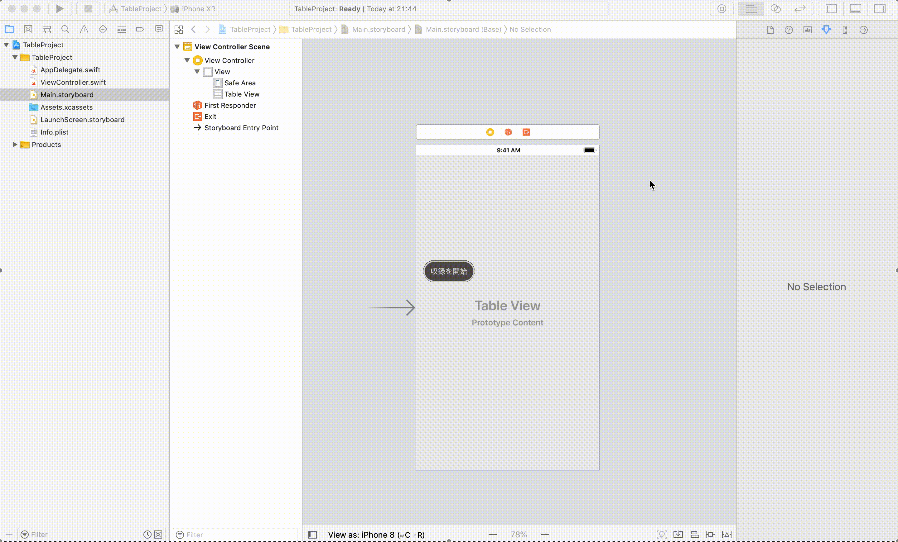
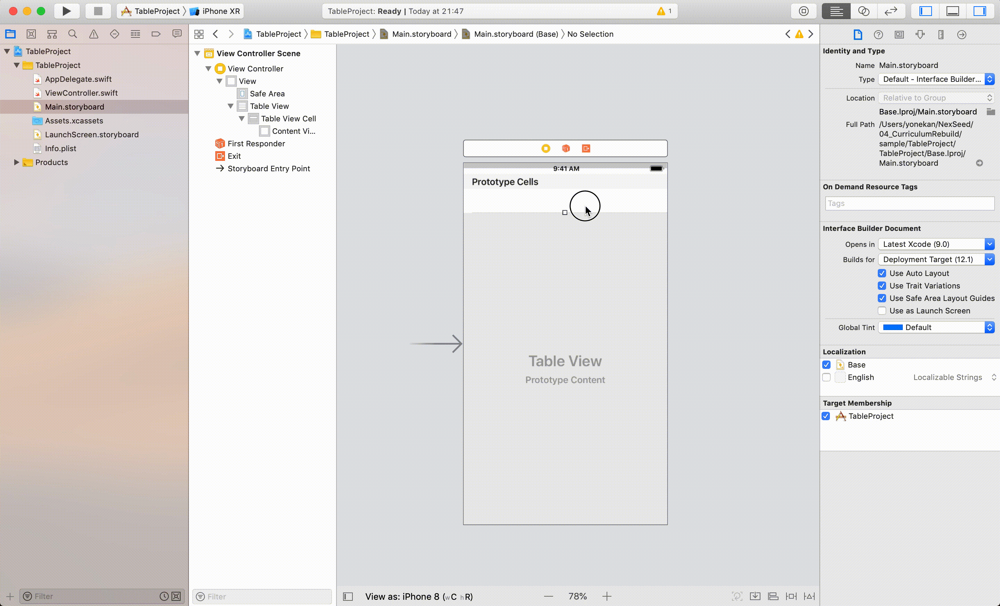
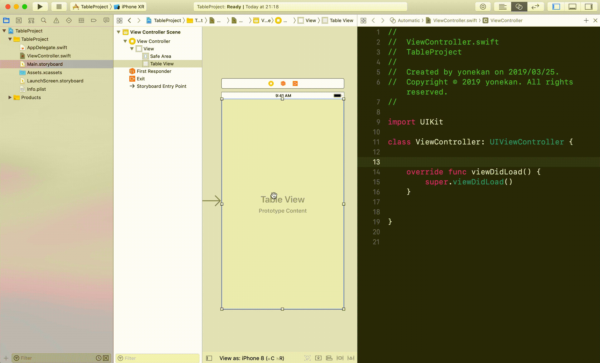

# UITableView

## 目標
- UITableViewが使えるようになる

## 開発の流れ

1. 画面の部品を配置する
	- UITableViewの設置
2. 配置した画面の部品をプログラムで扱えるよう設定する
3. UITableViewの設定を書く

## 部品の説明

|部品名|概要|
|---|---|
| UITableView |行に分けてデータを表示できる|

## 開発しよう

1. プロジェクトを作成する  
	[01_はじめてのアプリ開発](../s01_はじめてのアプリ開発.md)と同じように新規プロジェクトを作成する。  
	アプリ名：TableProject
	
2. 画面の部品を配置する
	1. UITableViewを配置する
	

	2. UITableViewCellを配置する
	

	3. 配置したUITableViewCellに識別子（名前）をつける
		UITableViewCellを選択し、ユーティリティエリアの属性インスペクタを選択する。  
		identifierに「tableViewCell」と入力する。
	

3. 配置した画面の部品をプログラムで扱えるよう設定する
	1. 画面と対になるプログラムファイルを開く。  
		プログラムファイルを開きたい画面を選択し、右上の∞に似たアイコンをクリックする。  
		ViewController.swiftが開かれれば成功です。

	2. UITableViewをViewController.swiftに接続する。  
	接続のためのウィンドウが表示されたら、Connection欄で「Outlet」を選択し、Name欄に「tableView」、Type欄に「UITableView」と入力し、「Connect」を選択。

	

4. UITableViewの設定を書く
	1. ViewController.swiftにTableViewを使うためのプロトコルを追加する。

		> プロトコルとは**約束事**のことです。  
		> 今回の場合だと、TableViewを使う際の約束事が定義されたファイルを追加していると考えてください。

		``` 
		class ViewController: UIViewController {
		```

		この部分を以下に以下の２つのプロトコルを追加してください。
		- UITableViewDelegate
		- UITableViewDataSource

		修正後のViewController

		```
		class ViewController: UIViewController, UITableViewDelegate, UITableViewDataSource {
		```
  
	2. UITableViewの行数と、UITableViewの表示する内容を定義する。
		> UITableViewDelegate, UITableViewDataSourceを追加するとエラーが発生したと思います。  
		> TableViewに必要な約束事を定義していないからです。  
		> これからその約束事をそれぞれ定義していきましょう。

		1. 設定に必要な関数を追加する。
			以下の２つの関数をviewDidLoadの下に追加してください。

			```
			func tableView(_ tableView: UITableView, numberOfRowsInSection section: Int) -> Int {
        <#code#>
    	}
    
    	func tableView(_ tableView: UITableView, cellForRowAt indexPath: IndexPath) -> UITableViewCell {
        <#code#>
    	}
			```

			追加後のViewController

			```
			class ViewController: UIViewController, UITableViewDelegate, UITableViewDataSource {

		    @IBOutlet weak var tableView: UITableView!
    
    		override func viewDidLoad() {
        	super.viewDidLoad()
    		}

    		func tableView(_ tableView: UITableView, numberOfRowsInSection section: Int) -> Int {
        	<#code#>
    		}
    
    		func tableView(_ tableView: UITableView, cellForRowAt indexPath: IndexPath) -> UITableViewCell {
        	<#code#>
    		}

			}
			```

			各メソッドの説明

			|メソッド名|概要|
			|---|---|
			|func tableView(_ tableView: UITableView, numberOfRowsInSection section: Int)|TableViewの行数を設定する|
			|func tableView(_ tableView: UITableView, cellForRowAt indexPath: IndexPath)|TableViewに表示する内容を設定する|

		2. PickerViewに表示する内容を保持した配列を追加する。  
			以下のような配列を作成し、下記のプログラムの下に定義してください。  
			```@IBOutlet weak var tableView: UITableView!```  

			|配列名|内容|
			|---|---|
			|fruits|cherry, banana, apple, melon|
			
			<details><summary>回答例</summary><div>
	
			```
			@IBOutlet weak var pickerView: UIPickerView!
    
			let fruits = ["cherry", "banana", "apple", "melon"]
			
			override func viewDidLoad() {
				super.viewDidLoad()
			}
			```
			</div></details>

		3. UITableViewの行数を定義する。  
		  func tableView(_ tableView: UITableView, numberOfRowsInSection section: Int)メソッドに以下のプログラムを追記する。

			```
			return fruits.count
			```

			func tableView(_ tableView: UITableView, numberOfRowsInSection section: Int)の完成形

			```
			func tableView(_ tableView: UITableView, numberOfRowsInSection section: Int) -> Int {
				return fruits.count
			}
			```

			> 解説  
			> TableViewには配列に格納されたフルーツ名を順番に全て表示するので、  
			> 配列の要素数を返すcountメソッドを使ってTableViewの行数を設定しています。

		4. UITableViewに表示する内容を定義する。  
		  func tableView(_ tableView: UITableView, cellForRowAt indexPath: IndexPath)に以下のプログラムを追記する。

			```
			let cell = tableView.dequeueReusableCell(withIdentifier: "tableViewCell", for: indexPath)
        
      cell.textLabel?.text = fruits[indexPath.row]
        
    	return cell
			```

			func tableView(_ tableView: UITableView, cellForRowAt indexPath: IndexPath)の完成形

			```
			func tableView(_ tableView: UITableView, cellForRowAt indexPath: IndexPath) -> UITableViewCell {
        let cell = tableView.dequeueReusableCell(withIdentifier: "tableViewCell", for: indexPath)
        
        cell.textLabel?.text = fruits[indexPath.row]
        
        return cell
    	}
			```
	
			> 解説  
			> ここでは1行目から最後の行まで表示する文字を設定します。  
			> ```let cell = tableView.dequeueReusableCell(withIdentifier: "tableViewCell", for: indexPath)```
			> この部分でテーブルのセルをidentifier（識別子）を元に取得しています。  
			> ```cell.textLabel?.text = fruits[indexPath.row]```  
			> この部分で取得したセルのテキストに文字を設定しています。  
			> 引数indexPathのrowプロパティには何行目かの行番号が入っています。1行目の場合にはindexPath.rowに0が入っています。  
			> 今回は配列fruitsが保持する文字を順番に表示したいので、```fruits[row]```としています。  
			> そして最後に、文字を設定し終えたセルを```return```で返しています。

		5. 画面のTableViewに設定を反映する。
		  ここまででViewControllerに以下の設定を追加しました。

			- UITableViewの行数
			- UITableViewに表示する内容

			これらの設定を```@IBOutlet weak var tableView: UITableView!```に反映させましょう。  
			viewDidLoadに以下のプログラムを追記してください。

			```
			tableView.delegate = self
			tableView.dataSource = self
			```

			viewDidLoadの完成形

			```
			override func viewDidLoad() {
				super.viewDidLoad()

				tableView.delegate = self
				tableView.dataSource = self
    	}
			```

5. プロジェクトを実行する。
	以下のように実行されれば成功です。
	