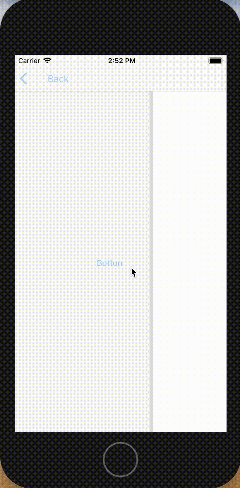
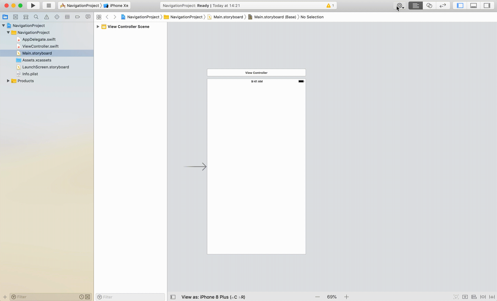
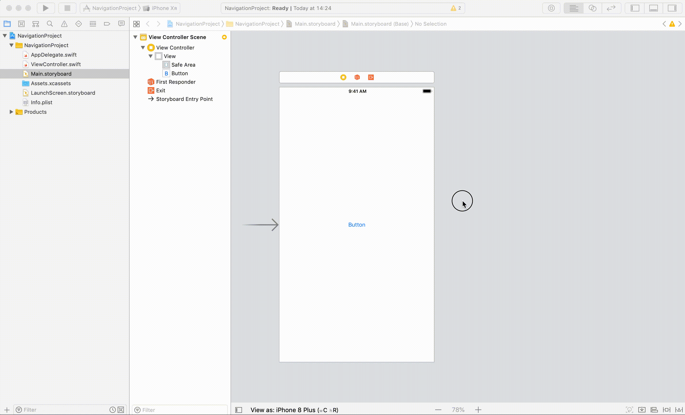
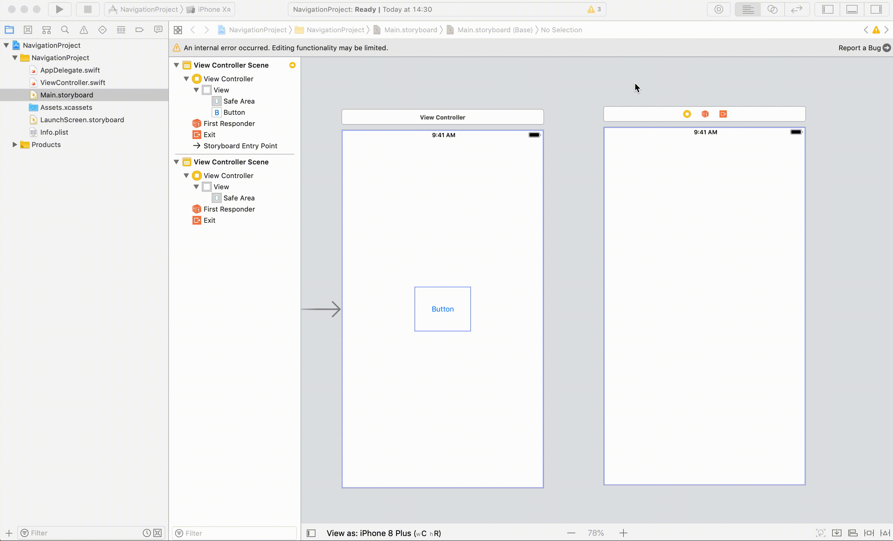
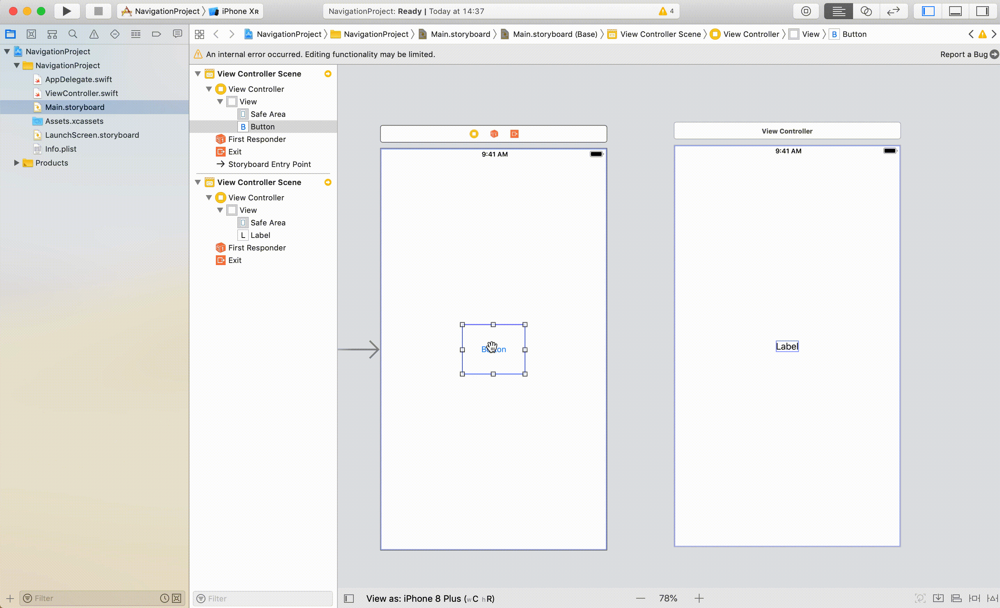
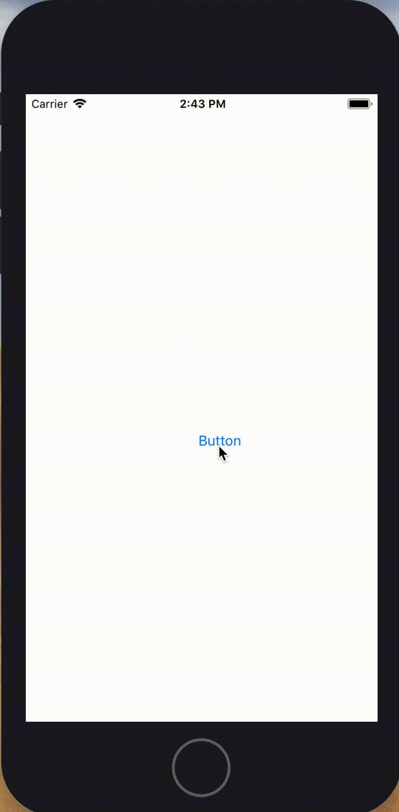
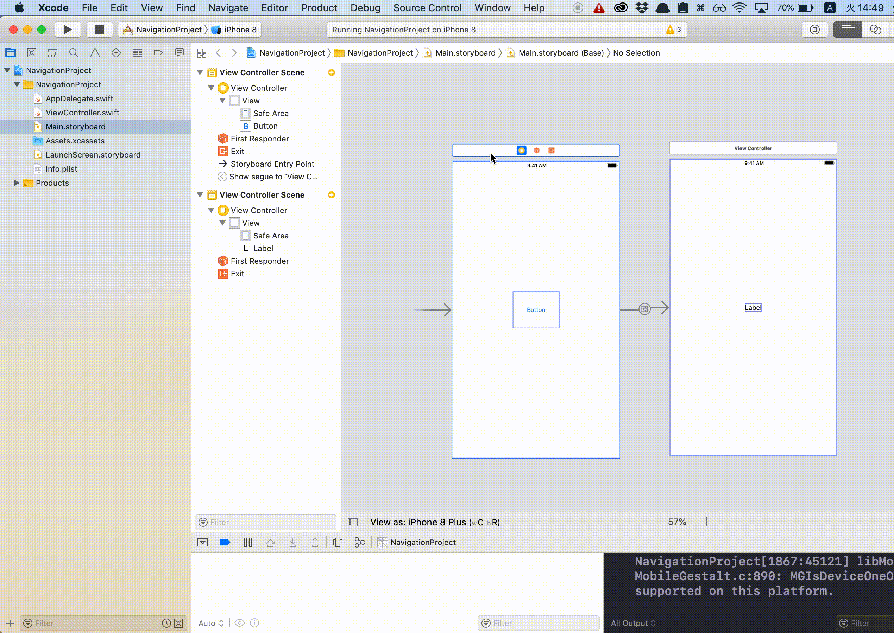

# UINavigationController

## 目標
- UINavigationControllerが使えるようになる

## 作成するアプリ  

## 開発の流れ

1. 画面の部品を配置する
	- Buttonの設置
	- ViewControllerの設置
2. 次画面に遷移するよう設定する
3. UINavigationControllerの設置

## 部品の説明

|部品名|概要|
|---|---|
| UINavigationController |自動的に画面の履歴を管理して戻るを実装できる|

## 開発しよう

1. プロジェクトを作成する  
	[01_はじめてのアプリ開発](../01_はじめてのアプリ開発.md)と同じように新規プロジェクトを作成する。  
	アプリ名：NavigationProject
	
2. 画面の部品を配置する
	1. Buttonを配置する
	

	2. ViewControllerを配置する
	

	3. 次画面にLabelを配置する
	

3. 次画面に遷移するよう設定する
	1. 配置したButtonと次画面画面とつなげる。  
		Buttonを選択し、Ctrlキーを押しながら、ViewControllerまでドラッグする。  
		接続時に表示されたウィンドウで、「show」を選択する

		

	2. 実行してみる。  
		以下のように実行されればOKです。  

		

4. UINavigationControllerの設置する
	最初の画面を選択し、上のメニューから「Editor」→「Embed in」→ 「Navigation Controller」を選択する
	
	
	
5. 実行してみる。
	以下のように実行されればOKです。  

	