# 画面遷移

## 目標
- 画面遷移ができるようになる

## 開発の流れ

1. 画面の部品を配置する
	- UIButtonの設置
	- UITextFieldの設置
	- ViewController（次画面）の設置
2. 画面遷移の処理を書く
3. 次画面に値を渡す処理を書く

## 開発しよう

1. プロジェクトを作成する  
	[01_はじめてのアプリ開発](../01_はじめてのアプリ開発.md)と同じように新規プロジェクトを作成する。  
	アプリ名：PageTransitionProject
	
2. 画面の部品を配置する
	1. TextField, Buttonを以下のように配置する。  
		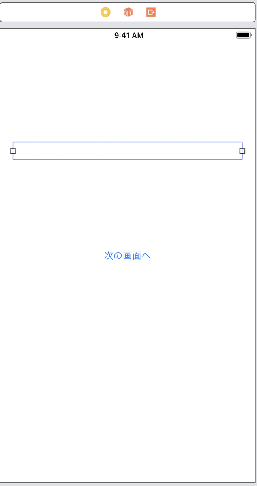

	2. ViewController（次画面）を配置する。
		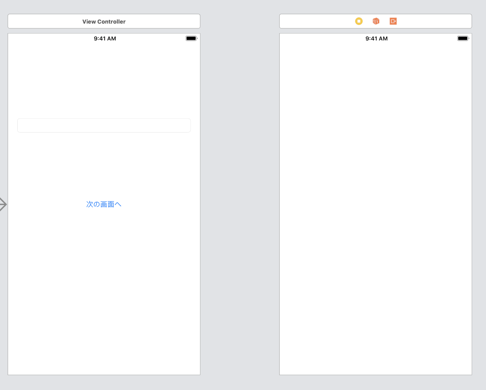

3. 配置した画面の部品をプログラムで扱えるよう設定する
	1. 配置したTextField, ButtonをViewController.swiftに接続する。

		|部品|接続時のName|
		|---|---|
		|UITextField|textField|
		|UIButton|didClickButton|

	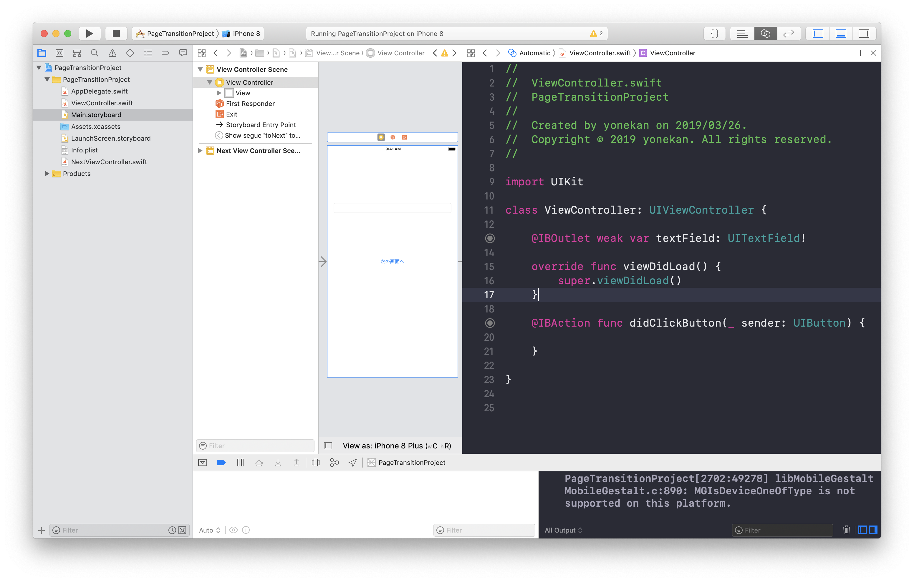

4. 画面遷移の処理を書く
	1. Main.storyboardでTop画面と次画面を接続する。  
		TOP画面を選択し、Ctrlキーを押しながら、次画面までドラッグする。   
		接続時に表示されたウィンドウで、「show」を選択する

		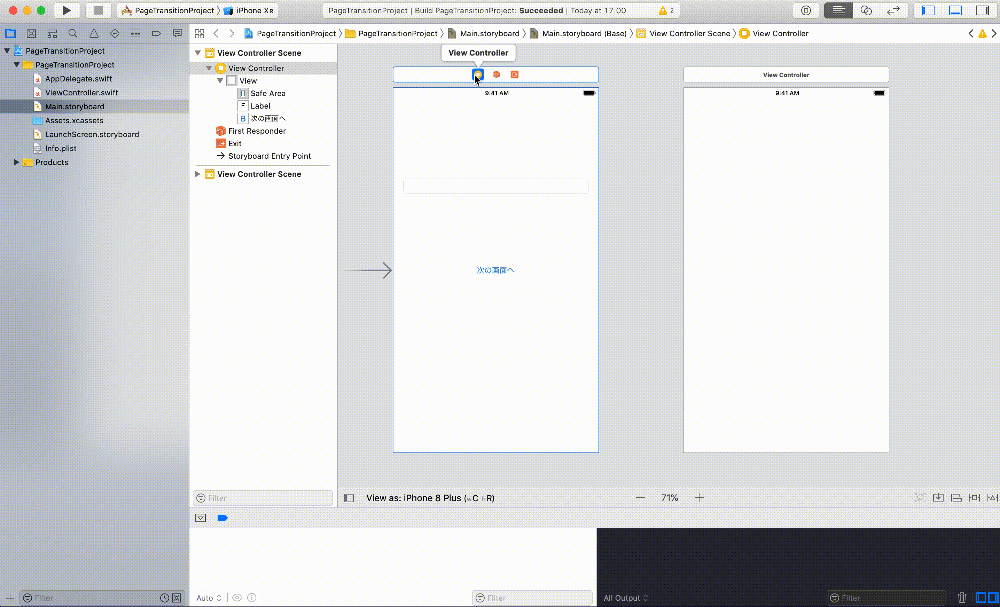

	2. 画面遷移の接続を表す矢印に識別子（名前）を設定する
		矢印を選択し、ユーティリティエリアの属性インスペクタを選択する。  
		identifierに「toNext」と入力する。

		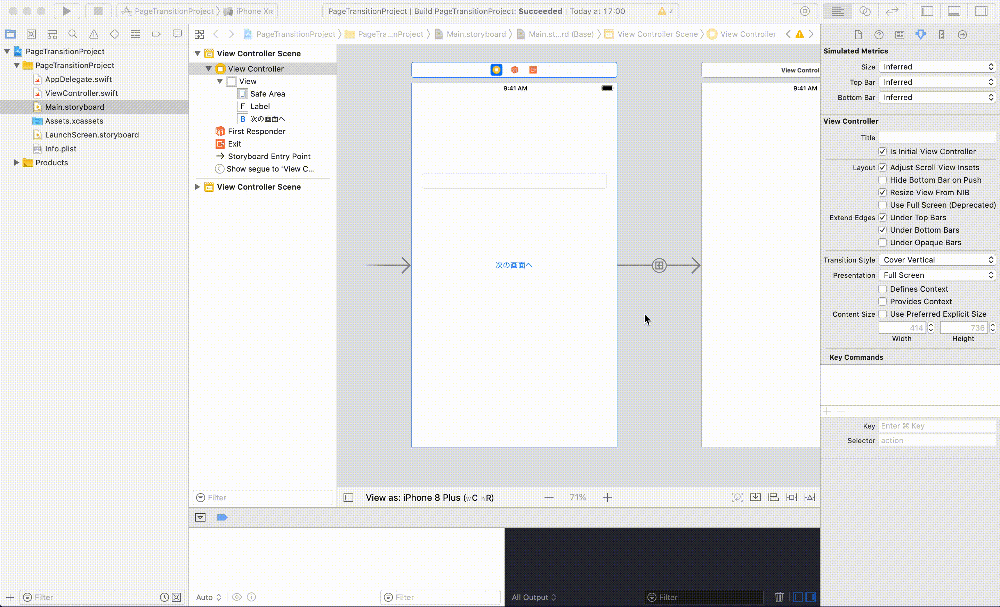

	3. didClickButtonで画面遷移の処理を書く
		以下の処理をdidClickButtonに追記する。
		```
		performSegue(withIdentifier: "toNext", sender: nil)
		```

		追記後のdidClickButton
		
		```
		@IBAction func didClickButton(_ sender: UIButton) {
			performSegue(withIdentifier: "toNext", sender: nil)
		}
		```

		> 解説  
		> performSegueは画面遷移のための関数です。  
		> withIdentifierには矢印の名前（identifier）を、
		> senderには遷移先の画面に渡したい値を設定します。

	4. 実行してみる
		以下のようになればOKです  
		
		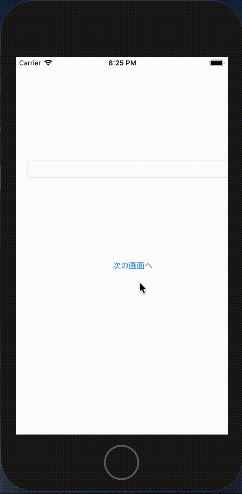

5. 次画面に値を渡す処理を書く
	1. 次画面の準備
		1. NextViewController.swiftを作成する
			

		2. 作成したNextViewController.swiftをMain.storyboardの次画面と接続する
			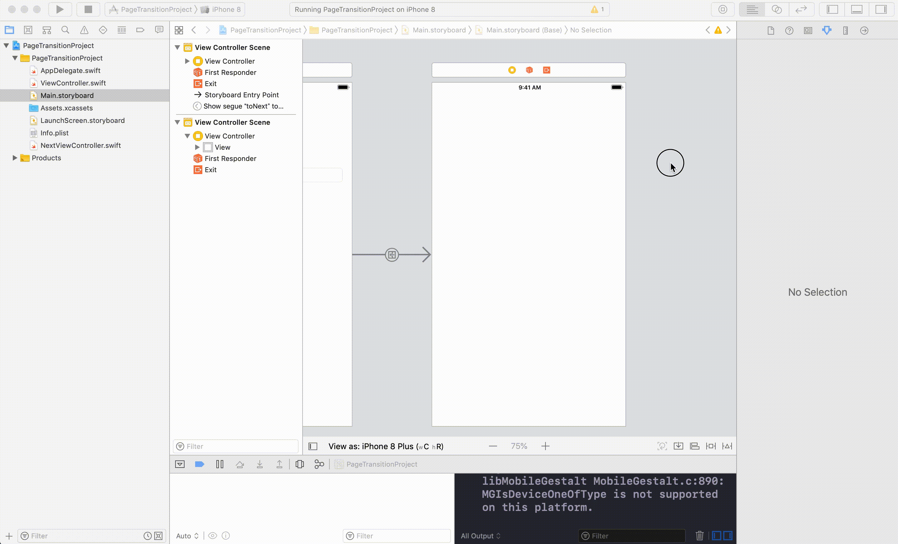

		3. UILabelを配置する
			UILabelを以下のように配置する。  
			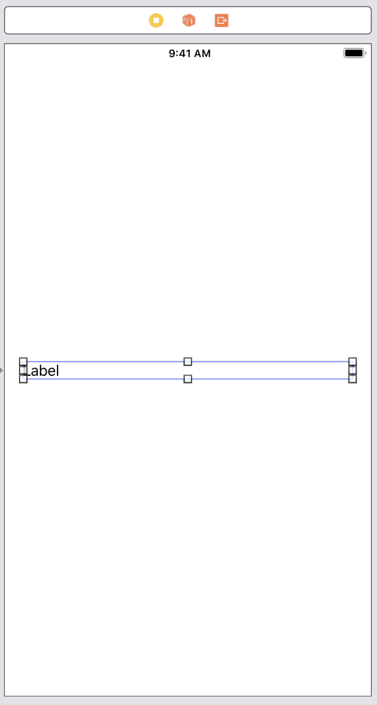

		4. 配置したUILabelをNextViewController.swiftに接続する。

			|部品|接続時のName|
			|---|---|
			|UILabel|label|

			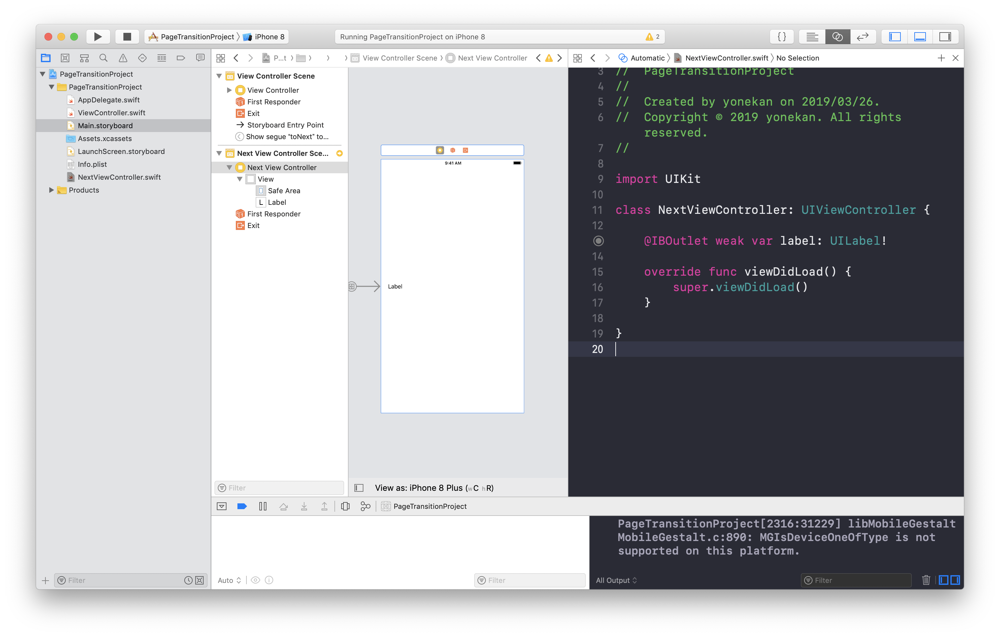

		5. 次画面から入力値を受け取る変数を用意する。
			```@IBOutlet weak var label: UILabel!```の下に変数value（初期値：空です）を用意する。  
			また、```viewDidLoad```で変数valueの値をlabelに設定するプログラムを追記する。

			変数valueを追加後のNextViewController

			```
			class NextViewController: UIViewController {

    			@IBOutlet weak var label: UILabel!
    
    			var value = "空です"
    
    			override func viewDidLoad() {
        			super.viewDidLoad()
        
        			label.text = value
    			}

			}
			```

			6. 実行してみる
				以下のようになればOKです  
				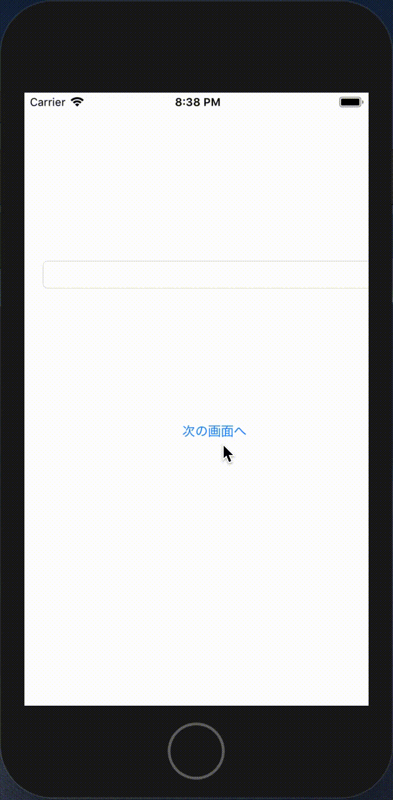
			
	2. ViewController.swiftでNextViewController.swiftに値を渡す処理を書く
		1. didClickButtonにテキストフィールドの値を次画面に渡す処理を追記する。

			追記後のdidClickButton
			
			```
			@IBAction func didClickButton(_ sender: UIButton) {
		      	let inputValue = textField.text
        		performSegue(withIdentifier: "toNext", sender: inputValue)
    		}
			```

			> 解説  
			> performSegueの引数senderにテキストフィールドの入力値を設定しています。  
			> senderには遷移先の画面に渡したい値を設定します。

		2. 次画面に渡す値を次画面のViewControllerの特定のプロパティ（変数）に設定する。
			1. ```prepare```メソッドを追記する

				```
				override func prepare(for segue: UIStoryboardSegue, sender: Any?) {
        			<#code#>
    			}
				```

				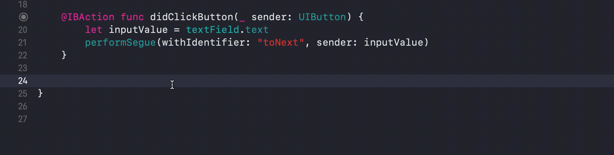

			2. 追記した```prepare```メソッド内でテキストフィールドの入力値をNextViewController.swiftの変数valueに設定する。  
				以下の処理を追記する。
				
				```
				if segue.identifier == "toNext" {
            		let nextVC = segue.destination as! NextViewController
            		nextVC.value = sender as! String
        		}
				```

				追記後のprepareメソッド

				```
				override func prepare(for segue: UIStoryboardSegue, sender: Any?) {
        			if segue.identifier == "toNext" {
          	  		let nextVC = segue.destination as! NextViewController
            			nextVC.value = sender as! String
        			}
    			}
				```

				#### 解説  ```segue.identifier == "toNext"```について  
				1つのページから複数のページに遷移することがあります。
				例えば、1つのページに3つのボタンがあり、それぞれが別のページに遷移するパターンなどがあります。
				そして、ページ毎に渡す値を変えなければならない状況がでてきます。
				そこで、```segue.identifier == "toNext"```の部分でこれから遷移しようとしている画面がどの画面なのか判定して、  
				それぞれの遷移先画面に合わせて渡す値を設定しています。  
				今回の場合、NextViewController.swiftに遷移する矢印の名前（identifier）は「toNext」なので、その名前を条件に使用しています。

				#### 解説 ```let nextVC = segue.destination as! NextViewController```について  
				この部分で遷移先画面のViewControllerを取得しています。  
				取得後、```nextVC.value = sender as! String```として、```didClickButton```内の```performSegue```で設定したsenderの値をNextViewControllerの変数valueに設定しています。

6. 実行してみる  
	以下のようになればOKです
		
	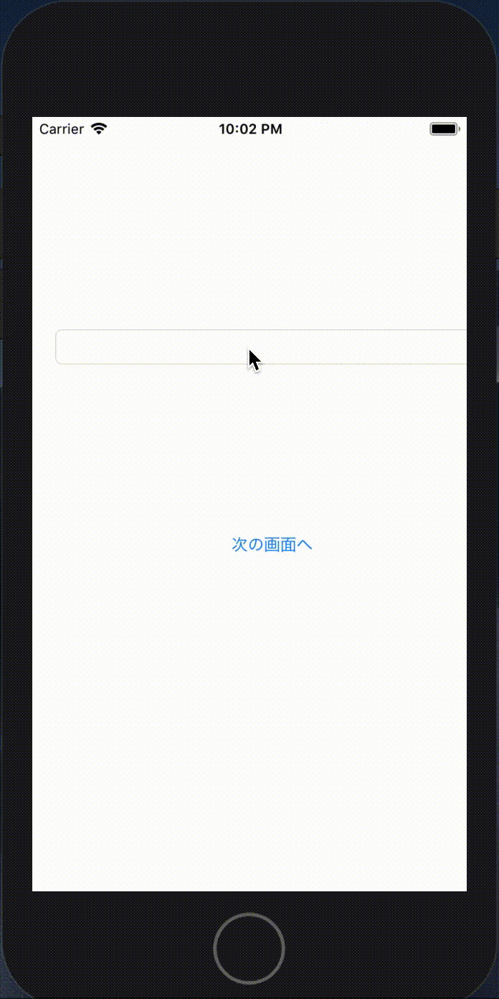