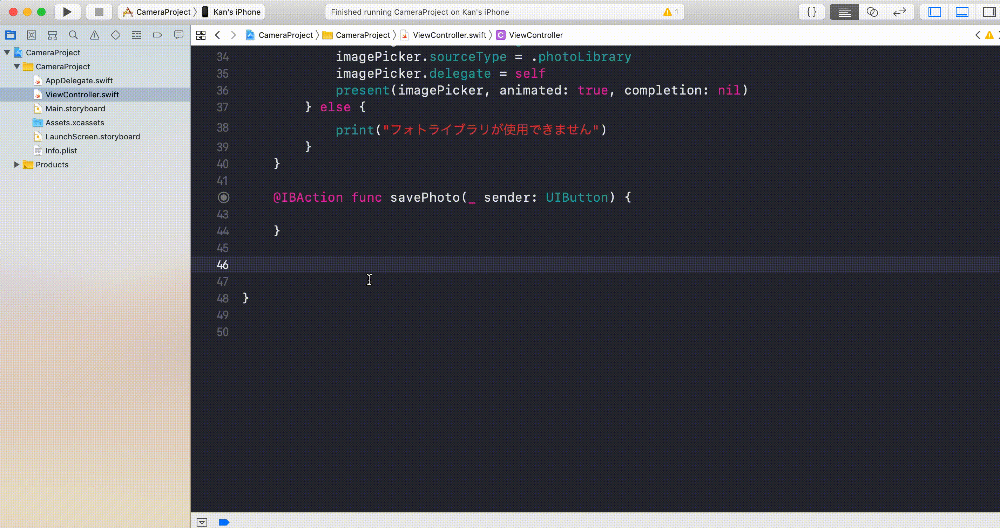

# Camera  

## 目標
- カメラが使えるようになる

## 作成するアプリ


## 開発の流れ
1. 画面の部品を配置する
2. カメラ・フォトライブラリのアクセス利用設定
3. カメラ撮影機能
4. フォトライブラリ表示機能
5. 撮影または選択された画像の表示機能
6. 写真保存機能

## 開発しよう
1. プロジェクトを作成する  
  アプリ名：CameraProject

2. 画面の部品を配置する
    1. 以下のような画面になるよう部品を配置する  
        
  
    2. 配置した部品をViewController.swiftに接続する。
    
        |部品|接続時のName|
        |---|---|
        |UIImageView|imageView|
        |UIButton（カメラ）|runCamera|
        |UIButton（アルバム）|showAlbum|
        |UIButton（保存）|savePhoto|

        

    3. デザインの制約を追加する。
        Main.storyboardで画面を選択し、右下にある「Pinボタン」内の「Add Missing Constraints」を選択する。
        > この作業をすることで、画面サイズによるデザインのずれを解決します。
        

3. ユーザー許可の設定をする
    Info.plistに以下のKeyとValueをを追加する

    - NSCameraUsageDescription
      - Privacy – Camera Usage Description
    - NSPhotoLibraryAddUsageDescription
      - Privacy – Photo Library Additions Usage Description

    |Key|内容|
    |---|---|
    |Privacy – Camera Usage Description|アプリがカメラを使用する許可設定|
    |Privacy – Photo Library Additions Usage Description|アプリがフォトライブラリに追加する許可設定|

    1. 左のナビゲータ領域からInfo.plistを選択する。
      

    2. 「Privacy – Camera Usage Description」を追加する。
      

    3. 「Privacy – Photo Library Additions Usage Description」を追加する。
      

4. カメラ撮影機能
    1. ViewControllerにDelegateを追加する  
      以下のDelegateを追加する。
      	- UIImagePickerControllerDelegate
      	- UINavigationControllerDelegate

      Delegate追加後のViewController
      
      ```
      class ViewController: UIViewController, UIImagePickerControllerDelegate, UINavigationControllerDelegate {
      ``` 

    2. ```runCamera```メソッドにカメラ起動処理を追記する。
      以下の処理を追記してください。

      ```
      if UIImagePickerController.isSourceTypeAvailable(.camera) {
        	let cameraPicker = UIImagePickerController()
        	cameraPicker.sourceType = .camera
        	cameraPicker.delegate = self
        	present(cameraPicker, animated: true, completion: nil)
      } else {
        	print("カメラが使用できません")
      }
      ```

      追記後の```runCamera```メソッド

      ```
      @IBAction func runCamera(_ sender: UIButton) {
        	if UIImagePickerController.isSourceTypeAvailable(.camera) {
	            let cameraPicker = UIImagePickerController()
	            cameraPicker.sourceType = .camera
	            cameraPicker.delegate = self
	            present(cameraPicker, animated: true, completion: nil)
        	} else {
        		print("カメラが使用できません")
        	}
    	}
      ```

      > 解説  
      > ```if UIImagePickerController.isSourceTypeAvailable(.camera) {```  
      > この部分でアプリがカメラを使用することを許可されているか確認しています。  
      > 許可されている場合はtrue、それ以外はfalseが返却されます。  

      > ```let cameraPicker = UIImagePickerController()```  
      > ```cameraPicker.sourceType = .camera```  
      > ```cameraPicker.delegate = self```  
      > この部分でカメラの画面を作成しています。
      > ```cameraPicker.sourceType = .camera``` と指定することにより、
      > フォトライブラリではなく、カメラのみで起動するよう指定しています。

      > ```present(cameraPicker, animated: true, completion: nil)```  
      > この部分で作成したカメラの画面を表示しています。

5. フォトライブラリ表示機能

    1. ```showAlbum```メソッドにフォトライブラリ動処理を追記する。
      以下の処理を追記してください。

      ```
      if UIImagePickerController.isSourceTypeAvailable(.photoLibrary) {
          let imagePicker = UIImagePickerController()
          imagePicker.sourceType = .photoLibrary
          imagePicker.delegate = self
          present(imagePicker, animated: true, completion: nil)
      } else {
          print("フォトライブラリが使用できません")
      }
      ```

      追記後の```showAlbum```メソッド

      ```
      @IBAction func showAlbum(_ sender: UIButton) {
          if UIImagePickerController.isSourceTypeAvailable(.photoLibrary) {
              let imagePicker = UIImagePickerController()
              imagePicker.sourceType = .photoLibrary
              imagePicker.delegate = self
              present(imagePicker, animated: true, completion: nil)
          } else {
              print("フォトライブラリが使用できません")
          }
      }
      ```

      > 解説  
      > ```if UIImagePickerController.isSourceTypeAvailable(.photoLibrary) {```  
      > この部分でアプリがフォトライブラリを使用することを許可されているか確認しています。  
      > 許可されている場合はtrue、それ以外はfalseが返却されます。  

      > ```let imagePicker = UIImagePickerController()```  
      > ```imagePicker.sourceType = .photoLibrary```  
      > ```imagePicker.delegate = self```  
      > この部分でフォトライブラリの画面を作成しています。
      > ```imagePicker.sourceType = .photoLibrary``` と指定することにより、
      > カメラではなく、フォトライブラリのみで起動するよう指定しています。

      > ```present(imagePicker, animated: true, completion: nil)```  
      > この部分で作成したフォトライブラリの画面を表示しています。

6. 撮影または選択された画像の表示機能
    1. ```imagePickerController(_ picker: UIImagePickerController, didFinishPickingMediaWithInfo info: [UIImagePickerController.InfoKey : Any])```を追記する

      

    2. 上記で追加したメソッドに撮影または選択された画像を表示するプログラムを追記する

      追記後の```imagePickerController(_ picker: UIImagePickerController, didFinishPickingMediaWithInfo info: [UIImagePickerController.InfoKey : Any])```

      ```
      func imagePickerController(_ picker: UIImagePickerController, didFinishPickingMediaWithInfo info: [UIImagePickerController.InfoKey : Any]) {
        if let pickedImage = info[.originalImage] as? UIImage {
            imageView.image = pickedImage
            imageView.contentMode = .scaleAspectFit
        }
        
        picker.dismiss(animated: true, completion: nil)
      }
      ```

      > 解説  
      > ```imagePickerController(_ picker: UIImagePickerController, didFinishPickingMediaWithInfo info: [UIImagePickerController.InfoKey : Any])```  
      > このメソッドは写真が撮影が終わった時、またはフォトライブラリから写真が選択された後、自動で呼ばれるメソッドです。
      > このメソッドはUIImagePickerControllerDelegateに含まれています。  

      > ```if let pickedImage = info[.originalImage] as? UIImage {```
      > この部分で配列infoに入っている撮影または選択された写真を取り出しています。  
      > 写真が取り出せた場合はtrue、取り出せなかった場合はfalseになります。  
      > 配列infoには写真の他にもいくつかデータが入っています。（写真のURLやメディアのタイプなど）  
      > 配列infoから写真を取得したい場合は、```info[.originalImage]```とすることで取得できます。

      > ```imageView.image = pickedImage```
      > この部分で画面に配置したImageViewのimageプロパティに撮影または選択された画像を設定しています。

      > ```imageView.contentMode = .scaleAspectFit```
      > ここで、ImageViewの縦横比についての設定をしています。
      > scaleAspectFitは「縦横の比率はそのままで長い辺を基準に全体を表示する」という設定になります。

      > ```picker.dismiss(animated: true, completion: nil)```
      >  この処理を呼ぶことによって、モーダルで表示されていたカメラもしくはアルバムの画面を閉じています。
7. 表示されている画像の保存機能

    1. ```savePhoto```メソッドに画像をアルバムに保存する処理を追記する。  
    以下の処理を追記してください。
    
    ```
    let image = imageView.image
        
    if image != nil {
        UIImageWriteToSavedPhotosAlbum(
            image!,
            self,
            #selector(<#code#>),
            nil)
    }
    ```

    追記後の```savePhoto```メソッド

    ```
    @IBAction func savePhoto(_ sender: UIButton) {
        let image = imageView.image
        
        if image != nil {
            UIImageWriteToSavedPhotosAlbum(
                image!,
                self,
                #selector(<#code#>),
                nil)
        }
    }
    ```

    2. 写真保存後に実行される関数を作成する。

    ```
    @objc func didFinishSavePhoto(_ image: UIImage,
                     didFinishSavingWithError error: NSError!,
                     contextInfo: UnsafeMutableRawPointer) {
        
        if error != nil {
            print("写真の保存に失敗しました。")
            print(error.code)
        } else {
            print("写真を保存しました")
        }
    }
    ```

    3. 上記で作成した```didFinishSavePhoto```を```savePhoto```メソッド内の```UIImageWriteToSavedPhotosAlbum```の引数に設定する。

    修正後の```UIImageWriteToSavedPhotosAlbum```

    ```
    UIImageWriteToSavedPhotosAlbum(
                image!,
                self,
                #selector(didFinishSavePhoto(_:didFinishSavingWithError:contextInfo:)),
                nil)
    ```

## 実行してみよう
