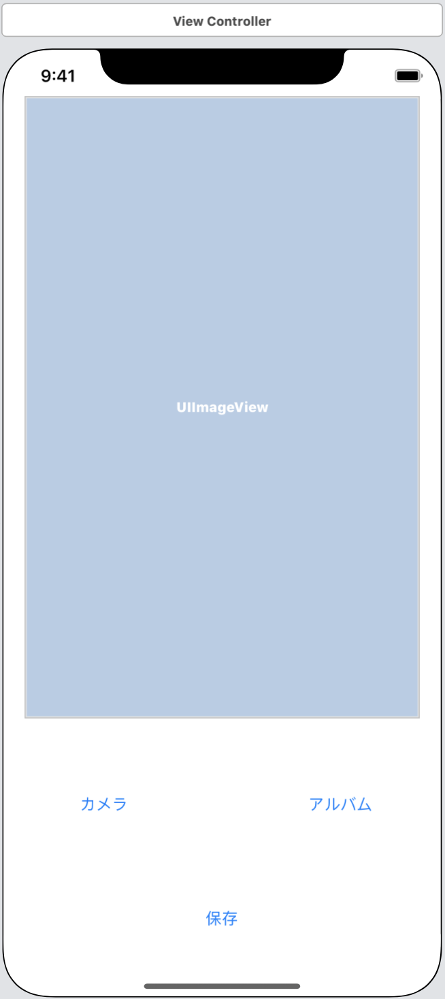
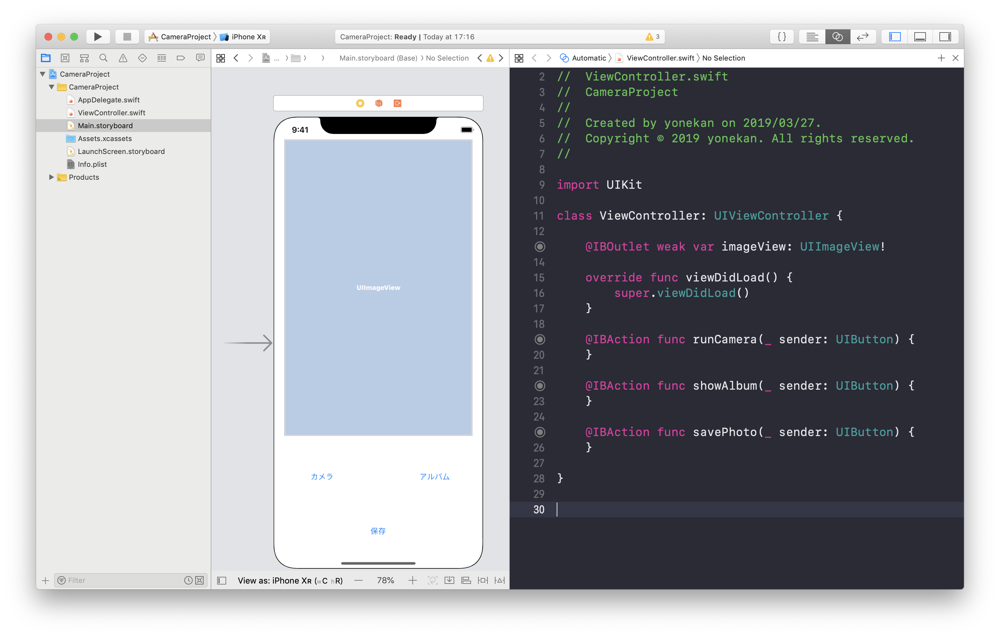
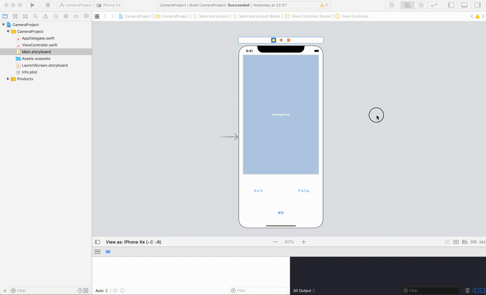
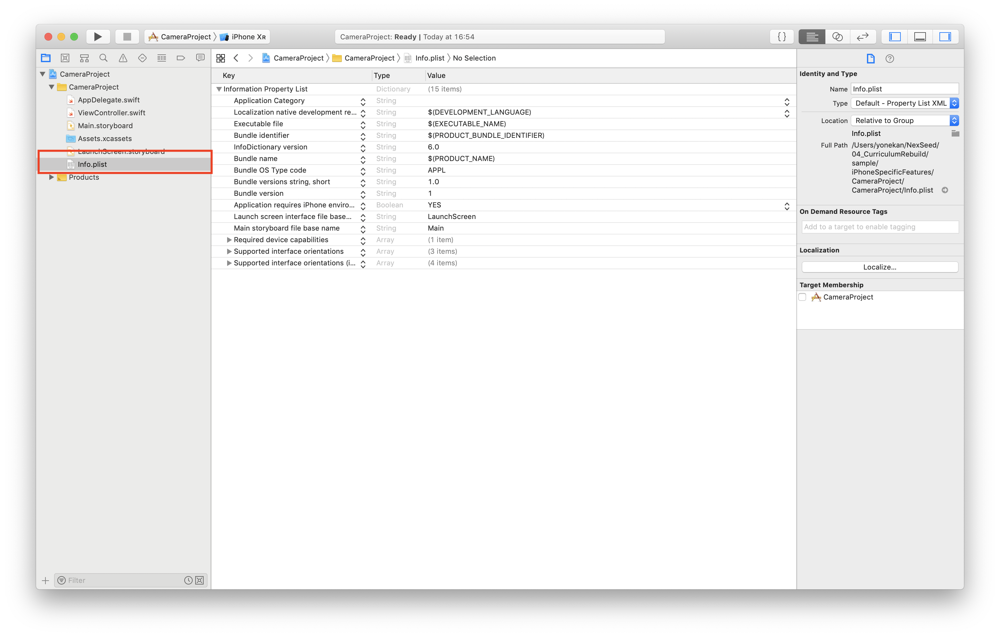
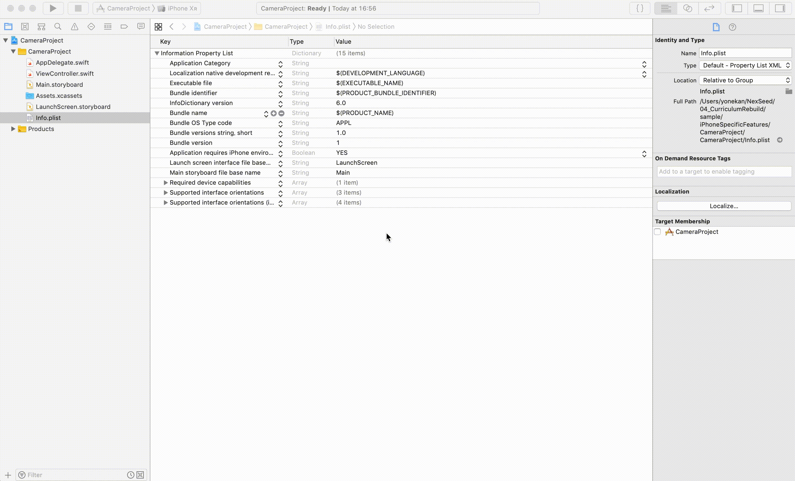
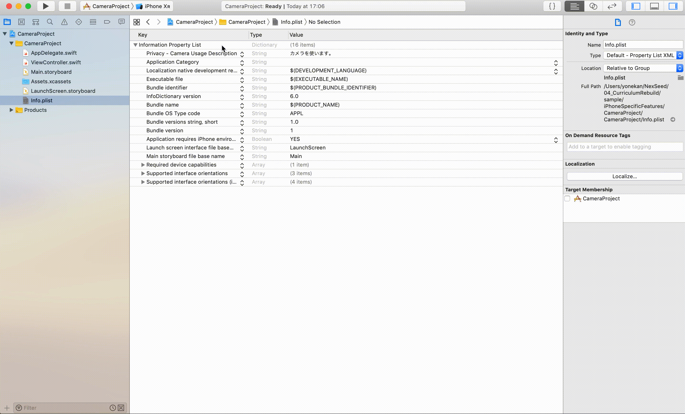

# Camera  

## 目標
- カメラが使えるようになる

## 作成するアプリ

## 開発の流れ
1. 画面の部品を配置する
2. カメラ・フォトライブラリのアクセス利用設定
3. カメラ撮影機能
4. フォトライブラリ表示
5. 写真保存機能

## 開発しよう
1. プロジェクトを作成する  
  アプリ名：CameraProject

2. 画面の部品を配置する
    1. 以下のような画面になるよう部品を配置する  
        
  
    2. 配置した部品をViewController.swiftに接続する。
    
        |部品|接続時のName|
        |---|---|
        |UIImageView|imageView|
        |UIButton（カメラ）|runCamera|
        |UIButton（アルバム）|showAlbum|
        |UIButton（保存）|savePhoto|

        

    3. デザインの制約を追加する。
        

3. ユーザー許可の設定をする
    Info.plistに以下のKeyとValueをを追加する

    - NSCameraUsageDescription
      - Privacy – Camera Usage Description
    - NSPhotoLibraryAddUsageDescription
      - Privacy – Photo Library Additions Usage Description

    |Key|内容|
    |---|---|
    |Privacy – Camera Usage Description|アプリがカメラを使用する許可設定|
    |Privacy – Photo Library Additions Usage Description|アプリがフォトライブラリに追加する許可設定|

    1. 左のナビゲータ領域からInfo.plistを選択する。
      

    2. 「Privacy – Camera Usage Description」を追加する。
      

    3. 「Privacy – Photo Library Additions Usage Description」を追加する。
      

4. カメラ撮影機能
    1. ViewControllerにDelegateを追加する
      以下のDelegateを追加する。
      - UIImagePickerControllerDelegate
      - UINavigationControllerDelegate

      Delegate追加後のViewController
      
      ```
      class ViewController: UIViewController, UIImagePickerControllerDelegate, UINavigationControllerDelegate {
      ``` 

    2. ```runCamera```メソッドにカメラ起動処理を追記する。
      以下の処理を追記してください。

      ```
      if UIImagePickerController.isSourceTypeAvailable(.camera) {
        	let cameraPicker = UIImagePickerController()
        	cameraPicker.sourceType = .camera
        	cameraPicker.delegate = self
        	present(cameraPicker, animated: true, completion: nil)
      } else {
        	print("カメラが使用できません")
      }
      ```

      追記後の```runCamera```メソッド

      ```
      @IBAction func runCamera(_ sender: UIButton) {
        	if UIImagePickerController.isSourceTypeAvailable(.camera) {
	            let cameraPicker = UIImagePickerController()
	            cameraPicker.sourceType = .camera
	            cameraPicker.delegate = self
	            present(cameraPicker, animated: true, completion: nil)
        	} else {
        		print("カメラが使用できません")
        	}
    	}
      ```

      > 解説  
      > ```if UIImagePickerController.isSourceTypeAvailable(.camera) {```  
      > この部分でアプリがカメラを使用することを許可されているか確認しています。  
      > 許可されている場合はtrue、それ以外はfalseが返却されます。  

      > ```let cameraPicker = UIImagePickerController()```  
      > ```cameraPicker.sourceType = .camera```  
      > ```cameraPicker.delegate = self```  
      > この部分でカメラの画面を作成しています。
      > ```cameraPicker.sourceType = .camera``` と指定することにより、
      > フォトライブラリではなく、カメラのみで起動するよう指定しています。

      > ```present(cameraPicker, animated: true, completion: nil)```  
      > この部分で作成したカメラの画面を表示しています。