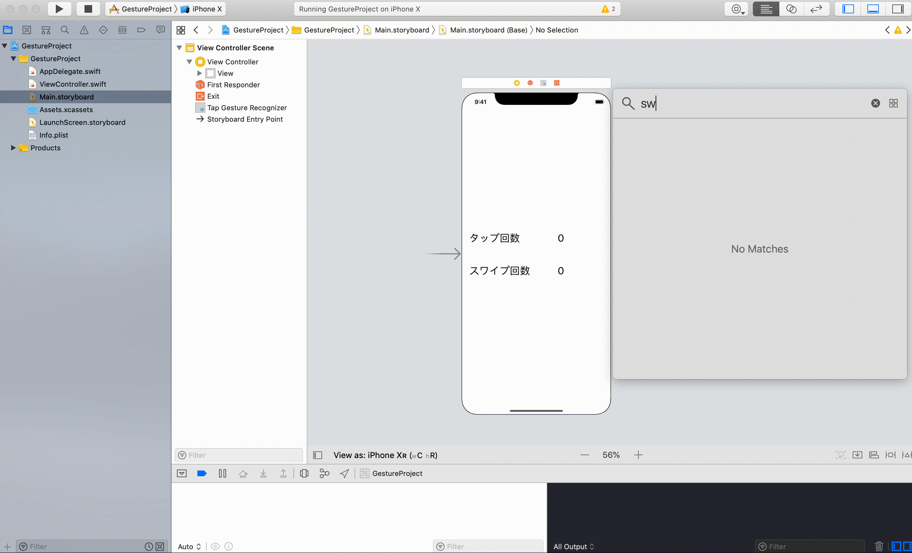
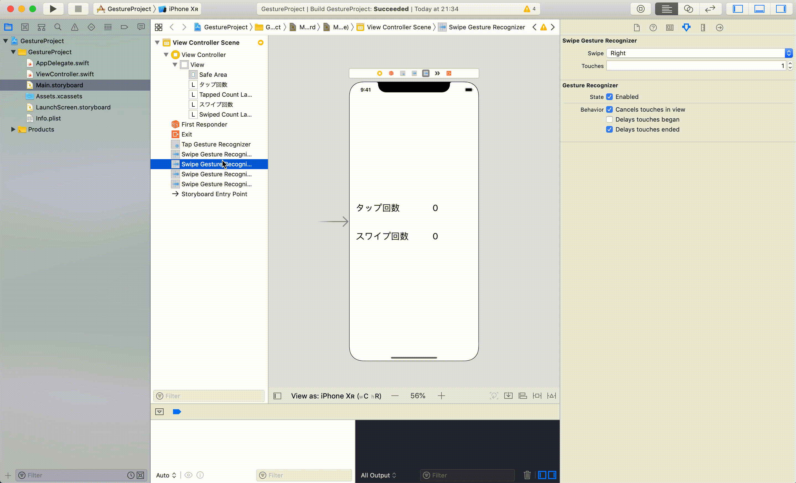
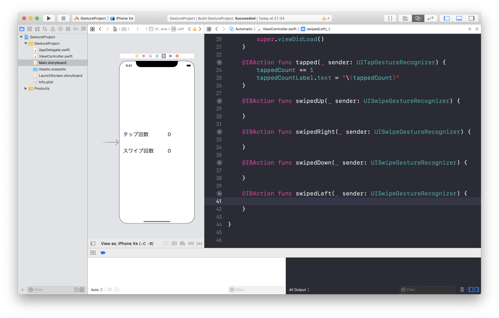

# Gesture  

## 目標
- Gestureが使えるようになる

## 作成するアプリ


## 開発の流れ
1. 画面の部品を配置する
2. タップ処理を追加する
3. スワイプ処理を追加する

## 開発しよう
1. プロジェクトを作成する  
  アプリ名：GestureProject

2. 画面の部品を配置する
    1. 以下のような画面になるよう部品を配置する  
        ※数値のラベルは別部品にしてください。合計4つのラベルになるようにしてください。
        
  
    2. 配置した部品をViewController.swiftに接続する。
    
        |部品|接続時のName|
        |---|---|
        |UILabel（タップ回数用）|tappedCountLabel|
        |UILabel（スワイプ回数用）|swipedCountLabel|

        

    3. デザインの制約を追加する。
        Main.storyboardで画面を選択し、右下にある「Pinボタン」内の「Add Missing Constraints」を選択する。
        > この作業をすることで、画面サイズによるデザインのずれを解決します。
        

3. タップ処理を追加する
    1. UITapGestureRecognizerを画面に追加する
      

    2. 配置したUITapGestureRecognizerをViewController.swiftに接続する。
      

    3. タップした回数を保持する変数を定義する。
      
        ```
        @IBOutlet weak var tappedCountLabel: UILabel!
      
        @IBOutlet weak var swipedCountLabel: UILabel!

        以下を追加
        var tappedCount = 0
        ```

    4. ```tapped```メソッドに回数をカウントアップする処理を追加する。

        ```
        @IBAction func tapped(_ sender: UITapGestureRecognizer) {
          tappedCount += 1
          tappedCountLabel.text = "\(tappedCount)"
        }
        ```
4. スワイプ処理を追加する
    1. UISwipeGestureRecognizerを画面に追加する。（4つUISwipeGestureRecognizerを追加してください）
      
      
    2. 追加したUISwipeGestureRecognizerのスワイプ向きをそれぞれ設定する（上下左右それぞれ設定してください）
        

    3. 配置したUISwipeGestureRecognizerをViewController.swiftに接続する。

        |部品|接続時のName|
        |---|---|
        |UISwipeGestureRecognizer（上向き）|swipedUp|
        |UISwipeGestureRecognizer（右向き）|swipedRight|
        |UISwipeGestureRecognizer（下向き）|swipedDown|
        |UISwipeGestureRecognizer（左向き）|swipedLeft|

        

    4. タップした回数を保持する変数を定義する。
      
        ```
        @IBOutlet weak var swipedCountLabel: UILabel!

        var tappedCount = 0

        以下を追加
        var swipedCount = 0
        ```

    5. スワイプ時に呼ばれるそれぞれのメソッドに回数をカウントアップする処理を追加する。

        ```
        @IBAction func swipedUp(_ sender: UISwipeGestureRecognizer) {
          swipedCount += 1
          swipedCountLabel.text = "\(swipedCount)"
        }
        ```
## 実行してみよう
