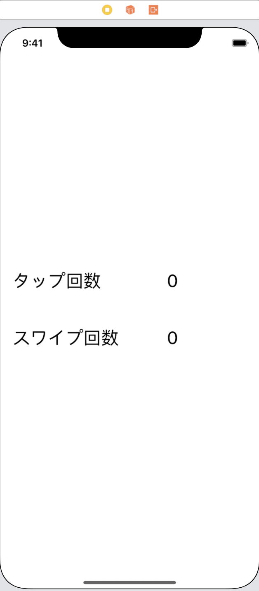
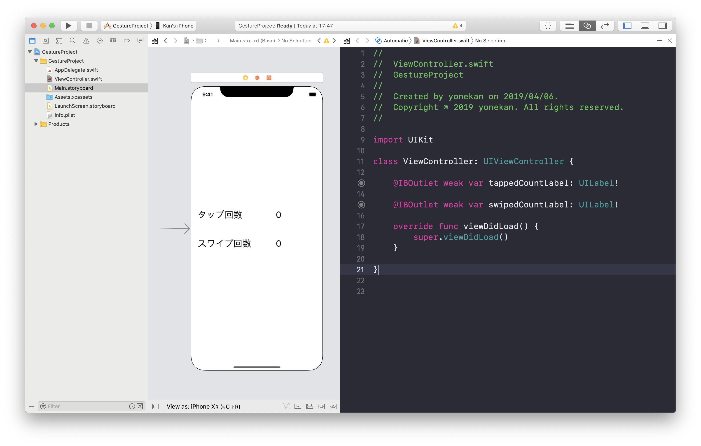
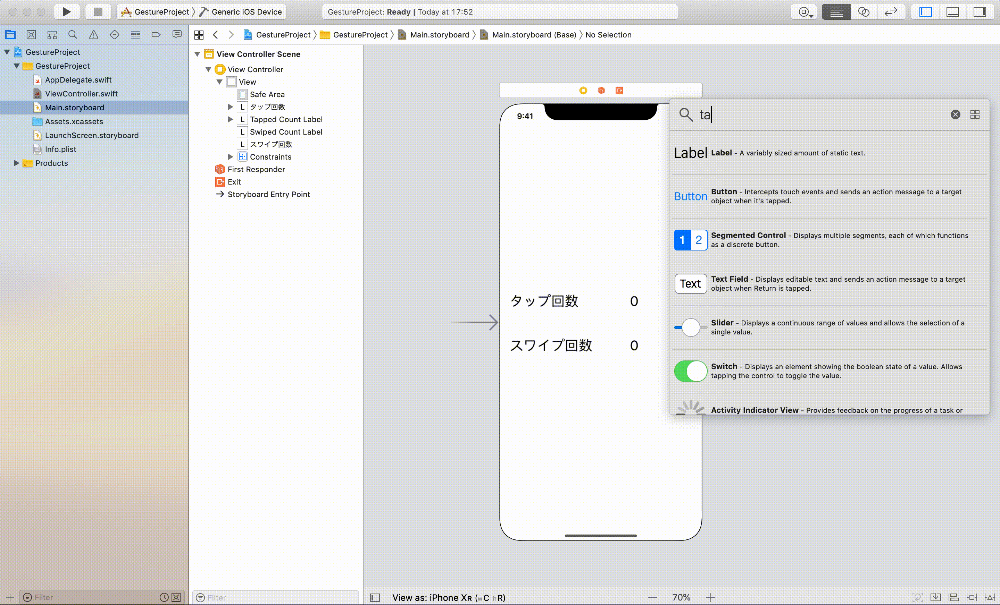
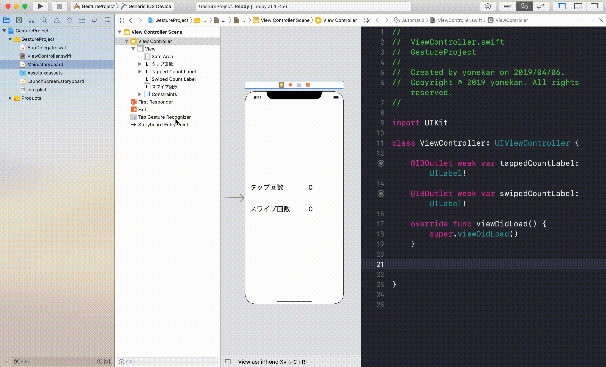

# Gesture  

## 目標
- Gestureが使えるようになる

## 作成するアプリ

## 開発の流れ
1. 画面の部品を配置する
2. カメラ・フォトライブラリのアクセス利用設定
3. カメラ撮影機能
4. フォトライブラリ表示機能
5. 撮影または選択された画像の表示機能
6. 写真保存機能

## 開発しよう
1. プロジェクトを作成する  
  アプリ名：GestureProject

2. 画面の部品を配置する
    1. 以下のような画面になるよう部品を配置する  
        ※数値のラベルは別部品にしてください。合計4つのラベルになるようにしてください。
        
  
    2. 配置した部品をViewController.swiftに接続する。
    
        |部品|接続時のName|
        |---|---|
        |UILabel（タップ回数用）|tappedCountLabel|
        |UILabel（スワイプ回数用）|swipedCountLabel|

        

    3. デザインの制約を追加する。
        Main.storyboardで画面を選択し、右下にある「Pinボタン」内の「Add Missing Constraints」を選択する。
        > この作業をすることで、画面サイズによるデザインのずれを解決します。
        

3. タップ処理を追加する
    1. UITapGestureRecognizerを画面に追加する
      

    2. 配置したUITapGestureRecognizerをViewController.swiftに接続する。
      

    3. タップした回数を保持する変数を定義する。
      
      ```
      @IBOutlet weak var tappedCountLabel: UILabel!
    
      @IBOutlet weak var swipedCountLabel: UILabel!

      ↓追加
      var tappedCount = 0
      ```

    4. ```tapped```メソッドに回数をカウントアップする処理を追加する。

        ```
        @IBAction func tapped(_ sender: UITapGestureRecognizer) {
          tappedCount += 1
          tappedCountLabel.text = "\(tappedCount)"
        }
        ```


