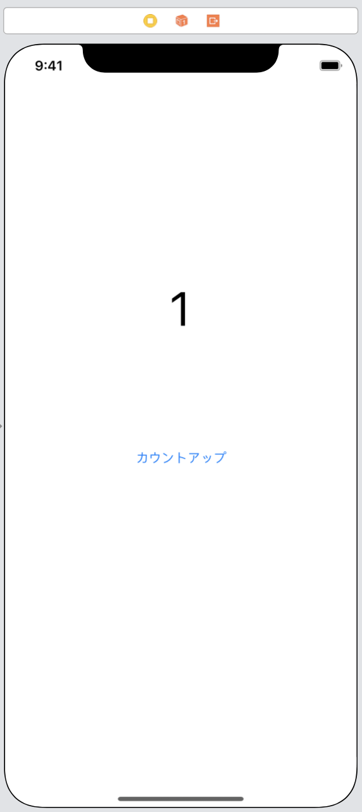
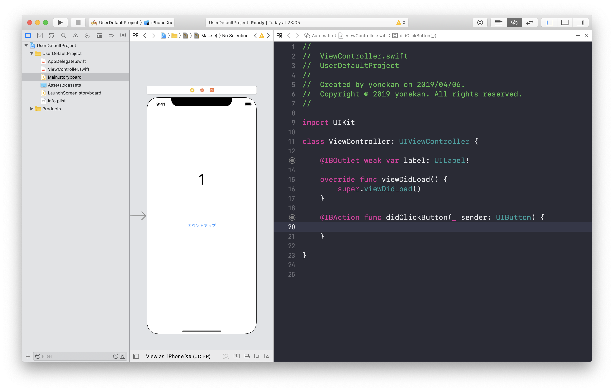

# UserDefault  

## 目標
- UserDefaultが使えるようになる

## UserDefaultとは
UserDefaultとは、iosアプリ内でデータを永続的に保存する方法の一つです。  
今まで変数などのいろいろなデータを使ってきました。しかしこれらのデータはアプリを一度閉じると消えていまいます。  
UserDefaultを使うとデータを保存することができ、そのデータはアプリを閉じて消えることはありません。

## 作成するアプリ


## 開発の流れ
1. 画面の部品を配置する
2. ボタン押下時処理を追加する

## 開発しよう
1. プロジェクトを作成する  
  アプリ名：UserDefaultProject

2. 画面の部品を配置する
    1. 以下のような画面になるよう部品を配置する  
        
  
    2. 配置した部品をViewController.swiftに接続する。
    
        |部品|接続時のName|
        |---|---|
        |UILabel|label|
        |UIButton|didClickButton|

        

    3. デザインの制約を追加する。
        Main.storyboardで画面を選択し、右下にある「Pinボタン」内の「Add Missing Constraints」を選択する。
        > この作業をすることで、画面サイズによるデザインのずれを解決します。
        

4. ボタン押下時処理を追加する
    1. ボタンを押されるたびにカウントアップする変数を作成する。  

      ```
      @IBOutlet weak var label: UILabel!

      以下を追加
      var colorOpt = 0
      ```

      > 変数colorOptの値が0の場合：White、1の場合：LightGray、2の場合：DarkGrayを背景色に設定するようにしていきます。

    2. 変数colorOptの値に応じて、画面の背景色を設定する関数を作成する。

      関数名：changeBgColor
      処理内容：以下の表の条件通り、画面の背景色を変更する

      |条件|背景色|
      |---|---|
      |デフォルト|White|
      |変数colorOptの値が1|LightGray|
      |変数colorOptの値が2|DarkGray|

      ```
      func changeBgColor() {
        switch colorOpt {
        case 1:
            view.backgroundColor = .lightGray
        case 2:
            view.backgroundColor = .darkGray
        default:
            view.backgroundColor = .white
        }
      }
      ```

      3. 変数colorOptの値に応じて、ラベルの文字を設定する関数を作成する。

        関数名：changeLabel
        処理内容：以下の表の条件通り、ラベルの文字を設定する

        |条件|背景色|
        |---|---|
        |デフォルト|White|
        |変数colorOptの値が1|LightGray|
        |変数colorOptの値が2|DarkGray|

        ```
        func changeLabel() {
          switch colorOpt {
          case 1:
              label.text = "LightGray"
          case 2:
              label.text = "DarkGray"
          default:
              label.text = "White"
          }
        }
        ```

      4. ボタンが押された時、背景色とラベルの文字を変更する処理を追記する  
      ```didClickButton```メソッドに以下の処理を追記する

        ```
        if colorOpt == 2 {
            colorOpt = 0
        } else {
            colorOpt += 1
        }
        
        changeBgColor()
        changeLabel()
        ```

        追記後の```didClickButton```メソッド

        ```
        @IBAction func didClickButton(_ sender: UIButton) {
          if colorOpt == 2 {
            colorOpt = 0
          } else {
              colorOpt += 1
          }
          
          changeBgColor()
          changeLabel()
        }
        ```

      5. 実行してみる
      

5. ```didClickButton```メソッドに変数colorOptの値をUserDefaultに保存する処理を追記する。  
    以下の処理を追記してください

        ```
        let userDefault = UserDefaults.standard
        userDefault.set(colorOpt, forKey: "colorOpt")
        ```

        追記後の```didClickButton```メソッド

        ```
        @IBAction func didClickButton(_ sender: UIButton) {
          if colorOpt == 2 {
              colorOpt = 0
          } else {
              colorOpt += 1
          }
          
          changeBgColor()
          changeLabel()
          
          let userDefault = UserDefaults.standard
          userDefault.set(colorOpt, forKey: "colorOpt")
        }
        ```

6. UserDefaultから保存されている変数colorOptの値を取得する処理を追記する

    1. ```viewDidLoad```メソッドにUserDefaultから保存されている変数colorOptの値を取得する処理を追記する  
    以下の処理を追記してください

        ```
        let userDefault = UserDefaults.standard
        colorOpt = userDefault.integer(forKey: "colorOpt")
        ```

        追記後の```viewDidLoad```メソッド

        ```
        override func viewDidLoad() {
          super.viewDidLoad()
        
          let userDefault = UserDefaults.standard
          colorOpt = userDefault.integer(forKey: "colorOpt")
        }
        ```

    2. ```viewDidLoad```メソッドに変数colorOptの値に応じて、背景色とラベルの文字を設定する処理を追記する  
    以下の処理を追記してください

      ```
      changeBgColor()
      changeLabel()
      ```

      追記後の```viewDidLoad```メソッド

      ```
      override func viewDidLoad() {
        super.viewDidLoad()
        
        let userDefault = UserDefaults.standard
        colorOpt = userDefault.integer(forKey: "colorOpt")
        
        changeBgColor()
        changeLabel()
      }
      ```

## 実行してみよう
