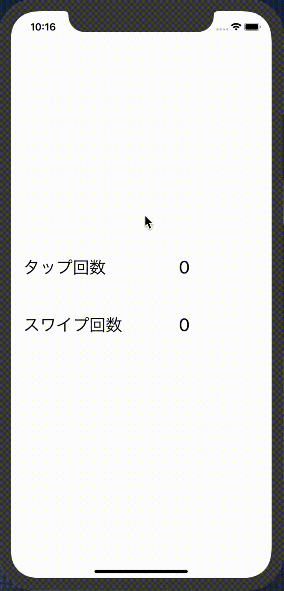

# UserDefault  

## 目標
- UserDefaultが使えるようになる

## UserDefaultとは
UserDefaultとは、iosアプリ内でデータを永続的に保存する方法の一つです。  
今まで変数などのいろいろなデータを使ってきました。しかしこれらのデータはアプリを一度閉じると消えていまいます。  
UserDefaultを使うとデータを保存することができ、そのデータはアプリを閉じて消えることはありません。

## 作成するアプリ


## 開発の流れ
1. 画面の部品を配置する
2. タップ処理を追加する
3. スワイプ処理を追加する

## 開発しよう
1. プロジェクトを作成する  
  アプリ名：UserDefaultProject

2. 画面の部品を配置する
    1. 以下のような画面になるよう部品を配置する  
        
  
    2. 配置した部品をViewController.swiftに接続する。
    
        |部品|接続時のName|
        |---|---|
        |UILabel|label|
        |UIButton|didClickButton|

        

    3. デザインの制約を追加する。
        Main.storyboardで画面を選択し、右下にある「Pinボタン」内の「Add Missing Constraints」を選択する。
        > この作業をすることで、画面サイズによるデザインのずれを解決します。
        

3. カウントアップ処理を追加する
    1. タップした回数を保持する変数を定義する。

        ```
        @IBOutlet weak var label: UILabel!
    
        以下を追加
        var count = 0
        ```

    2. ```didClickButton```メソッドに回数をカウントアップする処理を追加する。

        ```
        @IBAction func didClickButton(_ sender: UIButton) {
          count += 1
          label.text = "\(count)"
        }
        ```

    3. 画面の初期表示時に、Labelに初期カウントを設定する

        ```
        override func viewDidLoad() {
          super.viewDidLoad()
        
          label.text = "\(count)"
        }
        ```

    4. 実行してみる
        

        > 実行してみてわかるとおり、今の段階だとアプリを閉じるとカウントが0に戻ってしまいます。
        > これからUserDefaultでカウントを保存する処理を追加していきます。

4. UserDefaultを使ってカウントを保存する処理を追記する

    1. ```didClickButton```メソッドにカウントをUserDefaultに保存する処理を追記する。  
    以下の処理を追記してください

        ```
        let userDefault = UserDefaults.standard
        userDefault.set(count, forKey: "currentCount")
        ```

        追記後の```didClickButton```メソッド

        ```
        @IBAction func didClickButton(_ sender: UIButton) {
          count += 1
          label.text = "\(count)"
        
          let userDefault = UserDefaults.standard
          userDefault.set(count, forKey: "currentCount")
        
        }
        ```

5. UserDefaultから前回のカウントを取得する処理を追記する

    1. ```viewDidLoad```メソッドにUserDefaultから前回のカウントを取得する処理を追記する  
    以下の処理を追記してください

        ```
        count = userDefault.integer(forKey: "currentCount")
        ```

        追記後の```viewDidLoad```メソッド

        ```
        override func viewDidLoad() {
          super.viewDidLoad()
        
          let userDefault = UserDefaults.standard
          count = userDefault.integer(forKey: "currentCount")
          label.text = "\(count)"
        }
        ```

## 実行してみよう
