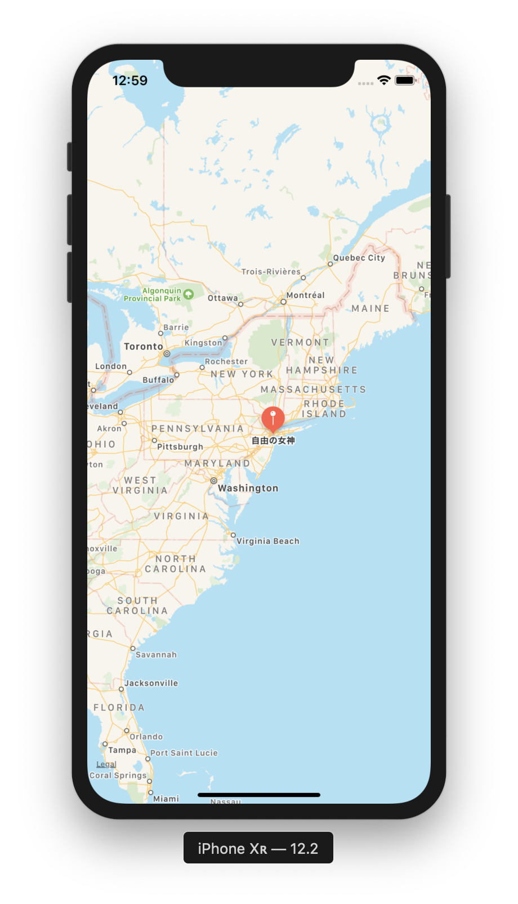
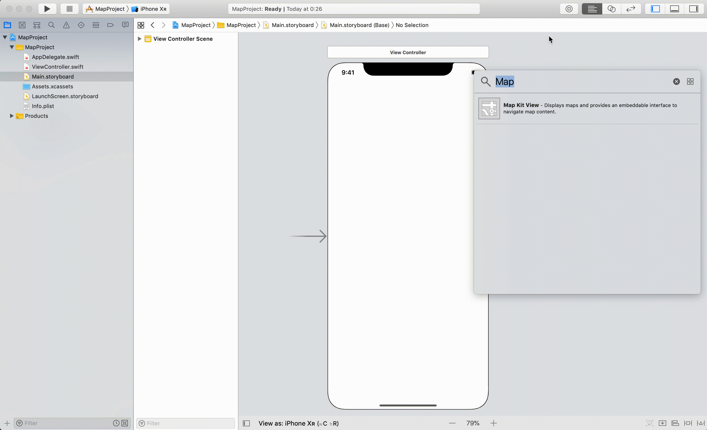
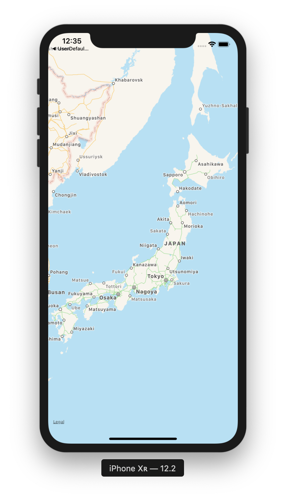
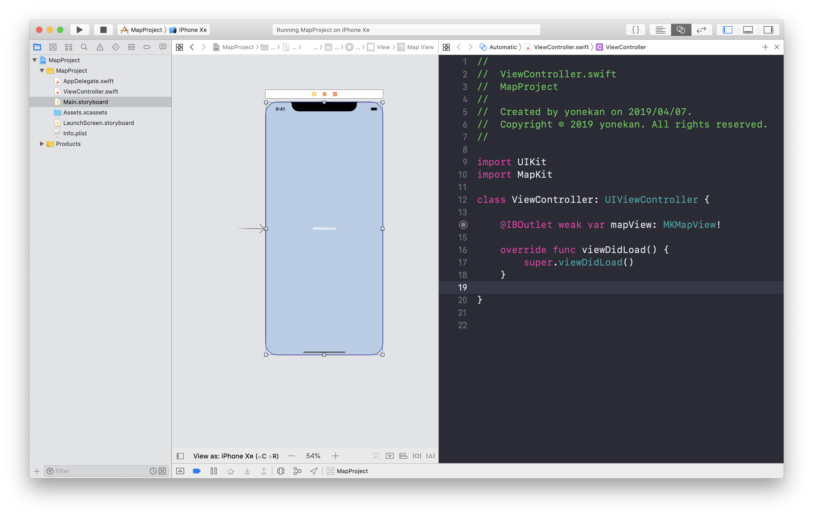
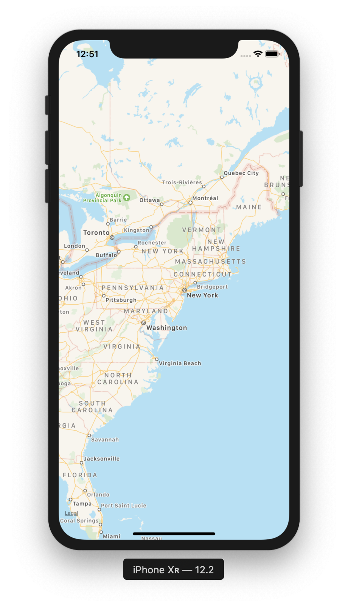

# Map  

## 目標
- Mapが使えるようになる

## 作成するアプリ


## 開発の流れ
1. 画面の部品を配置する
2. タップ処理を追加する
3. スワイプ処理を追加する

## 開発しよう
1. プロジェクトを作成する  
  アプリ名：MapProject

2. 画面の部品を配置する
    1. MapKitViewを配置する  
        

    2. 実行してみる
    

3. マップに位置情報を設定する
    1. ViewController.swiftでMapKitをインポートする。  
    以下のコードを追記してください

        ```
        import MapKit
        ```

        追記後のViewController.swift

        ```
        import UIKit
        import MapKit

        class ViewController: UIViewController {

          override func viewDidLoad() {
            super.viewDidLoad()
          }
        }
        ```

        > インポートとは  
        > 何かの機能を読み込んで使えるようにすることです。  
        > 今回の場合だと、マップの機能を使えるようにするためMapKitを読み込んでいます。

    2. MapViewをViewController.swiftに接続する。

        |部品|接続時のName|
        |---|---|
        |MKMapView|mapView|

        

    3. CLLocationCoordinate2DMakeで緯度・経度の設定をする。  
    ```viewDidLoad```に以下の処理を追記してください

        ```
        let location = CLLocationCoordinate2DMake(40.6156, -74.7706)

        mapView.setCenter(location, animated: true)
        ```

        追記後の```viewDidLoad```

        ```
        override func viewDidLoad() {
          super.viewDidLoad()
        
          let location = CLLocationCoordinate2DMake(40.6156, -74.7706)
        
          mapView.setCenter(location, animated: true)
        }
        ```

    4. 実行してみる
    

4. マップにピンを配置する
    1. ピンを作成する。  
    ```viewDidLoad```に以下の処理を追記してください

        ```
        let myPin: MKPointAnnotation = MKPointAnnotation()

        let center = CLLocationCoordinate2DMake(40.6892, -74.0445);
        // 座標を設定.
        myPin.coordinate = center

        // タイトルを設定.
        myPin.title = "自由の女神"

        // サブタイトルを設定.
        myPin.subtitle = "いつか見てみたい自由の女神"
        ```

        追記後の```viewDidLoad```

        ```
        override func viewDidLoad() {
          super.viewDidLoad()
        
          let location = CLLocationCoordinate2DMake(40.6156, -74.7706)
        
          mapView.setCenter(location, animated: true)
        
          let myPin: MKPointAnnotation = MKPointAnnotation()
        
          let center = CLLocationCoordinate2DMake(40.6892, -74.0445);
          // 座標を設定.
          myPin.coordinate = center
        
          // タイトルを設定.
          myPin.title = "自由の女神"
        
          // サブタイトルを設定.
          myPin.subtitle = "いつか見てみたい自由の女神"
        }
        ```
    
    2. マップにピンを追加する
    ```viewDidLoad```に以下の処理を追記してください

        ```
        mapView.addAnnotation(myPin)
        ```

        追記後の```viewDidLoad```

        ```
        override func viewDidLoad() {
          super.viewDidLoad()
        
          let location = CLLocationCoordinate2DMake(40.6156, -74.7706)
        
          mapView.setCenter(location, animated: true)
        
          let myPin: MKPointAnnotation = MKPointAnnotation()
        
          let center = CLLocationCoordinate2DMake(40.6892, -74.0445);
          // 座標を設定.
          myPin.coordinate = center
        
          // タイトルを設定.
          myPin.title = "自由の女神"
        
          // サブタイトルを設定.
          myPin.subtitle = "いつか見てみたい自由の女神"

          mapView.addAnnotation(myPin)
        }
        ```

## 実行してみる

