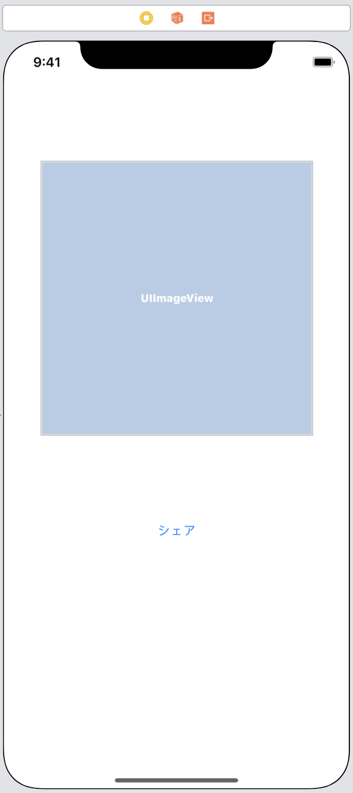
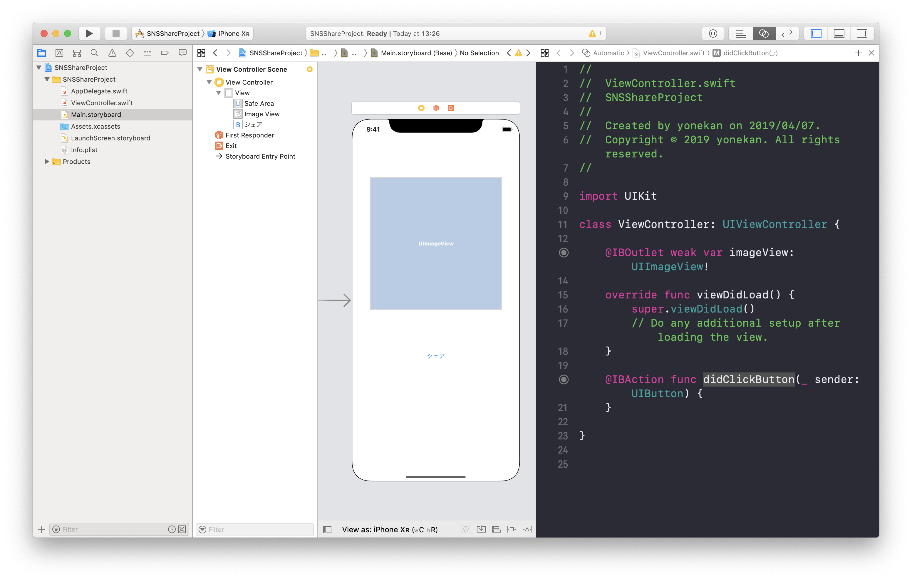
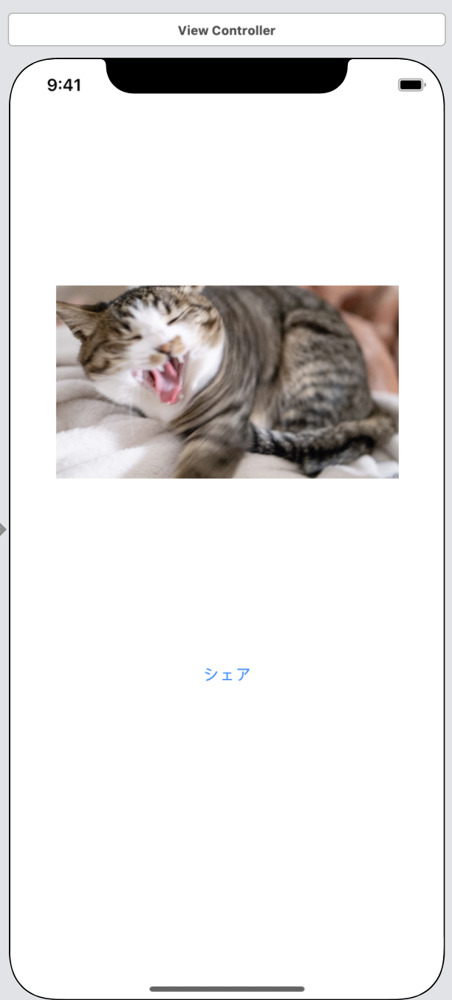

# SNSシェア  

## 目標
- SNSシェア機能が使えるようになる

## 作成するアプリ


## 開発の流れ
1. 画面の部品を配置する
2. タップ処理を追加する

## 開発しよう
1. プロジェクトを作成する  
  アプリ名：SNSShareProject

2. 画面の部品を配置する
    1. 以下のような画面になるよう部品を配置する  
        
  
    2. 配置した部品をViewController.swiftに接続する。
    
        |部品|接続時のName|
        |---|---|
        |UIImageView|imageView|
        |UIButton|didClickButton|

        

    3. デザインの制約を追加する。
        Main.storyboardで画面を選択し、右下にある「Pinボタン」内の「Add Missing Constraints」を選択する。
        > この作業をすることで、画面サイズによるデザインのずれを解決します。
        

    4. 画面に配置したImageViewに任意の画像を設定する  
        

3. SNSシェアの処理を追加する

    1. 以下の処理を```didClickButton```メソッドに追加する  
    以下の処理を追記する

        ```
        let data = [imageView.image!]
        let controller = UIActivityViewController(activityItems: data, applicationActivities: nil)
          
        present(controller, animated: true, completion: nil)
        ```

        追記後の```didClickButton```メソッド

        ```
        @IBAction func didClickButton(_ sender: UIButton) {
          let data = [imageView.image!]
          let controller = UIActivityViewController(activityItems: data, applicationActivities: nil)
        
          present(controller, animated: true, completion: nil)
        }
        ```

        > 解説  
        > let data = [imageView.image!]  
        > ここでSNSシェアするデータを用意しています。  

        > ```let controller = UIActivityViewController(activityItems: data, applicationActivities: nil)```  
        > ここでシェア方法を選択する画面を作成しています。  
        > activityItemsにはシェアするデータを配列で渡すことができます

        > ```present(controller, animated: true, completion: nil)```  
        > ここで先ほど作成したシェア方法を選択する画面を表示します

    2. 実行してみる  
        

4. 画像と文字をシェアする処理を追加する

    1. ```didClickButton```メソッドを編集する  

        ```let data = [imageView.image!]```を以下のように編集する

        ```
        let data = [imageView.image!, "猫の写真です"] as [Any]
        ```

## 実行してみる  

