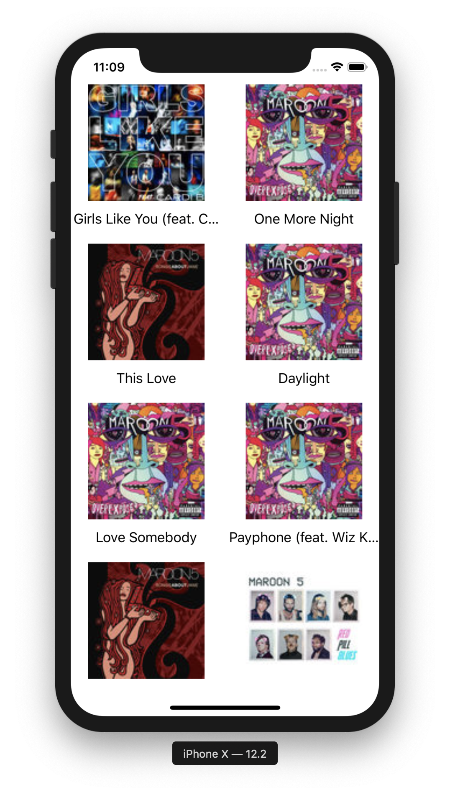
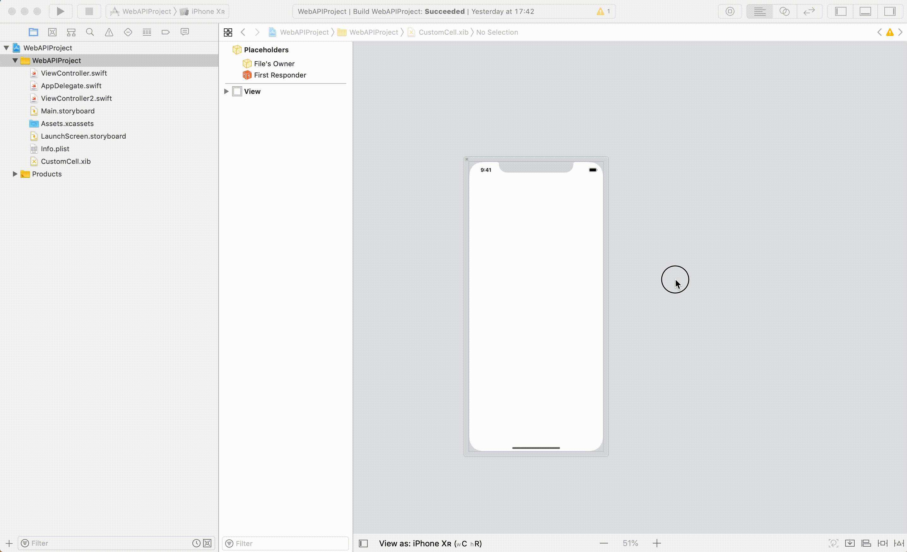
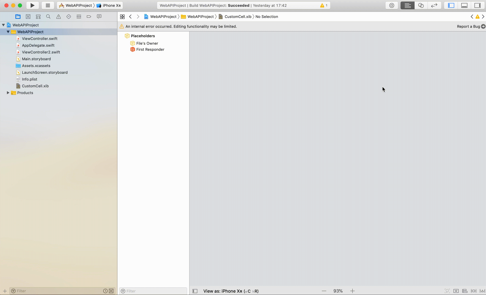
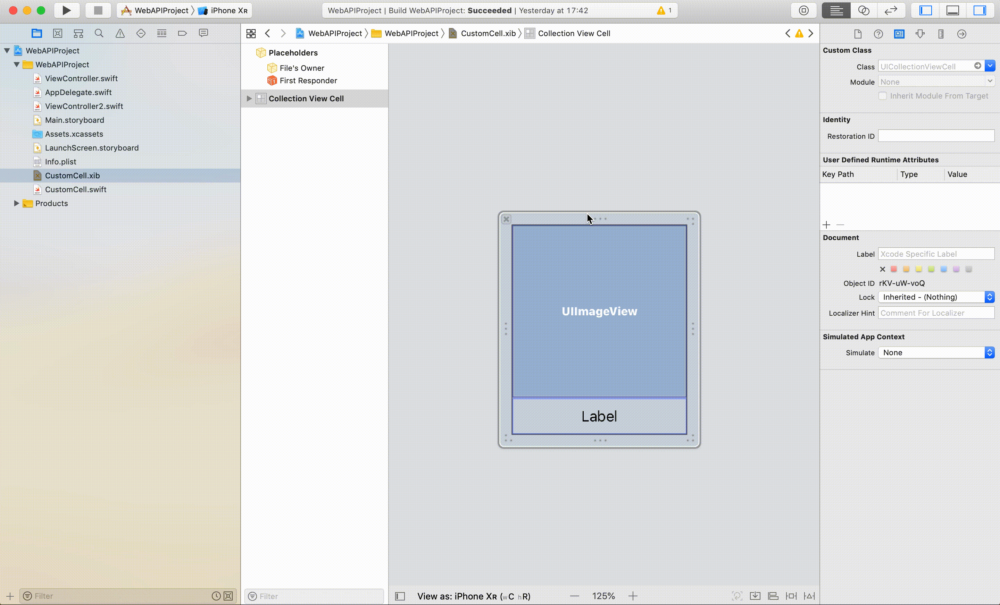
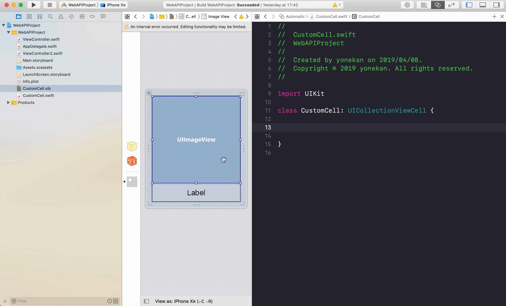
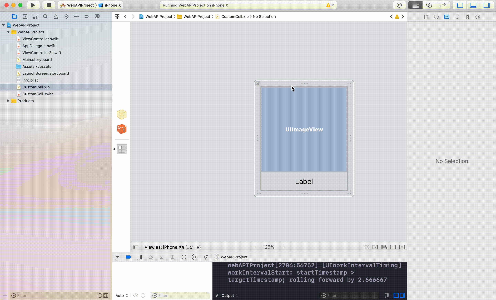
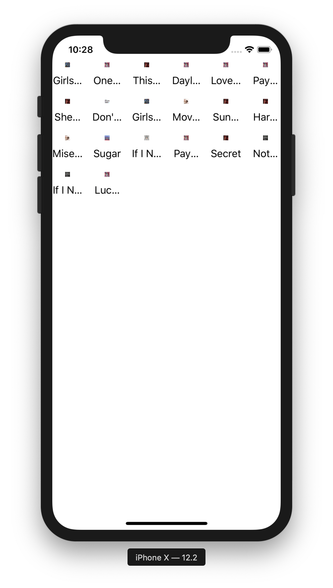
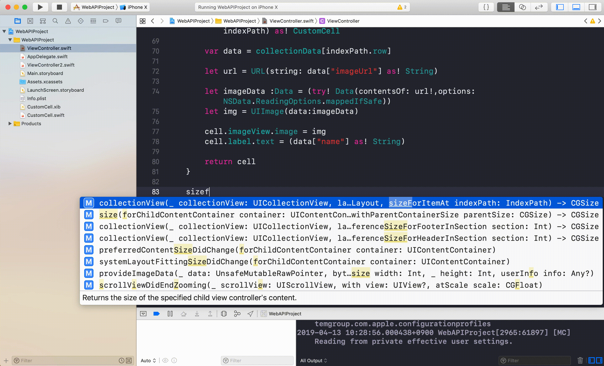
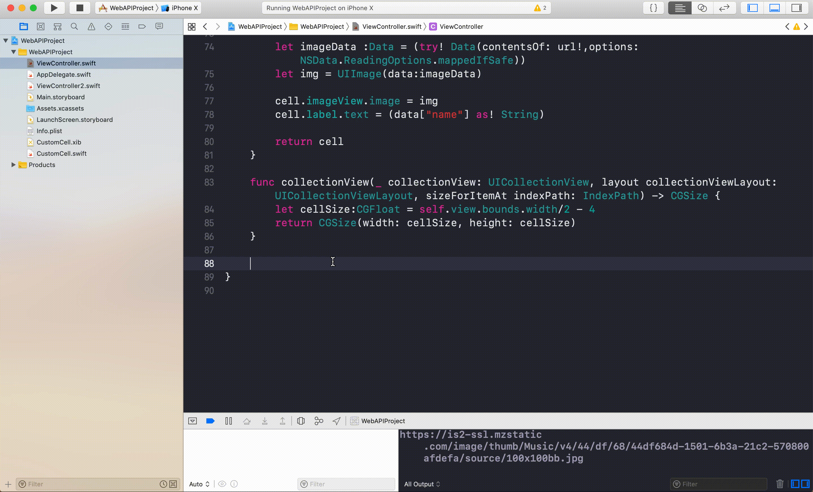

# WebAPI

## 目標
- WebAPIが使えるようになる

## 作成するアプリ


## 開発の流れ
1. 画面の部品を配置する
2. xibファイルでコレクションのセルを作成する
2. タップ処理を追加する
3. スワイプ処理を追加する

## 開発しよう
1. プロジェクトを作成する  
  アプリ名：WebAPIProject

2. 画面の部品を配置する
    1. 以下のような画面になるよう部品を配置する  
    ※コレクションビューを配置してください  
        
  
    2. 配置した部品をViewController.swiftに接続する。
    
        |部品|接続時のName|
        |---|---|
        |UICollectionView|collectionView|

        

    3. デザインの制約を追加する。
        Main.storyboardで画面を選択し、右下にある「Pinボタン」内の「Add Missing Constraints」を選択する。
        > この作業をすることで、画面サイズによるデザインのずれを解決します。
        

3. 自作セルを作成する
    1. xibファイルを作成する。  
    プロジェクトフォルダを選択し、右クリック→「New File」を選択→「View」選択し、Next→「CustomCell」と入力しCreate

        

    2. xibファイルにあるViewControllerを削除する。  
    ViewControllerを選択し、Deleteキーを押下

        

    3. xibファイルにCollectionViewCellを配置する。

        

    4. 以下のようにImageViewとLabelを配置する

        

    5. 作成したCollectionViewCellと対応するクラスファイルを作成する  
    プロジェクトフォルダを選択し、右クリック→「New File」を選択→「Cocoa Touch Class」を選択→クラス欄に「CustomCell」と入力、Subclass of 欄で「UICollectionViewCell」を選択→「Next」を選択→「Create」を選択

        

    6. CustomCell.xibとCustomCell.swiftを紐付ける
    CustomCell.xibを開き、ユーティリティエリアの左から3番目のアイデンティティインスペクタを選択。  
    Class欄に「CustomCell」と入力する

        

    7. CustomCell.xibのImageViewとlabelをCustomCell.swiftに接続する

        |部品|接続時のName|
        |---|---|
        |UIImageView|imageView|
        |UILabel|label|

        

    8. 自作セルにデザインの制約を追加する。
        CustomCell.xibでセルを選択し、右下にある「Pinボタン」内の「Add Missing Constraints」を選択する。
        > この作業をすることで、画面サイズによるデザインのずれを解決します。
        
        
4. 画面表示時にAPIを呼び出す処理を追記する
    1. iTunes APIを実行して、取得した結果を保存する変数```collectionData```を作成する
    ViewControllerに以下の変数を追記する

        ```
        @IBOutlet weak var collectionView: UICollectionView!

        ↓追加
        var collectionData: [[String: Any]] = []
        ```

    2. ```viewDidLoad```メソッドに以下の処理を追記してください。

        ```
        let url: URL = URL(string: "http://ax.itunes.apple.com/WebObjects/MZStoreServices.woa/wa/wsSearch?term=marron5&limit=20")!
        let task: URLSessionTask = URLSession.shared.dataTask(with: url, completionHandler: {data, response, error in
            do {
                let items = try JSONSerialization.jsonObject(with: data!) as! NSDictionary
                
                var result: [[String: Any]] = []
                
                for(key, data) in items {
                    if (key as! String == "results"){
                        let resultArray = data as! NSArray
                        for (eachMusic) in resultArray{
                            let dicMusic:NSDictionary = eachMusic as! NSDictionary
                            
                            print(dicMusic["trackName"]!)
                            print(dicMusic["artworkUrl100"]!)
                            
                            let data: [String: Any] = ["name": dicMusic["trackName"]!, "imageUrl": dicMusic["artworkUrl100"]!]
                            
                            result.append(data)
                        }
                    }
                }
                
                DispatchQueue.main.async() { () -> Void in
                    self.collectionData = result
                }

            } catch {
                print(error)
            }
        })
        task.resume()
        ```

    3. 変数```collectionData```の値がセットされたら、CollectionViewを更新する処理を追記する  
    変数```collectionData```にdidSetを追記する

        追記前

        ```
        var collectionData: [[String: Any]] = []
        ```

        追記後

        ```
        var collectionData: [[String: Any]] = [] {
            didSet {
                collectionView.reloadData()
            }
        }
        ```

5. CollectionViewの設定を追記する
    1. ViewControllerに```UICollectionViewDataSource```と```UICollectionViewDelegate```を追記する

        追記前
        ```
        class ViewController: UIViewController {
        ```

        追記後
        ```
        class ViewController: UIViewController, UICollectionViewDataSource, UICollectionViewDelegate {
        ```

    2. CollectionViewのセルに自作したセルを設定する  
    ```viewDidLoad```メソッドに以下の処理を追記する

        ```
        collectionView.register(UINib(nibName: "CustomCell", bundle: nil), forCellWithReuseIdentifier: "cell")
        ```

        追記後の```viewDidLoad```

        ```
        override func viewDidLoad() {
            super.viewDidLoad()
            
            let url: URL = URL(string: "http://ax.itunes.apple.com/WebObjects/MZStoreServices.woa/wa/wsSearch?term=marron5&limit=20")!
            let task: URLSessionTask = URLSession.shared.dataTask(with: url, completionHandler: {data, response, error in
                do {
                    let items = try JSONSerialization.jsonObject(with: data!) as! NSDictionary
                    
                    var result: [[String: Any]] = []
                    
                    for(key, data) in items {
                        if (key as! String == "results"){
                            let resultArray = data as! NSArray
                            for (eachMusic) in resultArray{
                                let dicMusic:NSDictionary = eachMusic as! NSDictionary
                                
                                print(dicMusic["trackName"]!)
                                print(dicMusic["artworkUrl100"]!)
                                
                                let data: [String: Any] = ["name": dicMusic["trackName"]!, "imageUrl": dicMusic["artworkUrl100"]!]
                                
                                result.append(data)
                            }
                        }
                    }
                    
                    DispatchQueue.main.async() { () -> Void in
                        self.collectionData = result
                    }
                    
                } catch {
                    print(error)
                }
            })
            task.resume()
            
            collectionView.register(UINib(nibName: "CustomCell", bundle: nil), forCellWithReuseIdentifier: "cell")
        }
        ```

    2. 設定に必要な関数を追加する。 以下の２つの関数をviewDidLoadの下に追加する

        ```
        func collectionView(_ collectionView: UICollectionView, numberOfItemsInSection section: Int) ->    Int {
            <#code#>
        }

        func collectionView(_ collectionView: UICollectionView, cellForItemAt indexPath: IndexPath) -> UICollectionViewCell {
            <#code#>
        }
        ```

    3. UICollectionViewの要素数と、UICollectionViewに表示する内用を定義する
        1. ```func collectionView(_ collectionView: UICollectionView, numberOfItemsInSection section: Int)```を以下のように修正する

            ```
            func collectionView(_ collectionView: UICollectionView, numberOfItemsInSection section: Int) -> Int {
                return collectionData.count
            }
            ```

        2. ```func collectionView(_ collectionView: UICollectionView, cellForItemAt indexPath: IndexPath)```を以下のように修正する

            ```
            func collectionView(_ collectionView: UICollectionView, cellForItemAt indexPath: IndexPath) -> UICollectionViewCell {
                let cell = collectionView.dequeueReusableCell(withReuseIdentifier: "cell", for: indexPath) as! CustomCell
    
                var data = collectionData[indexPath.row]
                
                let url = URL(string: data["imageUrl"] as! String)

                let imageData :Data = (try! Data(contentsOf: url!,options: NSData.ReadingOptions.mappedIfSafe))
                let img = UIImage(data:imageData)
                
                cell.imageView.image = img
                cell.label.text = (data["name"] as! String)
                
                return cell
            }
            ```
    
    4. 画面のCollectionViewに設定を反映する。  
    ```viewDidLoad```メソッドに以下の処理を追記する
        ```
        collectionView.delegate = self
        collectionView.dataSource = self
        ```

        追記後の```viewDidLoad```

        ```
        override func viewDidLoad() {
            super.viewDidLoad()
            
            let url: URL = URL(string: "http://ax.itunes.apple.com/WebObjects/MZStoreServices.woa/wa/wsSearch?term=marron5&limit=20")!
            let task: URLSessionTask = URLSession.shared.dataTask(with: url, completionHandler: {data, response, error in
                do {
                    let items = try JSONSerialization.jsonObject(with: data!) as! NSDictionary
                    
                    var result: [[String: Any]] = []
                    
                    for(key, data) in items {
                        if (key as! String == "results"){
                            let resultArray = data as! NSArray
                            for (eachMusic) in resultArray{
                                let dicMusic:NSDictionary = eachMusic as! NSDictionary
                                
                                print(dicMusic["trackName"]!)
                                print(dicMusic["artworkUrl100"]!)
                                
                                let data: [String: Any] = ["name": dicMusic["trackName"]!, "imageUrl": dicMusic["artworkUrl100"]!]
                                
                                result.append(data)
                            }
                        }
                    }
                    
                    DispatchQueue.main.async() { () -> Void in
                        self.collectionData = result
                    }
                    
                } catch {
                    print(error)
                }
            })
            task.resume()
            
            collectionView.register(UINib(nibName: "CustomCell", bundle: nil), forCellWithReuseIdentifier: "cell")
            
            collectionView.delegate = self
            collectionView.dataSource = self
        }
        ```

    5. 実行してみる
        

6. CollectionViewのセルの大きさなどを設定する
    1. ViewControllerに```UICollectionViewDelegateFlowLayout```を追加する

        追記前

        ```
        class ViewController: UIViewController, UICollectionViewDataSource, UICollectionViewDelegate {
        ```

        追記後

        ```
        class ViewController: UIViewController, UICollectionViewDataSource, UICollectionViewDelegate, UICollectionViewDelegateFlowLayout {
        ```

    2. セルの大きさを設定する
        1. ```func collectionView(_ collectionView: UICollectionView, layout collectionViewLayout: UICollectionViewLayout, sizeForItemAt indexPath: IndexPath) -> CGSize```メソッドを追記する
    
            

        2. セルの大きさを画面の半分の大きさに設定する
        ```func collectionView(_ collectionView: UICollectionView, layout collectionViewLayout: UICollectionViewLayout, sizeForItemAt indexPath: IndexPath) -> CGSize```メソッドを以下のように修正する

            ```
            func collectionView(_ collectionView: UICollectionView, layout collectionViewLayout: UICollectionViewLayout, sizeForItemAt indexPath: IndexPath) -> CGSize {
                let cellSize:CGFloat = self.view.bounds.width/2 - 4
                return CGSize(width: cellSize, height: cellSize)
            }
            ```

    3. セルとセルの横の幅の設定をする
        1. ```func collectionView(_ collectionView: UICollectionView, layout collectionViewLayout: UICollectionViewLayout, minimumInteritemSpacingForSectionAt section: Int) -> CGFloat```メソッドを追記する

            

        2. セルとセルの横幅を0に設定する
        ```func collectionView(_ collectionView: UICollectionView, layout collectionViewLayout: UICollectionViewLayout, minimumInteritemSpacingForSectionAt section: Int) -> CGFloat```メソッドを以下のように修正する

            ```
            func collectionView(_ collectionView: UICollectionView, layout collectionViewLayout: UICollectionViewLayout, minimumInteritemSpacingForSectionAt section: Int) -> CGFloat {
                return 0
            }
            ```

    4. セルとセルの縦の幅の設定をする
        1. ```func collectionView(_ collectionView: UICollectionView, layout collectionViewLayout: UICollectionViewLayout, minimumLineSpacingForSectionAt section: Int) -> CGFloat```メソッドを追記する

            
        
        2. ```func collectionView(_ collectionView: UICollectionView, layout collectionViewLayout: UICollectionViewLayout, minimumLineSpacingForSectionAt section: Int) -> CGFloat```メソッドを以下のように修正する

            ```
            func collectionView(_ collectionView: UICollectionView, layout collectionViewLayout: UICollectionViewLayout, minimumLineSpacingForSectionAt section: Int) -> CGFloat {
                return 10
            }
            ```

## 実行してみる
