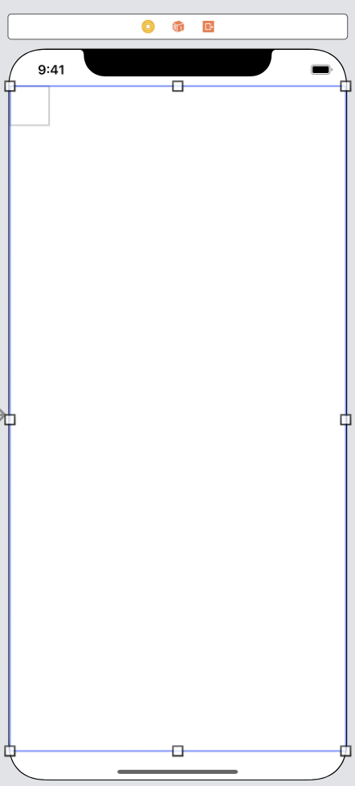
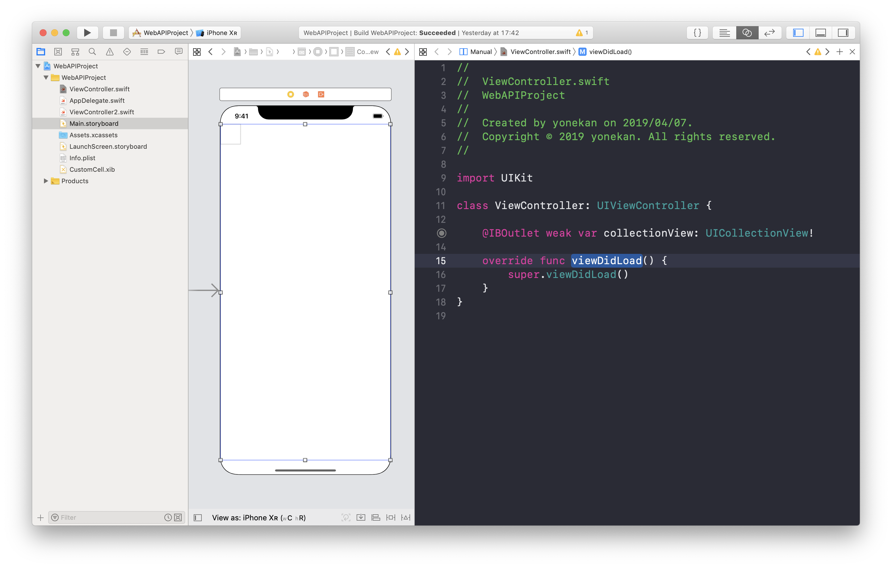

# WebAPI

## 目標
- WebAPIが使えるようになる

## 作成するアプリ

## 開発の流れ
1. 画面の部品を配置する
2. xibファイルでコレクションのセルを作成する
2. タップ処理を追加する
3. スワイプ処理を追加する

## 開発しよう
1. プロジェクトを作成する  
  アプリ名：WebAPIProject

2. 画面の部品を配置する
    1. 以下のような画面になるよう部品を配置する  
    ※コレクションビューを配置してください
        
  
    2. 配置した部品をViewController.swiftに接続する。
    
        |部品|接続時のName|
        |---|---|
        |UICollectionView|collectionView|

        

    3. デザインの制約を追加する。
        Main.storyboardで画面を選択し、右下にある「Pinボタン」内の「Add Missing Constraints」を選択する。
        > この作業をすることで、画面サイズによるデザインのずれを解決します。
        

3. 自作セルを作成する
    1. xibファイルを作成する。  
    プロジェクトフォルダを選択し、右クリック→「New File」を選択→「View」選択し、Next→「CustomCell」と入力しCreate

        
