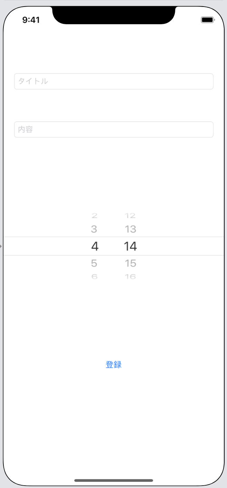
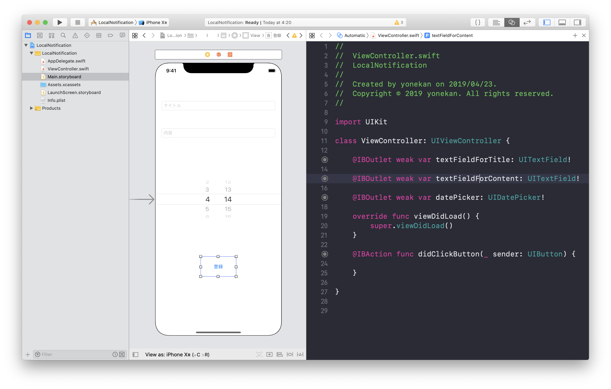
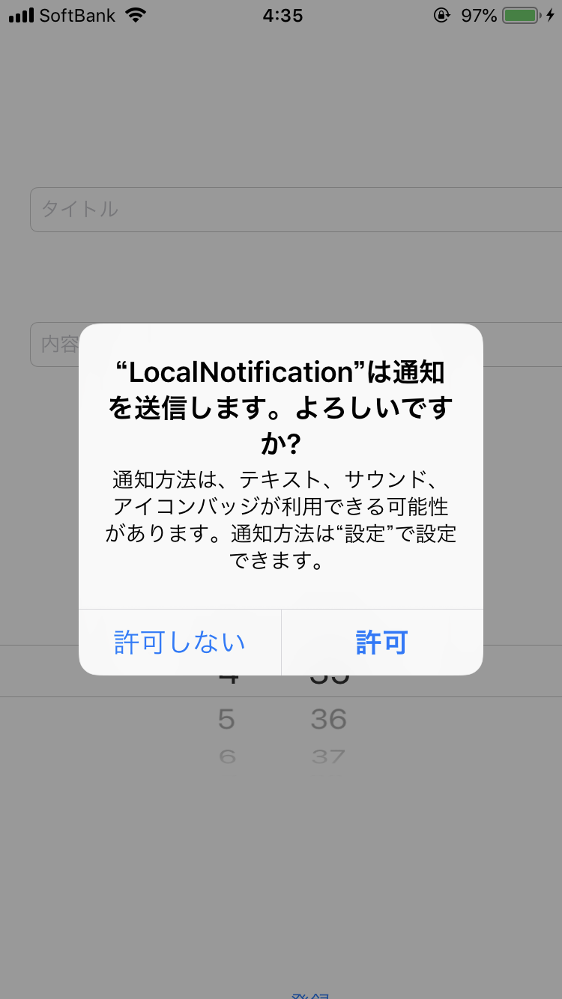

# LocalNotification

## 目標
- ローカル通知が使えるようになる

## 作成するアプリ  


## 開発の流れ

1. 画面の部品を配置する
	- TextFieldの設置
	- DatePickerの設置
	- Buttonの設置
2. 配置した画面の部品をプログラムで扱えるよう設定する
3. ユーザーに通知を許可するか確認するアラートを登録する
4. ボタンが押されたときのローカル通知の登録処理書く

## 部品の説明

|部品名|概要|
|---|---|
| TextField |通知のタイトル用|
| TextField |通知の内容用|
| DatePicker |通知時刻の設定用|
| Button |通知を登録する|

## 開発しよう

1. プロジェクトを作成する  
	[01_はじめてのアプリ開発](./01_はじめてのアプリ開発.md)と同じように新規プロジェクトを作成する。  
	アプリ名：LocalNotification
	
2. 画面の部品を配置する
	1. TextField, TextView, Button, Labelを以下のように配置する。  
		

3. 配置した画面の部品をプログラムで扱えるよう設定する
	1. 配置したTextField, DatePicker, Button, をViewController.swiftに接続する。

		|部品|接続時のName|
		|---|---|
		|UITextField（タイトル用）|textFieldForTitle|
		|UITextView（内容用）|textViewForContent|
		|DatePicker|datePicker|
		|UIButton|didClickButton|

		

4. ユーザーに通知を許可するか確認するアラートを登録する
	1. ```AppDelegate.swift```に以下のimport文を追記する

		```
		import UserNotifications
		```

		追記後の```AppDelegate.swift```

		```
		import UIKit
		import UserNotifications

		@UIApplicationMain
		class AppDelegate: UIResponder, UIApplicationDelegate {
		```

	2. ```UNUserNotificationCenterDelegate```を```AppDelegate.swift```に追記する

		追記後の```AppDelegate.swift```

		```
		@UIApplicationMain
		class AppDelegate: UIResponder, UIApplicationDelegate, UNUserNotificationCenterDelegate {
		```

	3. ```AppDelegate.swift```の```application(_ application: UIApplication, didFinishLaunchingWithOptions launchOptions: [UIApplication.LaunchOptionsKey: Any]?) -> Bool```メソッドに以下の処理を追記する

		```
		if #available(iOS 10.0, *) {
				// iOS 10
				let center = UNUserNotificationCenter.current()
				center.requestAuthorization(options: [.badge, .sound, .alert], completionHandler: { (granted, error) in
						if error != nil {
								return
						}
						
						if granted {
								print("通知許可")
								
								let center = UNUserNotificationCenter.current()
								center.delegate = self
								
						} else {
								print("通知拒否")
						}
				})
				
		} else {
				// iOS 9以下
				let settings = UIUserNotificationSettings(types: [.badge, .sound, .alert], categories: nil)
				UIApplication.shared.registerUserNotificationSettings(settings)
		}
		```

		追記後の```application(_ application: UIApplication, didFinishLaunchingWithOptions launchOptions: [UIApplication.LaunchOptionsKey: Any]?) -> Bool```メソッド

		```
		func application(_ application: UIApplication, didFinishLaunchingWithOptions launchOptions: [UIApplication.LaunchOptionsKey: Any]?) -> Bool {
			// Override point for customization after application launch.
			if #available(iOS 10.0, *) {
					// iOS 10
					let center = UNUserNotificationCenter.current()
					center.requestAuthorization(options: [.badge, .sound, .alert], completionHandler: { (granted, error) in
							if error != nil {
									return
							}
							
							if granted {
									print("通知許可")
									
									let center = UNUserNotificationCenter.current()
									center.delegate = self
									
							} else {
									print("通知拒否")
							}
					})
					
			} else {
					// iOS 9以下
					let settings = UIUserNotificationSettings(types: [.badge, .sound, .alert], categories: nil)
					UIApplication.shared.registerUserNotificationSettings(settings)
			}
			return true
    }
		```

		> 上記の処理を追加することによって、アプリ初回起動時に通知を許可するかの確認アラートが表示されます。  
		> 

5. ボタンが押されたときのローカル通知の登録処理書く
	1. ViewControllerに```UserNotifications```のimport文を追記する

		追記後のViewController

		```
		import UIKit
		import UserNotifications

		class ViewController: UIViewController {
		```

	2. 通知内容を作成する。  
	```didClickButton```メソッドに以下の処理を追記する。

		```
		let content = UNMutableNotificationContent()
		content.title = textFieldForTitle.text!
		content.body = textFieldForContent.text!
		content.sound = .default
		```

		追記後の```didClickButton```メソッド

		```
		@IBAction func didClickButton(_ sender: UIButton) {
        let content = UNMutableNotificationContent()
        content.title = textFieldForTitle.text!
        content.body = textFieldForContent.text!
        content.sound = .default
    }
		```

	3. 通知の時間のタイマーを作成する。  
	```didClickButton```メソッドに以下の処理を追記する。

		```
		var notificationTime = DateComponents()
		let calendar = Calendar.current
		notificationTime.hour = calendar.component(.hour, from: datePicker.date)
		notificationTime.minute = calendar.component(.minute, from: datePicker.date)
		```

		追記後の```didClickButton```メソッド

		```
		@IBAction func didClickButton(_ sender: UIButton) {
			let content = UNMutableNotificationContent()
			content.title = textFieldForTitle.text!
			content.body = textFieldForContent.text!
			content.sound = .default
			
			var notificationTime = DateComponents()
			let calendar = Calendar.current
			notificationTime.hour = calendar.component(.hour, from: datePicker.date)
			notificationTime.minute = calendar.component(.minute, from: datePicker.date)
    }
		```

	4. 3で作成したタイマーをトリガーに設定する。  
	```didClickButton```メソッドに以下の処理を追記する。

		```
		let trigger = UNCalendarNotificationTrigger(dateMatching: notificationTime, repeats: false)
		```

		追記後の```didClickButton```メソッド

		```
		@IBAction func didClickButton(_ sender: UIButton) {
			let content = UNMutableNotificationContent()
			content.title = textFieldForTitle.text!
			content.body = textFieldForContent.text!
			content.sound = .default
			
			var notificationTime = DateComponents()
			let calendar = Calendar.current
			notificationTime.hour = calendar.component(.hour, from: datePicker.date)
			notificationTime.minute = calendar.component(.minute, from: datePicker.date)
			
			let trigger = UNCalendarNotificationTrigger(dateMatching: notificationTime, repeats: false)
    }
		```

	5. 2で作成した通知内容と、4で作成したトリガーを使い、通知を作成する。  
	```didClickButton```メソッドに以下の処理を追記する。

		```
		let request = UNNotificationRequest(identifier: "uuid", content: content, trigger: trigger)
		```

		追記後の```didClickButton```メソッド

		```
		@IBAction func didClickButton(_ sender: UIButton) {
			let content = UNMutableNotificationContent()
			content.title = textFieldForTitle.text!
			content.body = textFieldForContent.text!
			content.sound = .default
			
			var notificationTime = DateComponents()
			let calendar = Calendar.current
			notificationTime.hour = calendar.component(.hour, from: datePicker.date)
			notificationTime.minute = calendar.component(.minute, from: datePicker.date)
			
			let trigger = UNCalendarNotificationTrigger(dateMatching: notificationTime, repeats: false)
			
			let request = UNNotificationRequest(identifier: "uuid", content: content, trigger: trigger)
    }
		```

	6. 5で作成した通知をセットする。  
	```didClickButton```メソッドに以下の処理を追記する。

		```
		UNUserNotificationCenter.current().add(request, withCompletionHandler: nil)
		```

		追記後の```didClickButton```メソッド

		```
		@IBAction func didClickButton(_ sender: UIButton) {
			let content = UNMutableNotificationContent()
			content.title = textFieldForTitle.text!
			content.body = textFieldForContent.text!
			content.sound = .default
			
			var notificationTime = DateComponents()
			let calendar = Calendar.current
			notificationTime.hour = calendar.component(.hour, from: datePicker.date)
			notificationTime.minute = calendar.component(.minute, from: datePicker.date)
			
			let trigger = UNCalendarNotificationTrigger(dateMatching: notificationTime, repeats: false)
			
			let request = UNNotificationRequest(identifier: "uuid", content: content, trigger: trigger)
			
			UNUserNotificationCenter.current().add(request, withCompletionHandler: nil)
    }
		```

6. TextFieldのReturn Key処理