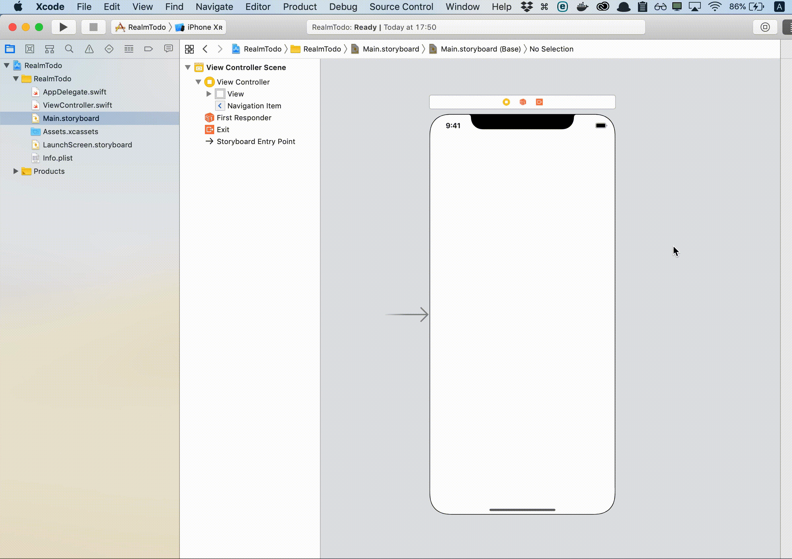
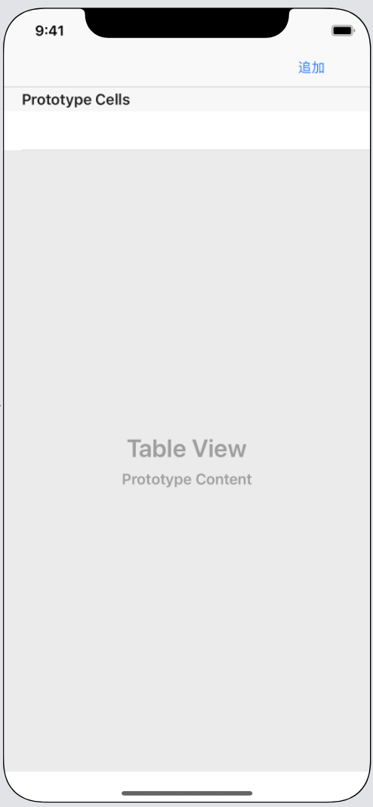
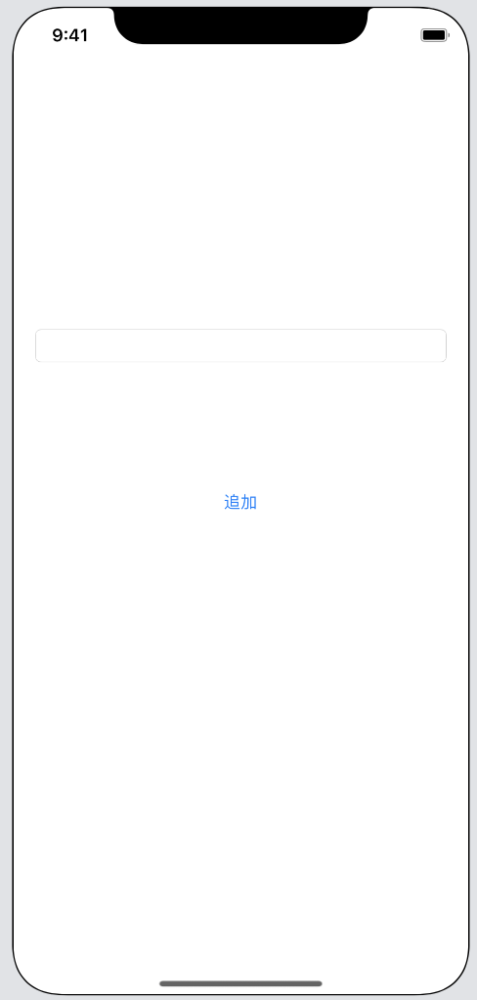

# RealmTodo

## 目標
- Realmが使えるようになる
- 役割や機能ごとにクラスを分けることができるようになる
- MVCについて理解する

## 作成するアプリ  
|タスク一覧|タスク追加|タスク編集|タスク削除|
|---|---|---|---|
|||||

## 開発の流れ

1. 画面の部品を配置する
2. RealmをCocoaPodsを使ってインストールする
2. 配置した画面の部品をプログラムで扱えるよう設定する
3. ユーザーに通知を許可するか確認するアラートを登録する
4. ボタンが押されたときのローカル通知の登録処理書く
5. キーボードを閉じる処理を書く

## 開発しよう

1. プロジェクトを作成する  
	[01_はじめてのアプリ開発](./01_はじめてのアプリ開発.md)と同じように新規プロジェクトを作成する。  
	アプリ名：RealmTodo

2. 画面の部品を配置する

	1. NavigationControllerを追加する。  
	Main.storyboardでViewControllerを選択し、「Editor」→「Embed in」→「Navigation Controller」を選択する

		

	2. 以下のような画面になるよう部品を配置する  
		

	3. 以下のような別画面を作成し、部品を配置する  
		

	4. 2つのViewControllerが画面遷移するよう設定する
		