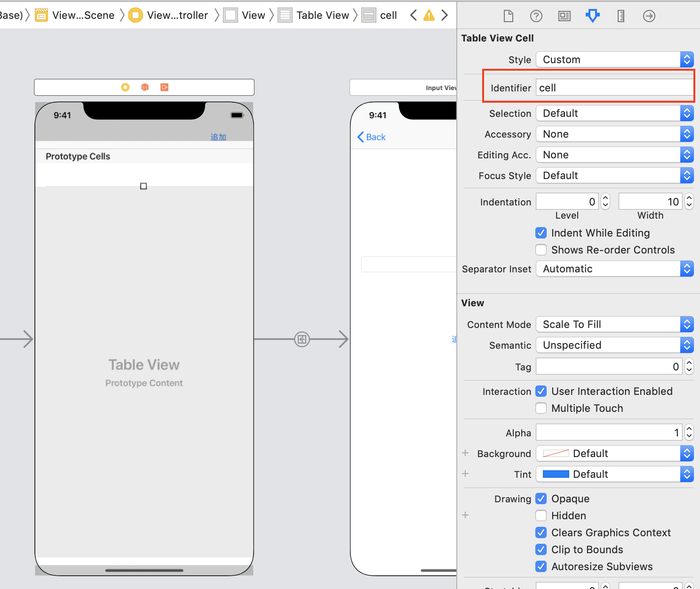

# RealmTodo

## 目標
- Realmが使えるようになる
- 役割や機能ごとにクラスを分けることができるようになる
- MVCについて理解する

## 作成するアプリ  
|タスク一覧|タスク追加|タスク編集|タスク削除|
|---|---|---|---|
|||||

## 開発の流れ

1. ViewController.swiftに全タスクを保持する配列を追記する
2. ```UITableViewDelegate```、```UITableViewDataSource```を追記し、必要な関数を設定する
3. Main.storyboardでTableViewCellのIdentifierを設定する
4. TodoRepository.swiftにタスク全件取得するメソッドを追加する
5. TodoService.swiftにTodoRepository.swiftのタスク全件取得するメソッドを呼び出す処理を追加する
6. ViewController.swiftにTodoService.swiftのタスク全件取得するメソッドを呼び出す処理を追記する

## 開発しよう

1. ViewController.swiftに全タスクを保持する配列を追記する

	以下の配列を定義する

	```
	var todos: [Todo] = []
	```

	追加後のViewController.swift

	```
	import UIKit

	class ViewController: UIViewController {

		@IBOutlet weak var tableView: UITableView!

		// テーブルに表示するTodoの配列
		var todos: [Todo] = []
	```

2. ```UITableViewDelegate```、```UITableViewDataSource```を追記し、必要な関数を設定する

	1. ```UITableViewDelegate```、```UITableViewDataSource```を追記する

		追記後のViewController.swift

		```
		class ViewController: UIViewController, UITableViewDelegate, UITableViewDataSource {
		```
		
	2. 設定に必要な関数を追加する。

		```
		func tableView(_ tableView: UITableView, numberOfRowsInSection section: Int) -> Int {
			<#code#>
		}

		func tableView(_ tableView: UITableView, cellForRowAt indexPath: IndexPath) -> UITableViewCell {
			<#code#>
		}
		``

	3. 追加した関数```numberOfRowsInSection```に処理を追記する  
	以下の処理を追記する

		```
		return todos.count
		```

		追記後の```numberOfRowsInSection```
		
		```
		func tableView(_ tableView: UITableView, numberOfRowsInSection section: Int) -> Int {
			return todos.count
		}
		```

	4. 追加した関数```cellForRowAt```に処理を追記する  
	以下の処理を追記する

		```
		let cell = tableView.dequeueReusableCell(withIdentifier: "cell", for: indexPath)

		let todo = todos[indexPath.row]

		// セルのタイトルにTodoのタイトルを設定
		cell.textLabel?.text = todo.title

		return cell
		```

		追加後の```cellForRowAt```

		```
		func tableView(_ tableView: UITableView, cellForRowAt indexPath: IndexPath) -> UITableViewCell {
			let cell = tableView.dequeueReusableCell(withIdentifier: "cell", for: indexPath)

			let todo = todos[indexPath.row]

			// セルのタイトルにTodoのタイトルを設定
			cell.textLabel?.text = todo.title

			return cell
		}
		```

	5. 以下の処理を```viewDidLoad```メソッドに追記する。

		```
		tableView.dataSource = self
		tableView.delegate = self
		```

		追記後の```viewDidLoad```メソッド

		```
		override func viewDidLoad() {
			super.viewDidLoad()

			tableView.dataSource = self
			tableView.delegate = self
		}
		```

3. Main.storyboardでTableViewCellのIdentifierを設定する

	

4. TodoRepository.swiftにタスク全件取得するメソッドを追加する

	1. タスクを全件取得するfindAllメソッドを追記する

		```
		// Todoを全件取得する
		func findAll() -> [Todo] {
			let todos = realm.objects(Todo.self)
			return todos.reversed()
		}
		```

5. TodoService.swiftにTodoRepository.swiftのタスク全件取得するメソッドを呼び出す処理を追加する

	1. 以下のメソッドを追加する

	```
	// Todoを全件取得する
	func findAll() -> [Todo] {
		return repository.findAll()
	}
	```

6. ViewController.swiftにTodoService.swiftのタスク全件取得するメソッドを呼び出す処理を追記する

	1. 以下のメソッドを追記する

	```
	override func viewWillAppear(_ animated: Bool) {
		// RealmにあるTodoを全件取得
		let todoService = TodoService()
		todos = todoService.findAll()

		tableView.reloadData()
	}
	```