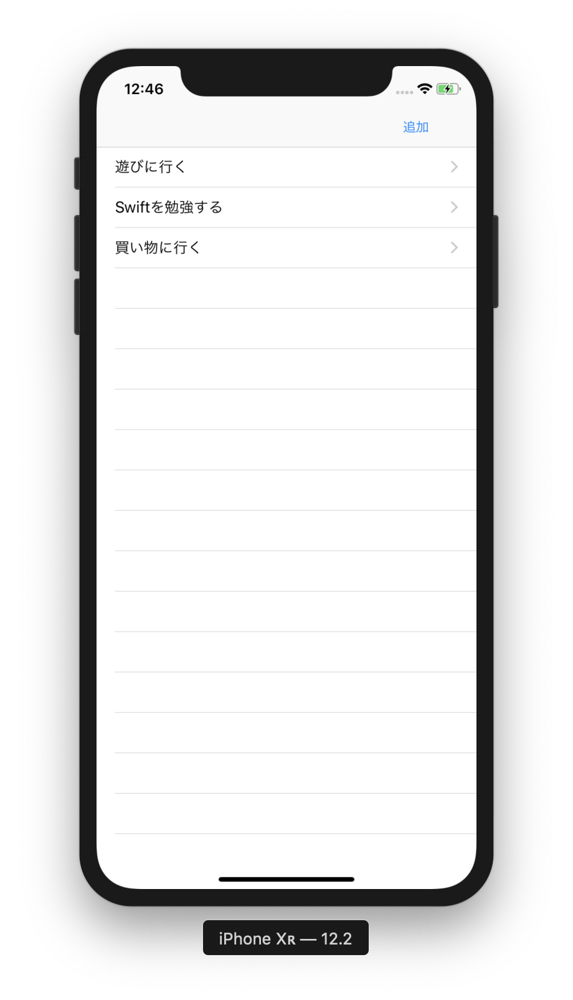
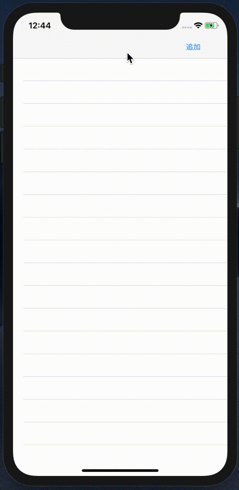
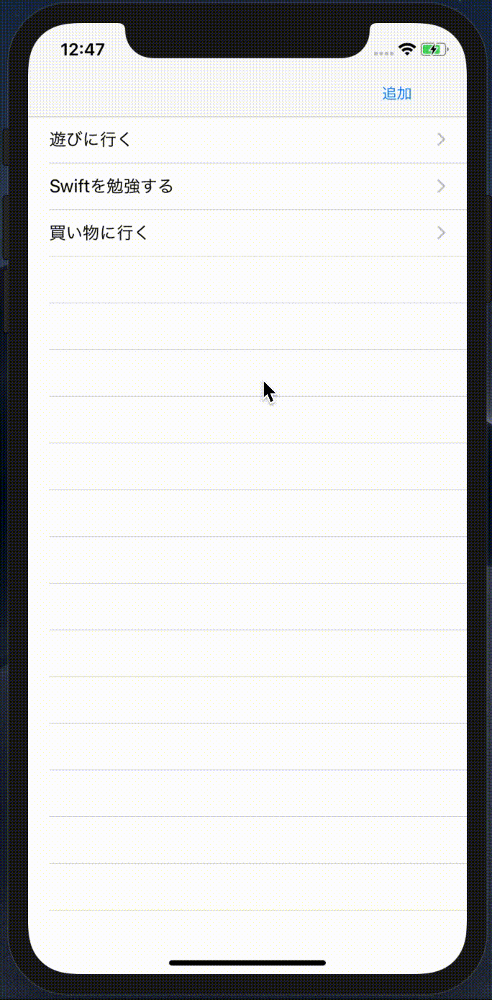
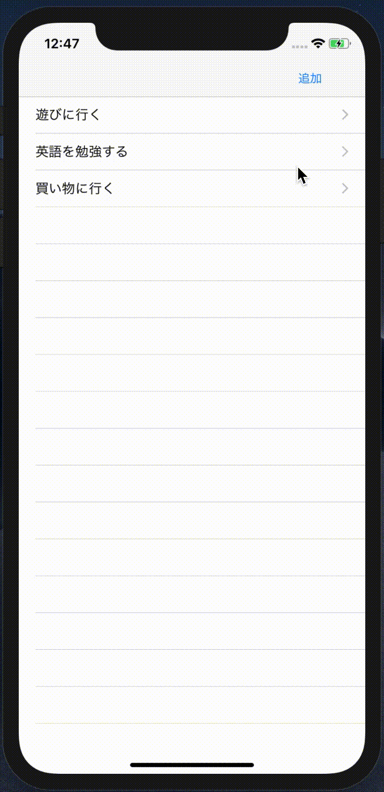

# RealmTodo

## 目標
- Realmが使えるようになる
- 役割や機能ごとにクラスを分けることができるようになる
- MVCについて理解する

## 作成するアプリ  
|タスク一覧|タスク追加|タスク編集|タスク削除|
|---|---|---|---|
|||||

## 開発の流れ

1. TodoRepository, TodoService,InputViewControllerにそれぞれ削除の処理を追記する。
2. セルにスワイプ処理と削除ボタンを追加する

## 開発しよう

1. TodoRepository, TodoServiceそれぞれ削除の処理を追記する。

	1. TodoRepositoryに以下のメソッドを追記する

		```
		func delete(id: Int) {
			let realm = try! Realm()
			let todo = findById(id: id)

			try! realm.write {
				realm.delete(todo!)
			}
		}
		```

	2. TodoServiceに以下のメソッドを追記する

		```
		func delete(id: Int) {
			repository.delete(id: id)
		}
		```

1. セルにスワイプ処理と削除ボタンを追加する

	1. ViewController.swiftに以下のメソッドを追記する

		```
		func tableView(_ tableView: UITableView, commit editingStyle: UITableViewCell.EditingStyle, forRowAt indexPath: IndexPath) {
			<#code#>
		}
		```

	2. 追加したメソッドを以下のように修正する。

		```
		func tableView(_ tableView: UITableView, commit editingStyle: UITableViewCell.EditingStyle, forRowAt indexPath: IndexPath) {

			if editingStyle == .delete {
				// セルをスワイプし、Deleteが選ばれた場合
				let id = todos[indexPath.row].id

				// Realmからた該当Todoを削除
				let todoService = TodoService()
				todoService.delete(id: id)

				// 配列から削除
				todos.remove(at: indexPath.row)

				// 画面から削除
				tableView.deleteRows(at: [indexPath], with: .fade)
			}
		}
		```