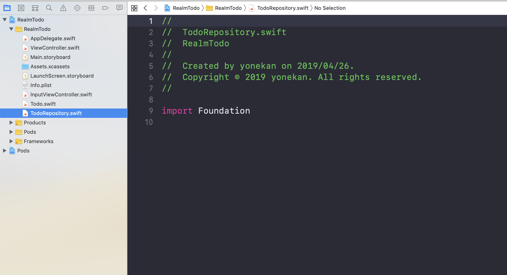

# RealmTodo

## 目標
- Realmが使えるようになる
- 役割や機能ごとにクラスを分けることができるようになる
- MVCについて理解する

## 作成するアプリ  
|タスク一覧|タスク追加|タスク編集|タスク削除|
|---|---|---|---|
|||||

## 開発の流れ

1. 必要なクラスを作成する
2. 配置した画面の部品をプログラムで扱えるよう設定する
3. RealmをCocoaPodsを使ってインストールする

## 開発しよう
1. 必要なクラスを作成する

	1. Realm Objectsを作成する  
	class名：Todo

		> このクラスは、タスクのタイトルや入力日時などのデータを管理するためのクラスです。

		

	2. レポジトリクラスを作成する
	class名：TodoRepository

		> このクラスは、上記で作ったTodoクラスを使って、タスクの取得・登録・編集・削除の操作をするためのクラスです。

		
		
	3. サービスクラスを作成する  
	class名：TodoService

		> このクラスは、上記で作ったTodoRepositoryクラスのタスク取得・登録・編集・削除に必要なデータを準備し、実際にTodoRepositoryクラスのタスク取得・登録・編集・削除を実行します。