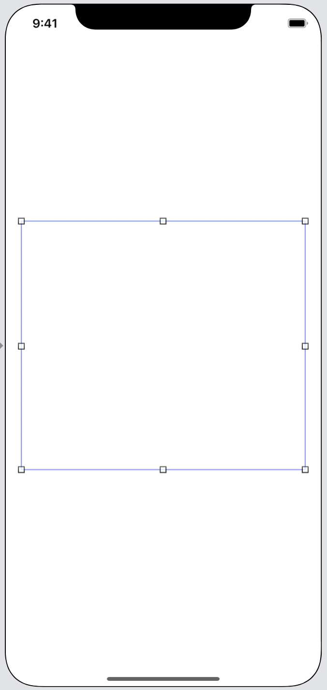
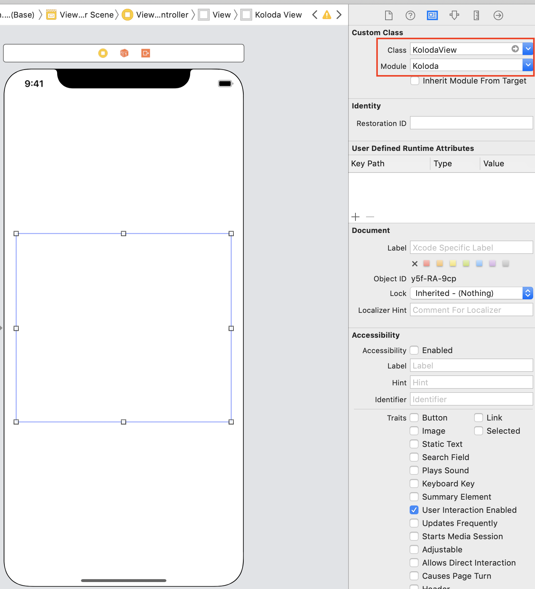
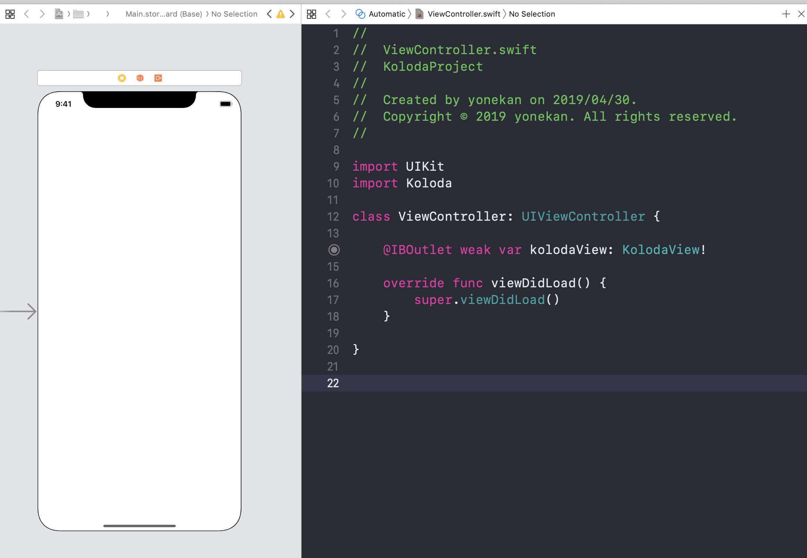
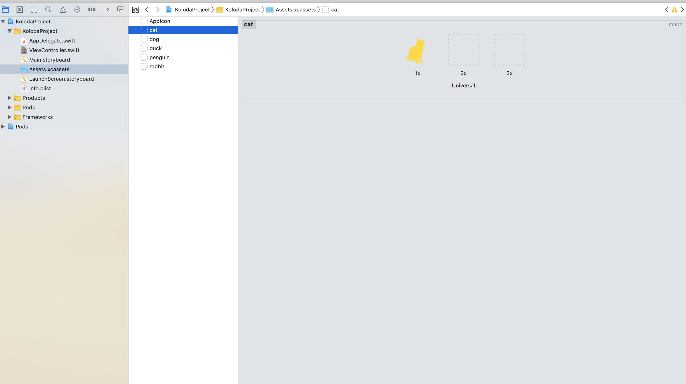

# Koloda  

## 目標
- Kolodaライブラリが使えるようになる

## 作成するアプリ


## 開発の流れ
1. プロジェクトを作成する
2. 画面の部品を配置する
3. 画像を用意する
4. ViewControllerにDelegateとDataSourceを追記する
5. Kolodaの設定を追記する

## 開発しよう
1. プロジェクトを作成する

	1. プロジェクトを作成する  
	アプリ名：KolodaProject
	
	2. CocoaPodsでKolodaをインストールする
	
		```
		pod "Koloda"
		```

2. 画面の部品を配置する

	1. 以下のような画面になるよう部品(View)を配置する  
		

	2. 配置したViewをKolodaViewに変更する
		

	3. ViewController.swiftに以下のコードを追加する
		
		```
		import Koloda
		```

		追加後のViewController.swift

		```
		import UIKit
		import Koloda

		class ViewController: UIViewController {
		```
  
	4. 配置した部品をViewController.swiftに接続する。
		
		|部品|接続時のName|
		|---|---|
		|KolodaView|kolodaView|

		

3. 画像を用意する

	1. ```Assets.xcassets```に任意の画像を追加する
	
		
	
	2. ViewController.swiftに追加した画像名の配列を追加する
	
		```
		let images = [
			"duck",
			"rabbit",
			"cat",
			"dog",
			"penguin"
		]
		```

		追加後のViewController.swift

		```
		class ViewController: UIViewController {

			@IBOutlet weak var kolodaView: KolodaView!
      
			let images = [
				"duck",
				"rabbit",
				"cat",
				"dog",
				"penguin"
			]
		```

4. ViewControllerにDelegateとDataSourceを追記する
	1. ViewControllerに```KolodaViewDelegate``` と ```KolodaViewDataSource```を追記する

		追記後のViewController

		```
		class ViewController: UIViewController, KolodaViewDelegate, KolodaViewDataSource {
		```
		
	2. 以下の処理を```viewDidLoad```に追記する
	
		```
		kolodaView.dataSource = self
		kolodaView.delegate = self
		```
		
		追記後の```viewDidLoad```

		```
		override func viewDidLoad() {
			super.viewDidLoad()
			
			kolodaView.dataSource = self
			kolodaView.delegate = self
		}
		```

5. Kolodaの設定を追記する
	
	1. 以下のメソッドを追記する

		```
		func kolodaNumberOfCards(_ koloda: KolodaView) -> Int {
			<#code#>
		}
    
    	func koloda(_ koloda: KolodaView, viewForCardAt index: Int) -> UIView {
    		<#code#>
    	}
		```
	
	2. ```kolodaNumberOfCards```メソッドを以下のように修正する

		```
		func kolodaNumberOfCards(_ koloda: KolodaView) -> Int {
			return images.count
		}
		```

	3. ```viewForCardAt```メソッドを以下のように修正する
		
		```
		func koloda(_ koloda: KolodaView, viewForCardAt index: Int) -> UIView {
			let image = UIImage(named: images[index])
			let imageView = UIImageView(image: image)
			imageView.backgroundColor = .black
			
			return imageView
		}
		```

## 実行してみる

