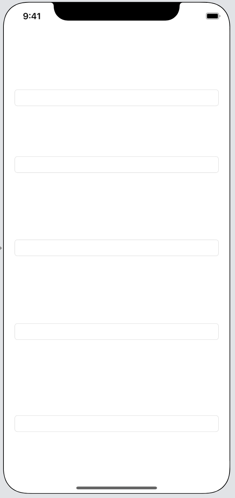

# IQKeyboardManager  

## 目標
- IQKeyboardManagerライブラリが使えるようになる

## 作成するアプリ


## 開発の流れ
1. プロジェクトを作成する
2. 画面の部品を配置する

## 開発しよう
1. プロジェクトを作成する
	1. プロジェクトを作成する  
	アプリ名：IQKeyboardManagerSwiftProject
	
	2. CocoaPodsでIQKeyboardManagerをインストールする
		
		```
		pod 'IQKeyboardManagerSwift'
		```

2. 画面の部品を配置する
	
	1. 以下のような画面になるよう部品を配置する  
		

3. ```AppDelegate.swift```に処理を追記する
	
	1. 以下のコードを追記する
		```
		import IQKeyboardManagerSwift
		```
		
		追記後の```AppDelegate.swift```

		```
		import UIKit
		import IQKeyboardManagerSwift

		@UIApplicationMain
		class AppDelegate: UIResponder, UIApplicationDelegate {
		```
  
  	2. ```AppDelegate.swift```の```didFinishLaunchingWithOptions```メソッドに以下の処理を追記する

		```
		IQKeyboardManager.shared.enable = true
		```

		追記後の```didFinishLaunchingWithOptions```メソッド

		```
		func application(_ application: UIApplication, didFinishLaunchingWithOptions launchOptions: [UIApplication.LaunchOptionsKey: Any]?) -> Bool {
			IQKeyboardManager.shared.enable = true
			return true
		}
		```

## 実行してみる

