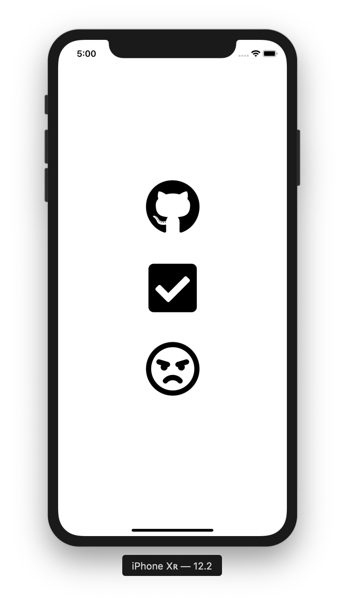
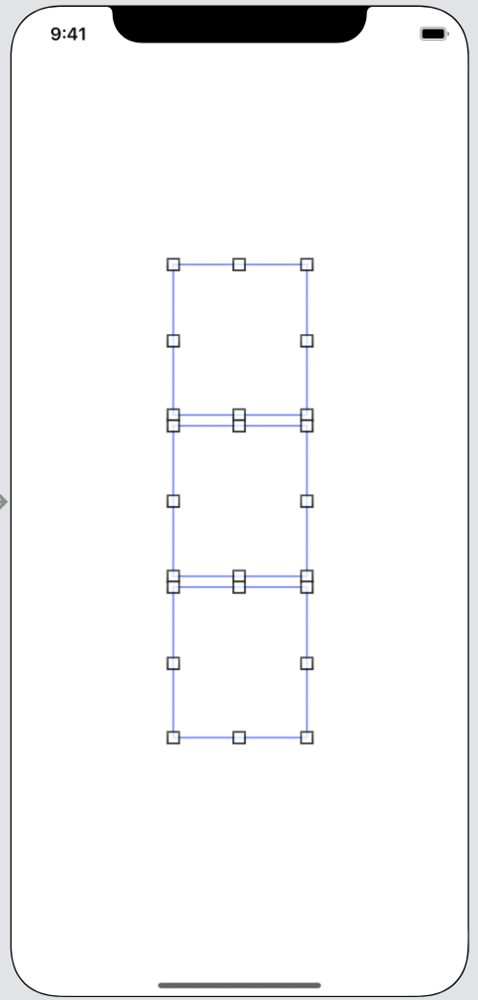
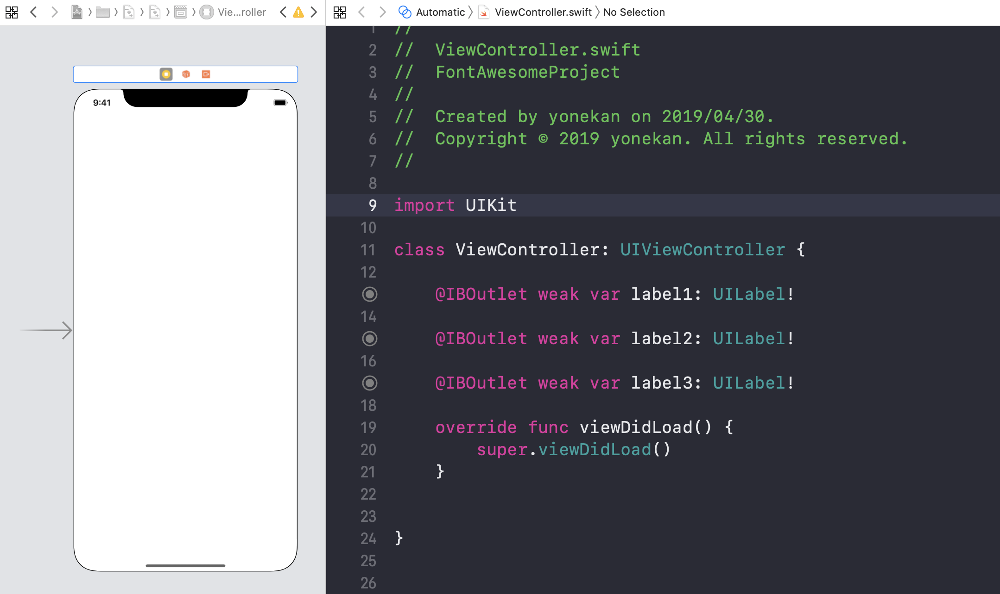

# FontAwesome  

## 目標
- FontAwesomeライブラリが使えるようになる

## 作成するアプリ


## 開発の流れ
1. プロジェクトを作成する
2. 画面の部品を配置する

## 開発しよう
1. プロジェクトを作成する
  1. プロジェクトを作成する  
  アプリ名：FontAwesomeProject

  2. CocoaPodsでFontAwesomeをインストールする

    ```
    pod 'FontAwesome.swift'
    ```

2. 画面の部品を配置する
    1. 以下のような画面になるよう部品(Label)を配置する  
        

    2. 配置した部品をViewController.swiftに接続する。
    
        |部品|接続時のName|
        |---|---|
        |UILabel(1つ目)|label1|
        |UILabel(2つ目)|label2|
        |UILabel(3つ目)|label3|

        

3. ViewControllerを修正する

  1. 以下のコードを追記する

    ```
    import FontAwesome_swift
    ```

    追記後の```ViewController.swift```

    ```
    import UIKit
    import FontAwesome_swift

    class ViewController: UIViewController {
    ```

  2. ```viewDidLoad```メソッドに以下の処理を追記する

    ```
    label1.font = UIFont.fontAwesome(ofSize: 100, style: .brands)
    label1.text = String.fontAwesomeIcon(name: .github)
    
    label2.font = UIFont.fontAwesome(ofSize: 100, style: .solid)
    label2.text = String.fontAwesomeIcon(name: .checkSquare)
    
    label3.font = UIFont.fontAwesome(ofSize: 100, style: .regular)
    label3.text = String.fontAwesomeIcon(name: .angry)
    ```

    追記後の```viewDidLoad```メソッド

    ```
    override func viewDidLoad() {
      super.viewDidLoad()
      
      label1.font = UIFont.fontAwesome(ofSize: 100, style: .brands)
      label1.text = String.fontAwesomeIcon(name: .github)
      
      label2.font = UIFont.fontAwesome(ofSize: 100, style: .solid)
      label2.text = String.fontAwesomeIcon(name: .checkSquare)
      
      label3.font = UIFont.fontAwesome(ofSize: 100, style: .regular)
      label3.text = String.fontAwesomeIcon(name: .angry)
    }
    ```

## 実行してみる


アイコンは以下から探すことができます
https://fontawesome.com/icons?d=gallery