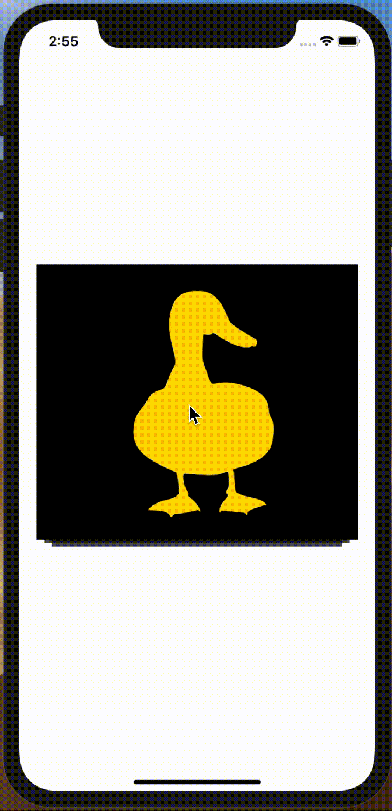
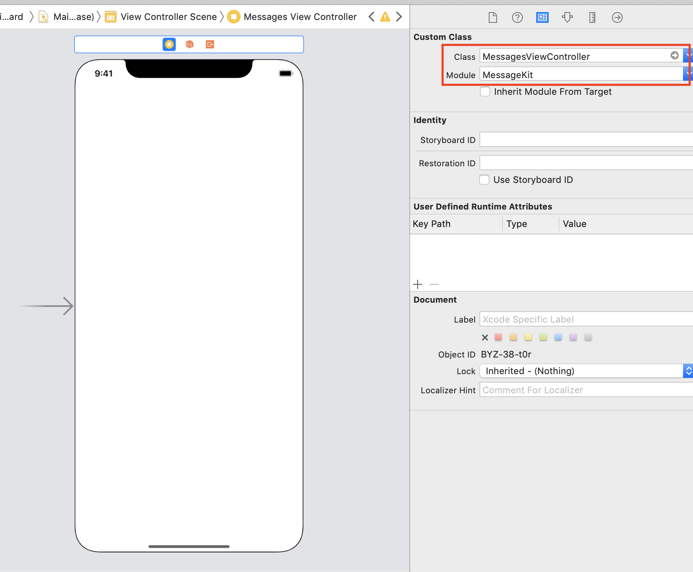
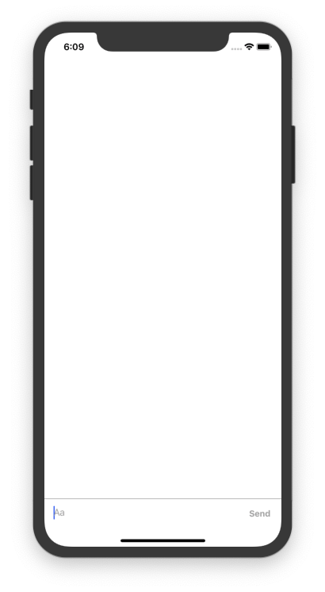
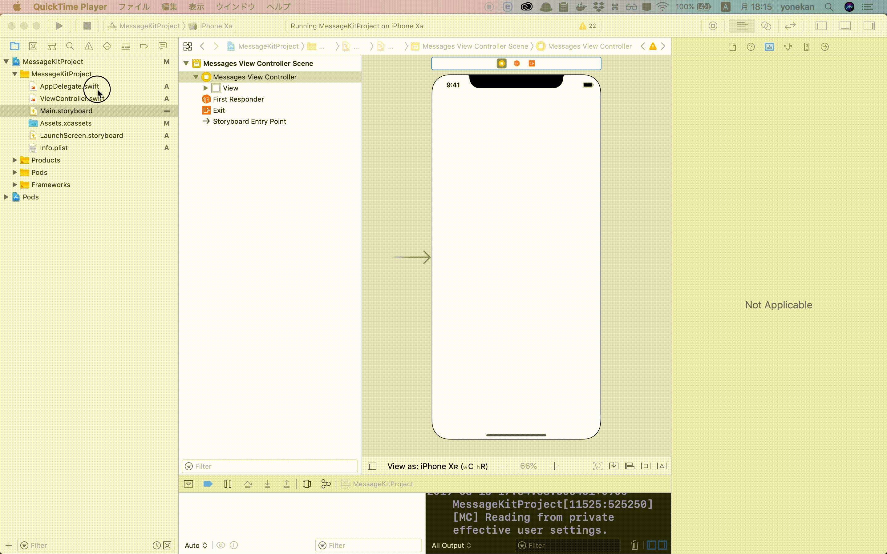
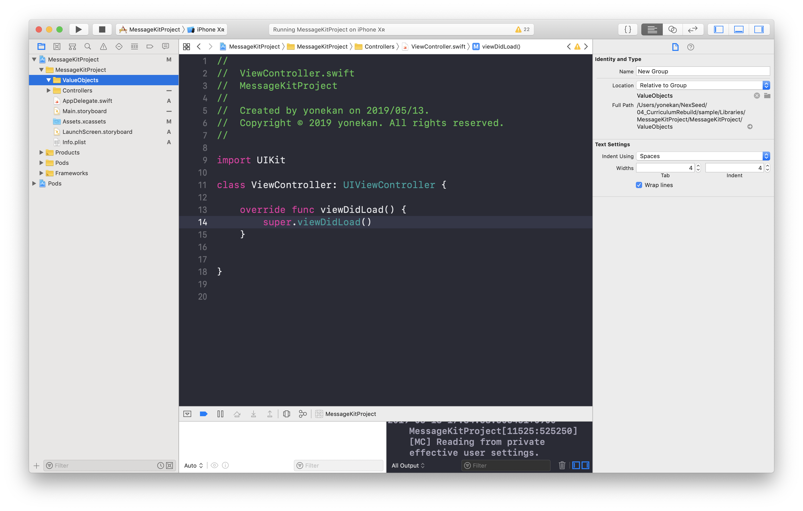
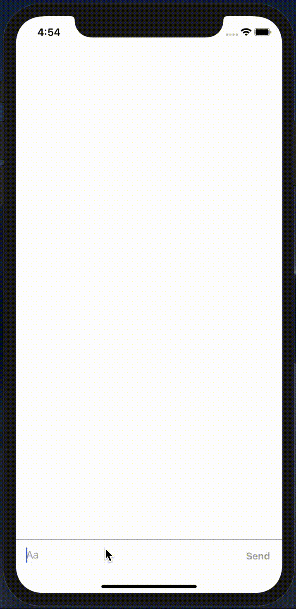
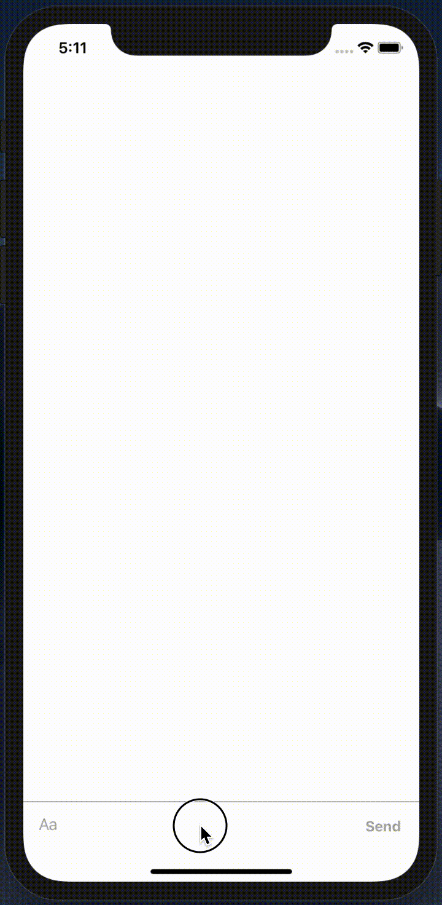

# MessageKit  

## 目標
- MessageKitライブラリが使えるようになる

## 使用するライブラリ
	<a href="https://github.com/MessageKit/MessageKit" target="_blank">MessageKit</a>

## 作成するアプリ
	

## 開発の流れ
1. プロジェクトを作成する
2. 画面の部品を配置する
3. 画像を用意する
4. ViewControllerにDelegateとDataSourceを追記する
5. Kolodaの設定を追記する

## 開発しよう
1. プロジェクトを作成する

	1. プロジェクトを作成する  
	アプリ名：MessageKitProject
	
	2. CocoaPodsでMessageKitをインストールする
		```
		pod 'MessageKit'
		```

2. 画面の部品を配置する
	1. 以下のように画面のCustomClassを```MessagesViewController```に変更する  
		
	
	2. プロジェクトを実行してみる
		

3. 必要なグループとファイルを作成する
	
	1. 「Controllers」というグループを作成する。また作成したグループに```ViewController.swift```を移動する
		
		
	
	2. 「ValueObjects」というグループを作成する
		
		
	
	3. 作成した「ValueObjects」の中に以下のファイルを新規作成する
		
		- ChatUser.swift
		- Message.swift
		
			

4. 必要なクラスを定義する
	
	1. 作成した```ChatUser.swift```にチャットのユーザーのデータを管理するクラスを追記する。  
	以下のプログラムを```ChatUser.swift```に追記する
		
		```swift
		import MessageKit
		
		/// チャットユーザーの情報を持つクラス
		class ChatUser: SenderType {
			/// ユーザーID
			var senderId: String
			
			/// 表示名
			var displayName: String
			
			/// イニシャライザ
			///
			/// - Parameters:
			///   - senderId: ユーザーID
			///   - displayName: 表示名
			init(senderId: String, displayName: String) {
				self.senderId = senderId
				self.displayName = displayName
			}
		}
		```

	2. 作成した```Message.swift```に1件メッセージデータを管理するクラスを追記する。  
	以下のプログラムを```Message.swift```に追記する
		
		```swift
		import MessageKit
		
		/// 1件のメッセージのデータを持つクラス
		class Message {
		
			/// 送信者（チャットユーザー）
			let user: ChatUser
			
			/// メッセージのテキスト
			let text: String
			
			/// メッセージID（1件のメッセージを特定するため）
			let messageId: String
			
			/// 送信日付
			let sentDate: Date
			
			/// イニシャライザ
			///
			/// - Parameters:
			///   - user: 送信者
			///   - text: メッセージのテキスト
			///   - messageId: メッセージID
			///   - sentDate: 送信日付
			init(user: ChatUser, text: String, messageId: String, sentDate: Date) {
				self.user = user
				self.text = text
				self.messageId = messageId
				self.sentDate = sentDate
			}
		}
		
		extension Message: MessageType {
		
			/// メッセージの送信者を返す
			var sender: SenderType {
				return Sender(id: user.senderId, displayName: user.displayName)
			}
			
			/// メッセージのタイプを返す
			var kind: MessageKind {
				// タイプ：テキストと返す
				return .text(text)
			}
		}
		
		```

5. ViewControllerでMessageKitを扱えるよう修正する

	1. ```ViewController.swift```を以下のように修正する

		修正前

		```swift
		import UIKit
		
		class ViewController: UIViewController {
		```

		修正後

		```swift
		import UIKit
		import MessageKit
		import InputBarAccessoryView
		
		class ViewController: MessagesViewController {
		```

		> 上記のように```UIViewController```から```MessagesViewController```に変更することによって、チャット画面を作成するために使える便利な機能を使用できるようになります。

	2. ```ViewController```内に送信された全てのメッセージを保持する配列を作成する  
	以下の変数を追記する

		```
		class ViewController: MessagesViewController {
			/// 全てのメッセージを保持する配列
			var messageList: [Message] = []
		```

6. チャットのデータの設定をする

	1. 以下のプログラムを```UIViewController.swift```に追記する

		```swift
		extension ViewController: MessagesDataSource {

		}
		```

	2. 上記コードを追記し、エラーが表示されたら「fix」ボタンをクリックする

		fixボタン押下後のプログラム

		```swift
		extension ViewController: MessagesDataSource {
			func currentSender() -> SenderType {
				<#code#>
			}

			func messageForItem(at indexPath: IndexPath, in messagesCollectionView: MessagesCollectionView) -> MessageType {
				<#code#>
			}
			
			func numberOfSections(in messagesCollectionView: MessagesCollectionView) -> Int {
				<#code#>
			}
			
		}
		```

		上記メソッドでは、それぞれ以下のような設定をすることができます。

		|メソッド名|設定する内容|
		|---|---|
		|currentSender|自分の情報|
		|messageForItem|各メッセージの情報（中身）|
		|numberOfSections|メッセージの件数|

	3. ```currentSender```メソッドを以下のように修正してください。  
	自分のIDを1234, 名前をSeedKunという設定にしています。
		```swift
		func currentSender() -> SenderType {
			let id = "1234"
			let name = "SeedKun"
			return ChatUser(id: id, displayName: name)
		}
		```

	4. ```messageForItem```メソッドを以下のように修正してください。

		```swift
		func messageForItem(at indexPath: IndexPath, in messagesCollectionView: MessagesCollectionView) -> MessageType {
			return messageList[indexPath.section]
		}
		```

	5. ```numberOfSections```メソッドを以下のように修正してください。

		```swift
		func numberOfSections(in messagesCollectionView: MessagesCollectionView) -> Int {
			return messageList.count
		}
		```

7. 送信ボタンの処理を追記する

	1. 以下のプログラムを```UIViewController.swift```に追記する

		```swift
		extension ViewController: InputBarAccessoryViewDelegate {

		}
		```

	2. 上記で追加したextension内に以下のメソッドを追記する  
	以下のメソッド内に、送信ボタンがクリックされた時の処理を書くことができます


		```swift
		func inputBar(_ inputBar: InputBarAccessoryView, didPressSendButtonWith text: String) {
			<#code#>
		}
		```

	3. ```inputBar```メソッドを以下のように修正する

		```swift
		func inputBar(_ inputBar: InputBarAccessoryView, didPressSendButtonWith text: String) {
			// 自分の情報を取得
			let me = self.currentSender() as! ChatUser

			// 自分の情報、送信されたテキストからMessageオブジェクト作成
			let newMessage = Message(user: me, text: text, messageId: UUID().uuidString, sentDate: Date())

			// 全メッセージを保持する配列に新しいメッセージを追加
			messageList.append(newMessage)

			// 新しいメッセージを画面に追加
			messagesCollectionView.insertSections([messageList.count - 1])
			
			// 入力バーの入力値リセット
			inputBar.inputTextView.text = ""
		}
		```

		> UUIDを使用すると、アプリ内で一意になるIDをを作成することができます。

8. 以下のプログラムを```UIViewController.swift```に追記する

	```swift
	extension ViewController: MessagesDisplayDelegate {
	
	}
	
	extension ViewController: MessagesLayoutDelegate {  

	}

	```

9. ```viewDidLoad```を修正して、ここまで作成してきたチャットの設定を反映する。  
以下のように修正する。

	```swift
	override func viewDidLoad() {
		super.viewDidLoad()
		
		messagesCollectionView.messagesDataSource = self
		messagesCollectionView.messagesLayoutDelegate = self
		messagesCollectionView.messagesDisplayDelegate = self
		
		messageInputBar.delegate = self
	}
	```

10. 実行してみる

	

11. 送信したメッセージに応じて返信をするメソッドを作成する

	1. 以下のメソッドを```ViewController```内に追記する

		```swift
		func createResponse(text: String) -> Message {
			let chatUser = ChatUser(senderId: "9999", displayName: "UserName");
			if text == "こんにちは" {
				return Message(user: chatUser, text: "Hello", messageId: UUID().uuidString, sentDate: Date())
			}
			
			return Message(user: chatUser, text: "よくわかりません", messageId: UUID().uuidString, sentDate: Date())
		}
		```

		追記後の```ViewController```

		```swift
		class ViewController: MessagesViewController {
			/// 全てのメッセージを保持する配列
			var messageList: [Message] = []
			
			override func viewDidLoad() {
				super.viewDidLoad()
				messagesCollectionView.messagesDataSource = self
				messagesCollectionView.messagesLayoutDelegate = self
				messagesCollectionView.messagesDisplayDelegate = self
				
				messageInputBar.delegate = self
			
			}
			
			/// レスポンスのメッセージを作成する
			///
			/// - Parameter text: 送信したメッセージ
			/// - Returns: レスポンスメッセージ
			func createResponse(text: String) -> Message {
				let chatUser = ChatUser(senderId: "9999", displayName: "UserName");
				if text == "こんにちは" {
					return Message(user: chatUser, text: "Hello", messageId: UUID().uuidString, sentDate: Date())
				}
				
				return Message(user: chatUser, text: "よくわかりません", messageId: UUID().uuidString, sentDate: Date())
			}
		}
		```

	2. 作成した```createResponse```メソッドを```inputBar```メソッド内で使用する。  
	```inputBar```メソッドを以下のように修正する

		```swift
		func inputBar(_ inputBar: InputBarAccessoryView, didPressSendButtonWith text: String) {
			// 自分の情報を取得
			let me = self.currentSender() as! ChatUser
			
			// 自分の情報、送信されたテキストからMessageオブジェクト作成
			let newMessage = Message(user: me, text: text, messageId: UUID().uuidString, sentDate: Date())
			
			// 全メッセージを保持する配列に新しいメッセージを追加
			messageList.append(newMessage)
			
			// 新しいメッセージを画面に追加
			messagesCollectionView.insertSections([messageList.count - 1])
			
			let responseMessage = createResponse(text: text)
			messageList.append(responseMessage)
			messagesCollectionView.insertSections([messageList.count - 1])
			
			// 入力バーの入力値リセット
			inputBar.inputTextView.text = ""
		}
		```

12. 実行してみる

	