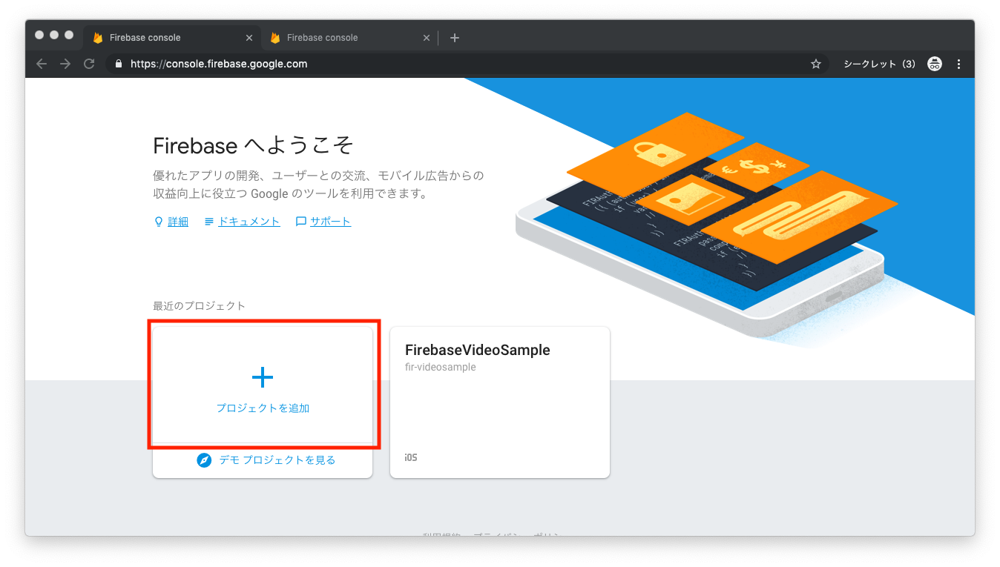
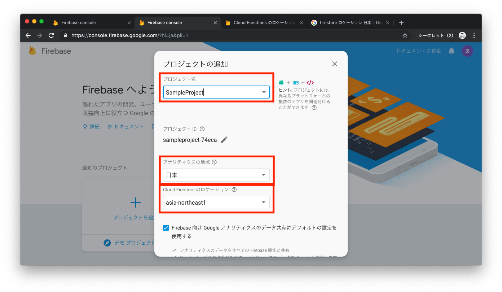
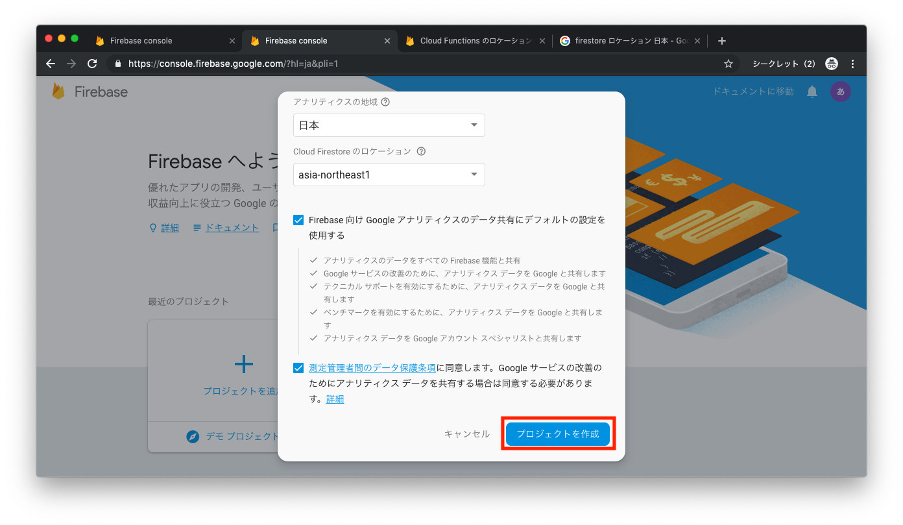
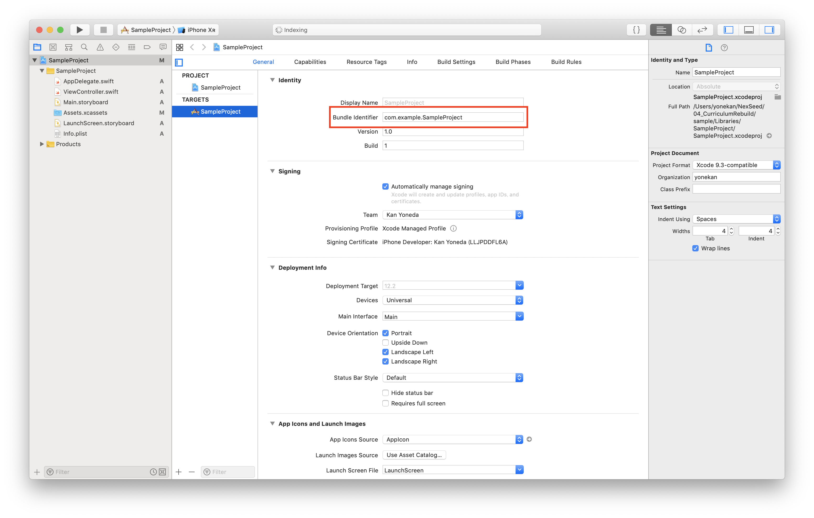
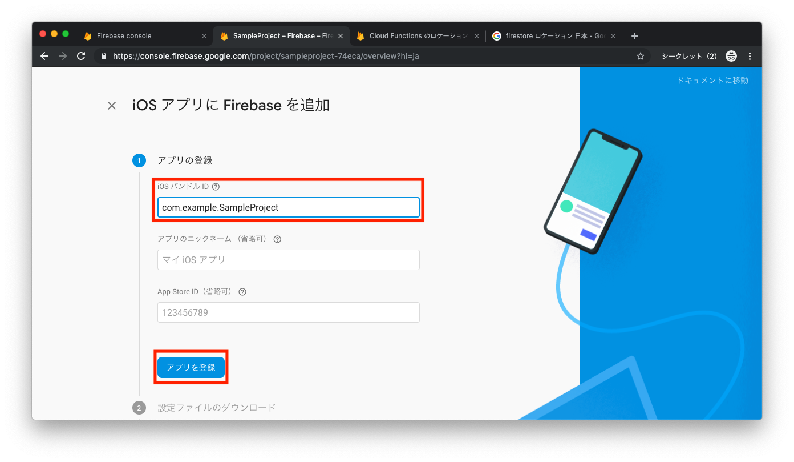
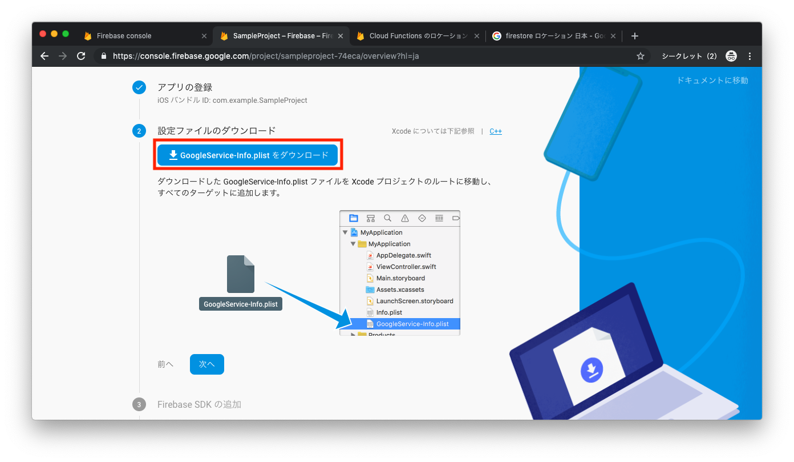
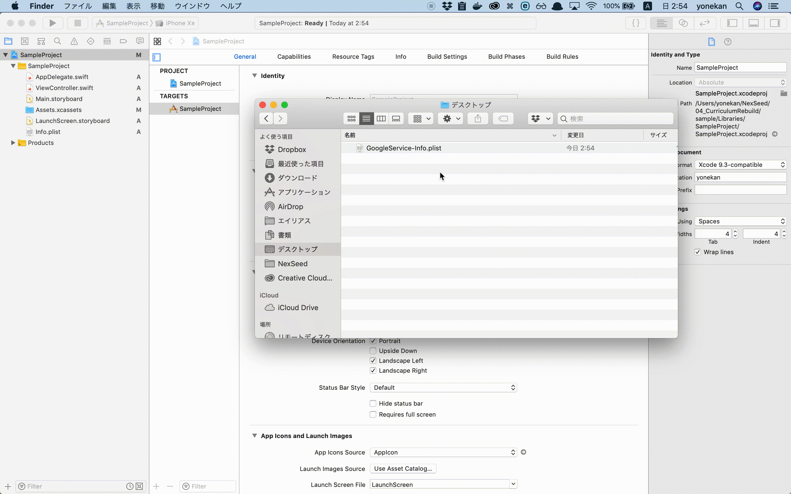
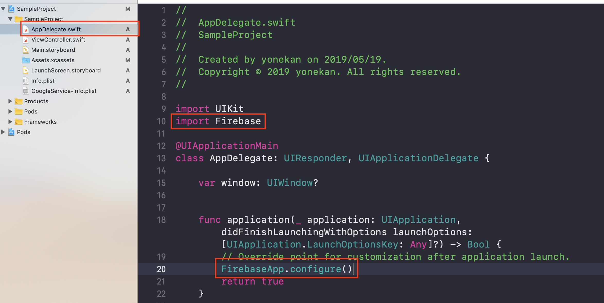
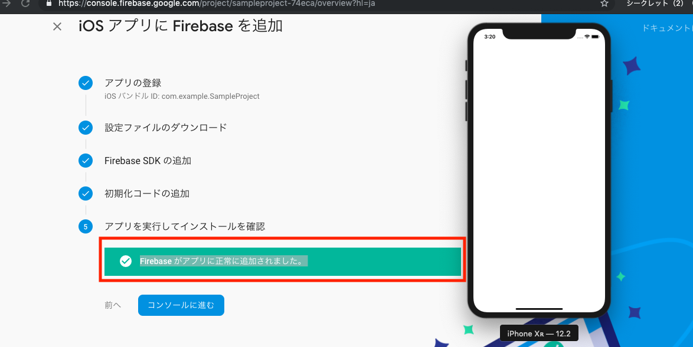

# Firebase導入手順

1. Firebaseプロジェクトを作成する
	
	1. 以下のリンクをクリックし、「使ってみる」をクリックする  
		<a href="https://firebase.google.com/?hl=ja">Firebase</a>
		
		
	
	2. 「プロジェクトを追加」をクリックする
	
		

	3. 任意のプロジェクト名を入力し、アナリティクスの地域を「日本」、Cloud Firestoreのロケーションに「asia-northeast1」を選択する。

		

	4. 「プロジェクトを作成」をクリックする

		

2. 作成したFirebaseプロジェクトにiOSアプリを追加する。  

	1. iOSのアイコンをクリックする。

		

	2. Firebaseを導入したいXcodeプロジェクトの「Bundle identifier」を入力し、「アプリを登録」をクリック

		

		

	3. 「GoogleService-info.plist」をダウンロードする。
	ダウンロードしたGoogleService-info.plistを、Xcode プロジェクトのルートに移動する。

		

		

	4. 手順通り、Firebase SDKをCocoaPodsでインストールする。

	5. 〇〇xcworkspaceを開き、AppDelegateを以下のように修正する。

		

	6. アプリを起動してみる。  
	「Firebase がアプリに正常に追加されました。」とならない場合、シミュレーターから一度アプリをアンインストールなどしてみてください。  
	また、確認しなくてもいいので、スキップしても大丈夫です。

		
