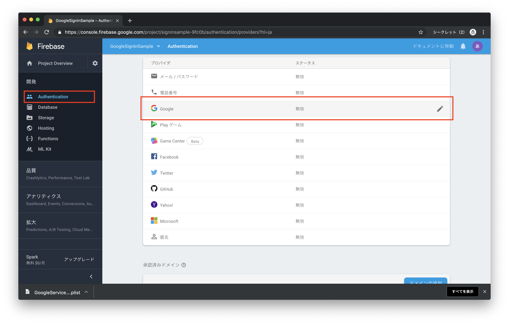
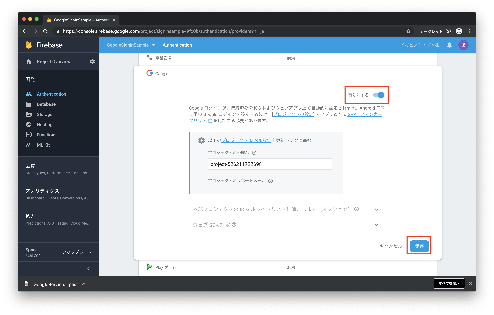
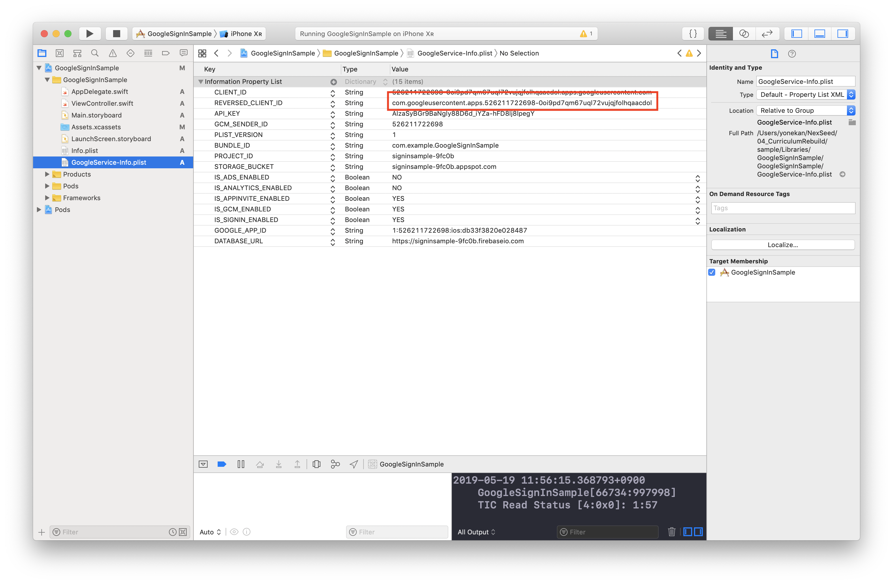
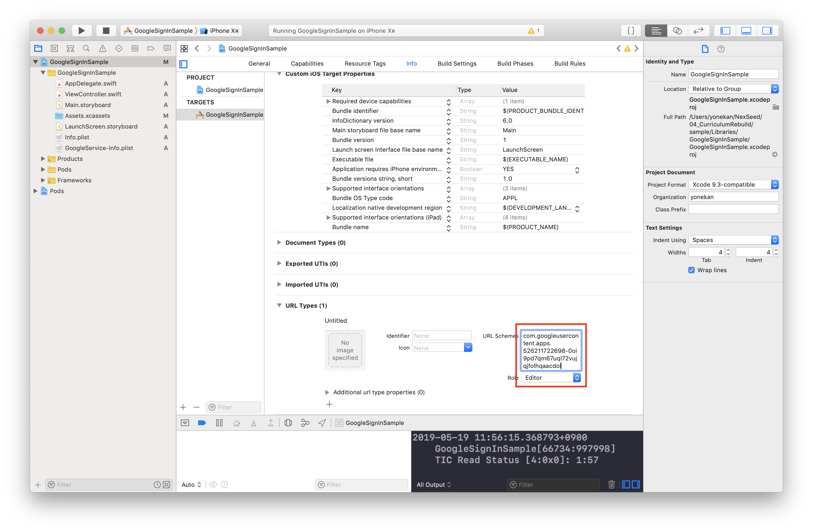
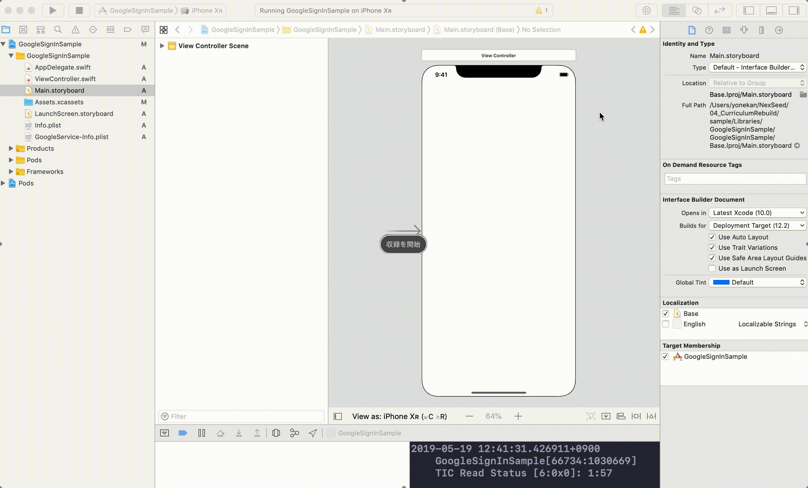
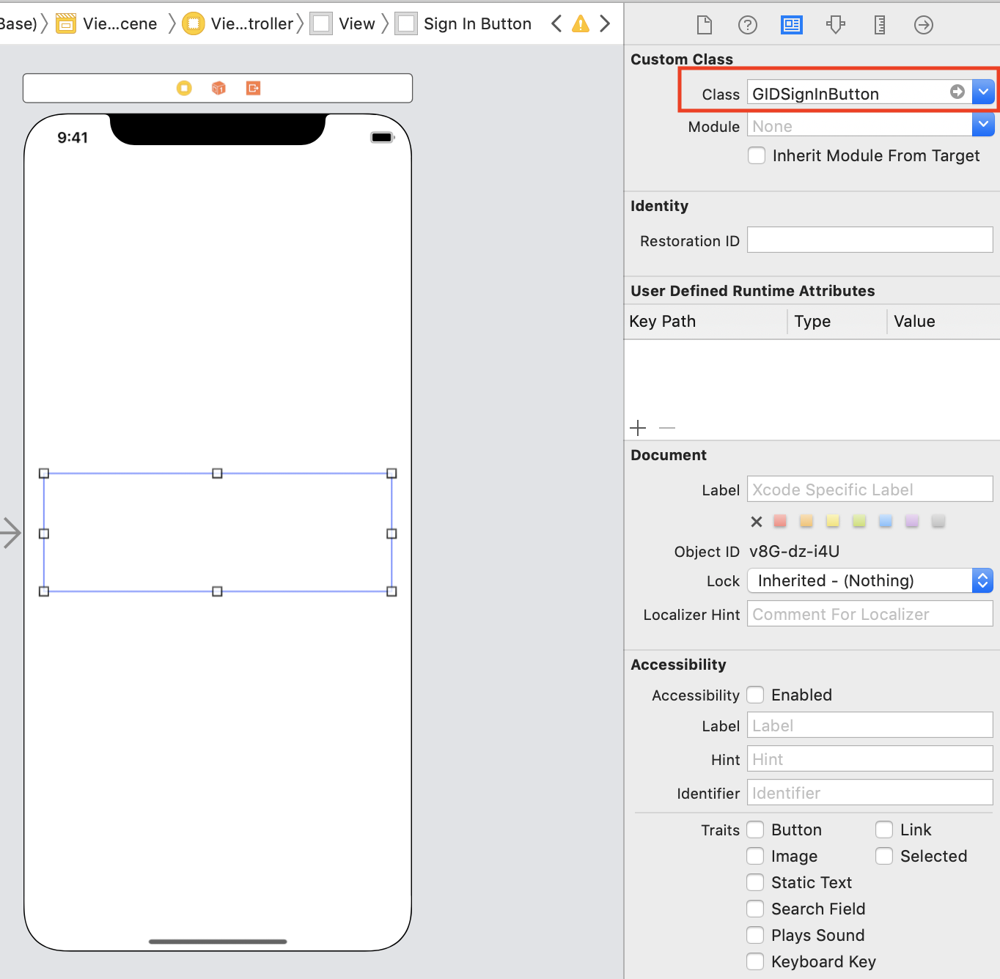
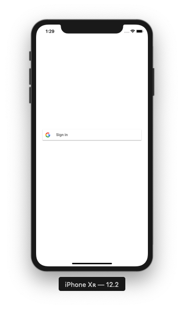

# Google Sign In

## 目標
- Google Sign in ができるようになる

## 作成するアプリ


## 開発の流れ
1. プロジェクトを作成する
2. Google Sign Inの準備をする
3. ログイン画面を作成する
4. ViewControllerにDelegateとDataSourceを追記する
5. Kolodaの設定を追記する

## 開発しよう

1. プロジェクトを作成する

	1. プロジェクトを作成する  
	プロジェクト名：GoogleSignInSample
	
	2. Firebaseプロジェクトを作成し、FirebaseをiOSプロジェクトに追加する

	3. ```Podfile```に次のポッドを追加し、```pod install```を実行する

		```
		pod 'Firebase/Auth'
		pod 'GoogleSignIn'
		```

2. Google Sign Inの準備をする
	
	1. Firebaseコンソールで、Authenticationのログイン方法からGoogleを有効にする

		
		
		
		
	2. 「GoogleService-Info.plist」の「REVERSED_CLIENT_ID」の値をコピーし、  
	プロジェクト設定の「Info」内のURL Typesに貼り付ける。
	
		
		
		
		
	3. ```AppDelegate.swift```に以下のimport文を追記する

		```
		import GoogleSignIn
		```
		
		追記後のimport文
		
		```
		import UIKit
		import Firebase
		import GoogleSignIn
		```
		
	4. ```AppDelegate.swift```の```application:didFinishLaunchingWithOptions:```メソッドに以下の処理を追記する
	
		```
		GIDSignIn.sharedInstance().clientID = FirebaseApp.app()?.options.clientID
		```
		
		追記後の```application:didFinishLaunchingWithOptions:```メソッド
		
		```
		func application(_ application: UIApplication, didFinishLaunchingWithOptions launchOptions: [UIApplication.LaunchOptionsKey: Any]?) -> Bool {
			// Override point for customization after application launch.
			FirebaseApp.configure()
			GIDSignIn.sharedInstance().clientID = FirebaseApp.app()?.options.clientID
			return true
		}
		```
		
	5. ```AppDelegate.swift```に以下のメソッドを追記する

		```
		@available(iOS 9.0, *)
		func application(_ application: UIApplication, open url: URL, options: [UIApplication.OpenURLOptionsKey : Any]) -> Bool {
			return GIDSignIn.sharedInstance().handle(url,sourceApplication:options[UIApplication.OpenURLOptionsKey.sourceApplication] as? String, annotation: [:])
		}
		```
		
3. ログイン画面を作成する

	1. Main.storyboardで、画面に「View」を追加する

		
		
	2. 追加したViewのクラスを「GIDSignInButton」に変更する

		
		
	3. 実行してみる

		