# Firestoreでシンプルなチャットアプリを作ろう

## 目標
- Firestoreが使えるようになる

## 作成するアプリ

## 開発の流れ

## 開発しよう
1. プロジェクトを作成する

	1. プロジェクトを作成する  
	プロジェクト名：SimpleChatApp
	
	2. Firebaseプロジェクトを作成し、FirebaseをiOSプロジェクトに追加する

2. 各画面を作成する
	
	1. トップ画面を作成する
		
		1. NavigationControllerを追加する
			
			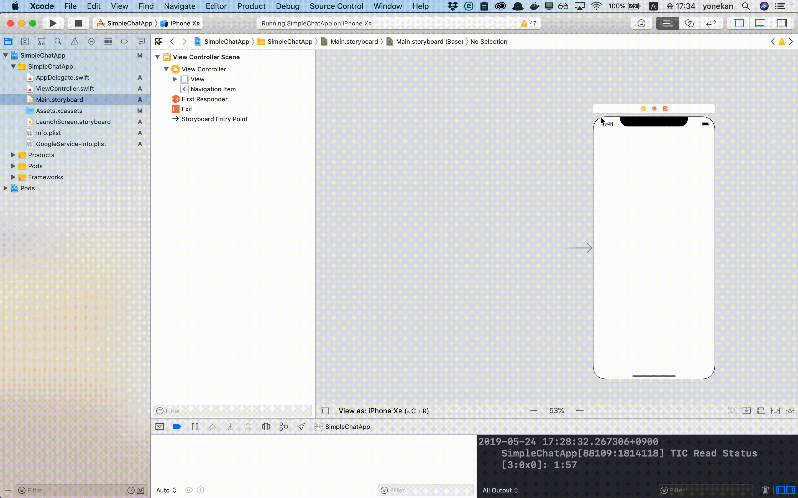
			
		2. NavigationBarにテキストフィールドとボタンを追加する

			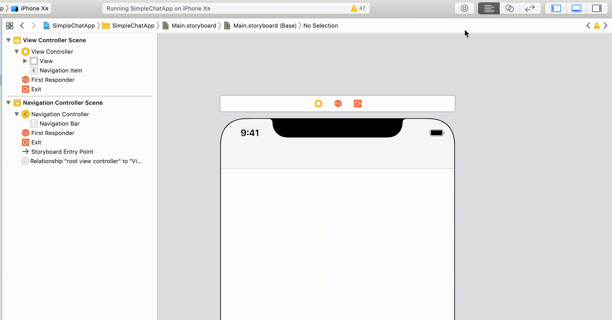
			
		3. TableViewとTableViewCellを追加する  
		TableViewCellのidentifierに「cell」を設定する
		
			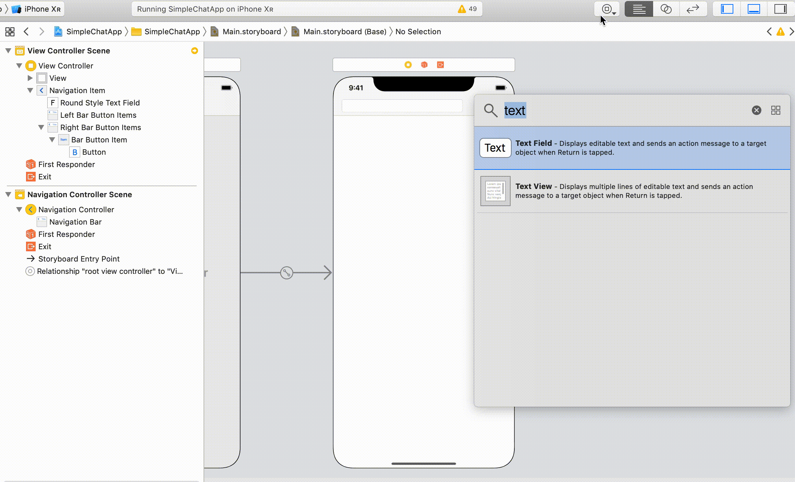
	
	2. チャット画面を作成する
		
		1. ViewControllerを追加する
			
			
			
		2. トップ画面とチャット画面に画面遷移を定義する  
		identifierに「toRoom」を設定する
			
			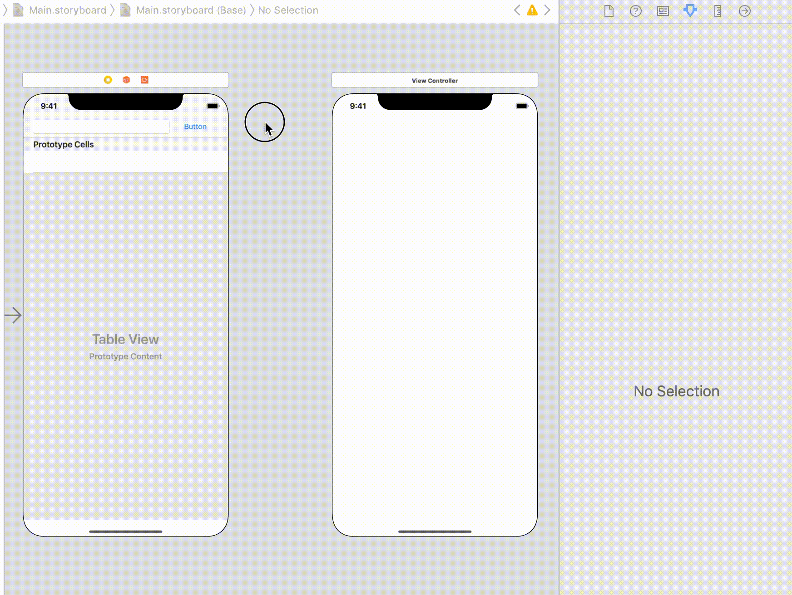
			
		3. Viewを画面下に配置する

			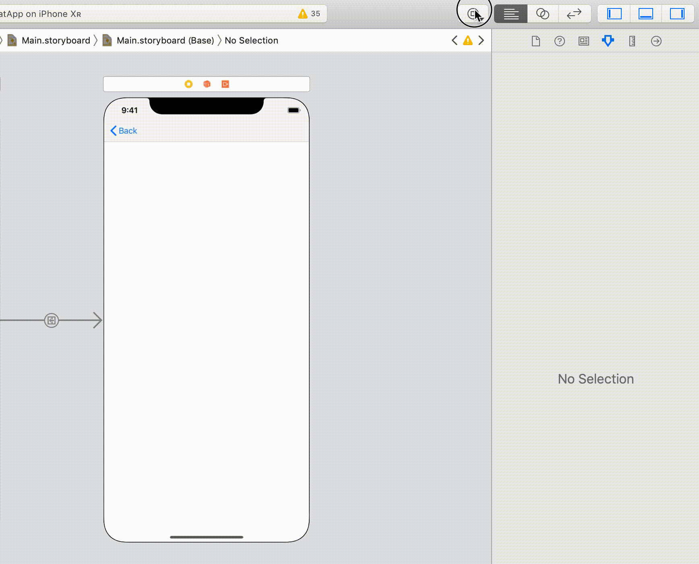
		
		4. 配置したView内にTextFieldとButtonを配置する  
		（配置後、幅や背景色など好みに設定してください）
		
			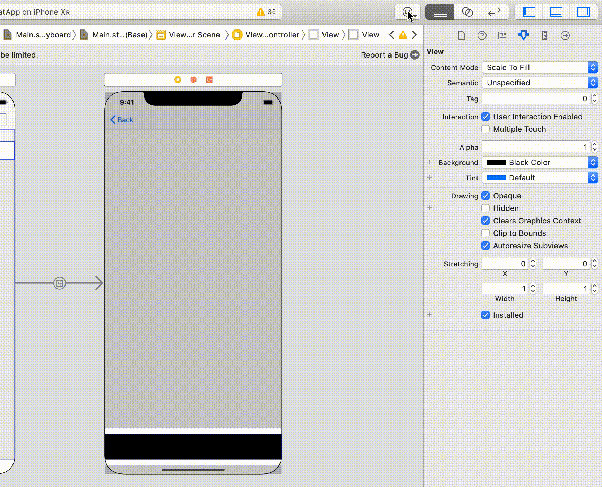
			
			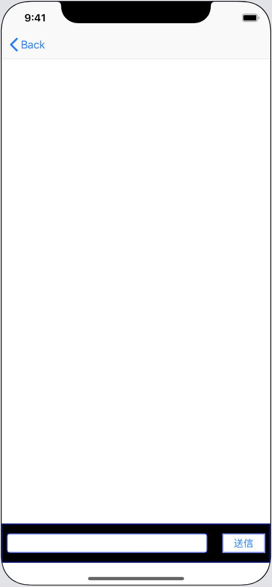

		5. TableViewを配置する

			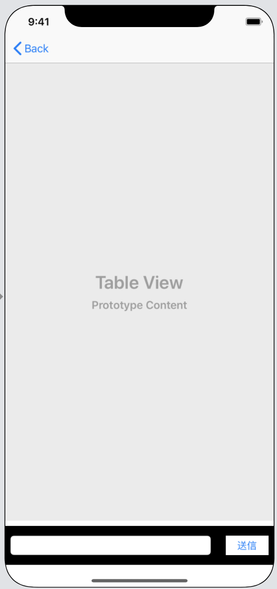

3. 各画面のViewControllerを準備する
	
	1. RoomViewController.swiftを作成する	

		

	2. Controllersグループを作成し、```ViewController.swift```と```RoomViewController.swift```をグループへ移動する

		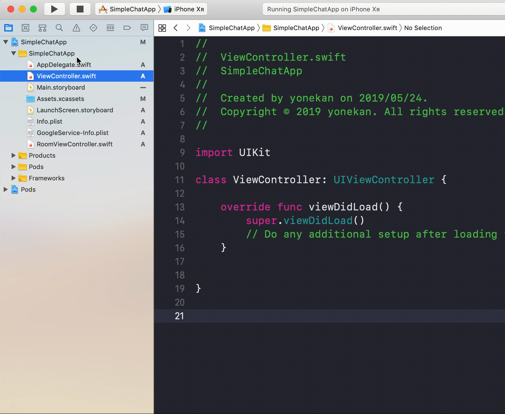

	3. ViewController.swiftに配置した部品を接続する  
	
		|部品|接続時のName|
		|---|---|
		|UITextField|roomNameTextField|
		|UITableView|tableView|
		|UIButton|didClickCreateRoomButton|

		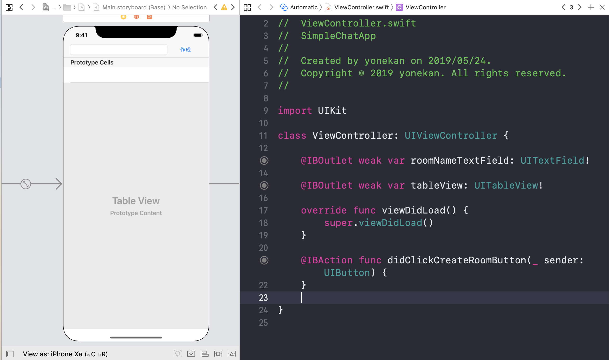

	4. RoomViewController.swiftに配置した部品を接続する  
	
		|部品|接続時のName|
		|---|---|
		|UITextField|messageTextField|
		|UITableView|tableView|
		|UIButton|didClickSendButton|

		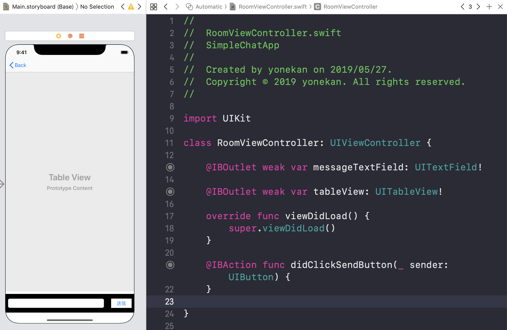

4. 必要なクラスを作成する

	1. ValueObjectsグループを作成する

		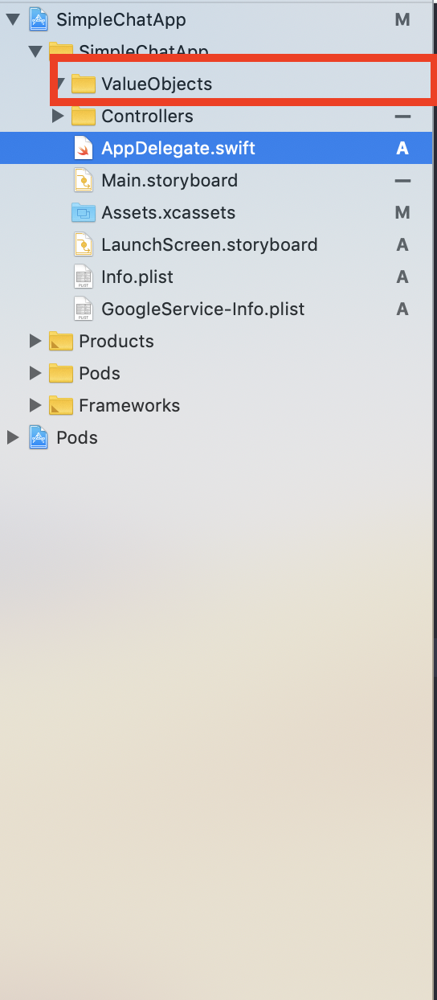

	2. チャットルームのデータを保持するRoomクラスを作成する。

		1. Room.swiftを作成する

			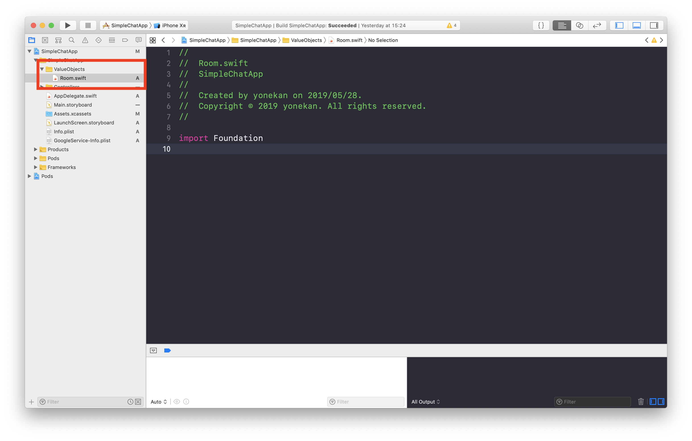

		2. Room.swiftの中身を以下のように修正する。

			```
			struct Room {
				let name: String
				let documentId: String
			}
			```

			> nameはトークルームの名前を保持するための変数です。  
			> documentIdはFirestoreのドキュメントIDを保持するための変数です。

			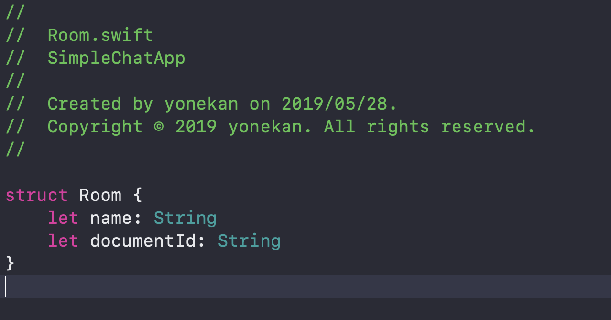

	3. メッセージのデータを保持するMessageクラスを作成する。

		1. Message.swiftを作成する

			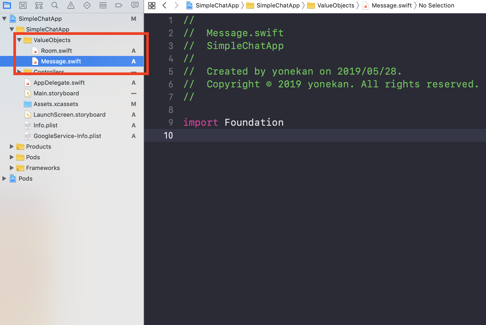

		2. Message.swiftの中身を以下のように修正する。

			```
			struct Message {
    		let documentId: String
    		let text: String
			}

			```

			> documentIdはFirestoreのドキュメントIDを保持するための変数です。  
			> textはメッセージのテキストを保持するための変数です。  

			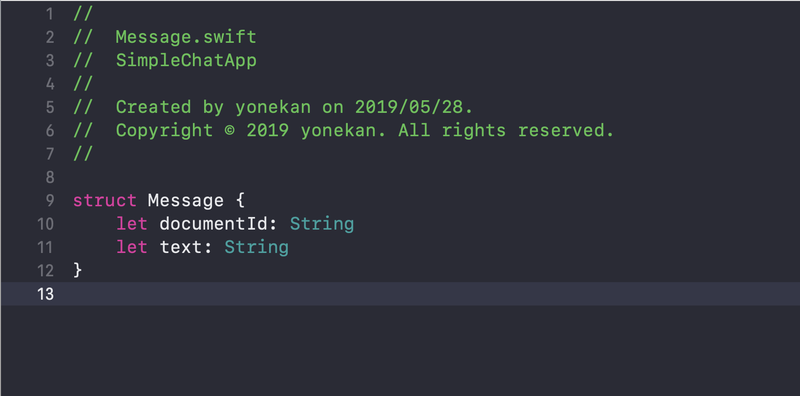