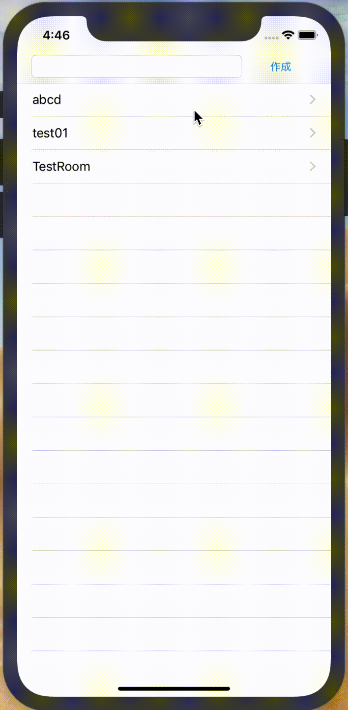
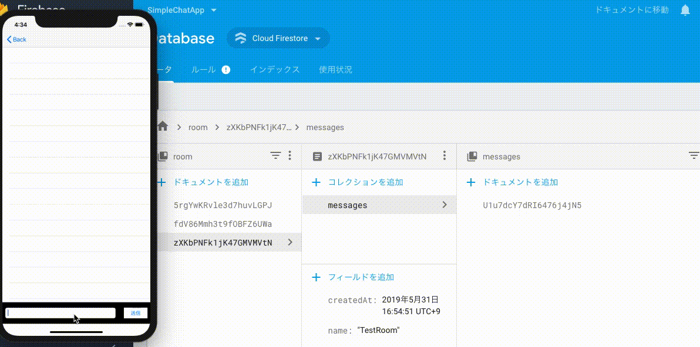

# Firestoreでシンプルなチャットアプリを作ろう（チャット画面）

## 目標
- Firestoreが使えるようになる

## 作成するアプリ

## 開発の流れ

## 開発しよう
1. チャットルームのドキュメントIDを保持する変数を用意する

	1. 以下の変数を`RoomViewController.swift`を追加する

		```
		var documentId = ""
		```

		追記後の`RoomViewController.swift`

		```swift
		class RoomViewController: UIViewController {
		
			@IBOutlet weak var messageTextField: UITextField!
			
			@IBOutlet weak var tableView: UITableView!
			
			var documentId = ""
		```

2. チャットルーム画面でルームが選択された時、選択されたチャットルームのドキュメントIDを、  
先程作成した変数`documentId`に設定するよう修正する。

	1. `ViewController.swift` に、チャットルームが選択されたときの処理を追記する

		以下のメソッドを`extension ViewController`に追記する

		```swift
		func tableView(_ tableView: UITableView, didSelectRowAt indexPath: IndexPath) {
			<#code#>
		}
		```

	2. 上記で追記した`didSelectRowAt`メソッド内で、チャットルームへ画面遷移する処理を追記する。

		以下の処理を追記する

		```swift
		let room = rooms[indexPath.row]
		performSegue(withIdentifier: "toRoom", sender: room.documentId)
		```

		追記後の`didSelectRowAt`メソッド

		```swift
		func tableView(_ tableView: UITableView, didSelectRowAt indexPath: IndexPath) {
			let room = rooms[indexPath.row]
			performSegue(withIdentifier: "toRoom", sender: room.documentId)
		}
		```

	3. 選択されたチャットルームのドキュメントIDを`RoomViewController.swift`の変数`documentId`に設定するため、`prepare`メソッドを実装する。

		追記する`prepare`メソッド

		```swift
		override func prepare(for segue: UIStoryboardSegue, sender: Any?) {
			if segue.identifier == "toRoom" {
				let roomVC = segue.destination as! RoomViewController
				roomVC.documentId = sender as! String
			}
		}
		```
	4. 実行してみる
	

	5. 選択された行のフォーカスを解除する処理を追記する。  
	`didSelectRowAt`メソッドに以下の処理を追記する。

		```swift
		tableView.deselectRow(at: indexPath, animated: true)
		```

		追記後の`didSelectRowAt`メソッド

		```swift
		func tableView(_ tableView: UITableView, didSelectRowAt indexPath: IndexPath) {
			let room = rooms[indexPath.row]
			tableView.deselectRow(at: indexPath, animated: true)
			performSegue(withIdentifier: "toRoom", sender: room.documentId)
		}
		```

3. チャットルームの全メッセージを保持する配列を作成する

	1. 以下の変数を`RoomViewController.swift`に追加する

		```
		var messages: [Message] = []
		```

		追記後の`RoomViewController.swift`

		```swift
		class RoomViewController: UIViewController {
			
			@IBOutlet weak var messageTextField: UITextField!
			
			@IBOutlet weak var tableView: UITableView!
			
			var messages: [Message] = []
		```

	2. 作成した変数`messages`の値が更新された時、TableViewをリロードするよう変数`messages`に`didSet`を設定する

		編集後の変数`messages`

		```swift
		var messages: [Message] = [] {
			didSet {
				tableView.reloadData()
			}
		}
		```

4. TableViewを設定する

	1. `extension RoomViewController: UITableViewDataSource, UITableViewDelegate`をRoomViewController.swiftに追記する。

		追記後のRoomViewController.swift

		```swift
		class RoomViewController: UIViewController {
			@IBOutlet weak var messageTextField: UITextField!
			
			@IBOutlet weak var tableView: UITableView!
			// 省略
		
		}
		
		extension RoomViewController: UITableViewDataSource, UITableViewDelegate {

		}
		```

	2. 追記したextensionにTableViewの設定に必要なメソッドを追記する。

		追記後のextension

		```swift
		extension RoomViewController: UITableViewDataSource, UITableViewDelegate {
			func tableView(_ tableView: UITableView, numberOfRowsInSection section: Int) -> Int {
				<#code#>
			}
			
			func tableView(_ tableView: UITableView, cellForRowAt indexPath: IndexPath) -> UITableViewCell {
				<#code#>
			}
		}
		```
	
	3. `numberOfRowsInSection`メソッドを、メッセージ数を返すよう修正する。

		追記後の`numberOfRowsInSection`メソッド

		```swift
		func tableView(_ tableView: UITableView, numberOfRowsInSection section: Int) -> Int {
			return messages.count
		}
		```

	4. `cellForRowAt`メソッドを、メッセージのテキストを表示するよう修正する。

		追記後の`cellForRowAt`メソッド

		```swift
		func tableView(_ tableView: UITableView, cellForRowAt indexPath: IndexPath) -> UITableViewCell {
			let cell = tableView.dequeueReusableCell(withIdentifier: "cell", for: indexPath)
			
			let message = messages[indexPath.row]
			
			cell.textLabel?.text = message.text
			
			return cell
		}
		```

	5. `@IBOutlet weak var tableView: UITableView!`にここまでの設定を反映させる  
	`viewDidLoad`メソッドを以下のように修正する。s

		修正後の`viewDidLoad`メソッド

		```swift
		override func viewDidLoad() {
			super.viewDidLoad()
			
			tableView.dataSource = self
			tableView.delegate = self
		}
		```

5. メッセージの送信機能を追加する

	1. 送信ボタンがクリックされた時、メッセージの空文字チェックをし、  
	空でない場合、メッセージを変数に入れる処理を追記する。

		修正後の`didClickSendButton`メソッド

		```swift
		@IBAction func didClickSendButton(_ sender: UIButton) {
			if messageTextField.text!.isEmpty {
				return
			}
			let message = messageTextField.text!
		}
		```

	2. Firebaseのimport文をViewController.swiftに追記する。

		追記後の`RoomViewController.swift`

		```swift
		import UIKit
		import Firebase
		
		class RoomViewController: UIViewController {
		```

	3. メッセージをFirestoreに登録する処理を追記する

		修正後の`didClickSendButton`メソッド

		```swift
		@IBAction func didClickSendButton(_ sender: UIButton) {
			if messageTextField.text!.isEmpty {
				return
			}
			
			let message = messageTextField.text!
			
			let db = Firestore.firestore()
			
			db.collection("room").document(documentId).collection("messages").addDocument(data: [
				"text": message,
				"createdAt": FieldValue.serverTimestamp()
			]) {err in
					if let err = err {
						print("メッセージの送信に失敗しました: \(err)")
					} else {
						print("メッセージの送信に作成しました：\(message)")
					}
			}
			messageTextField.text = ""
		}
		```

	4. 実行してみる
	