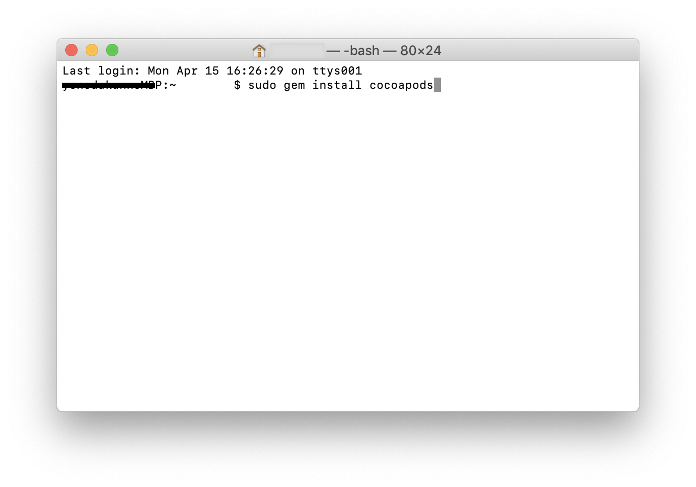
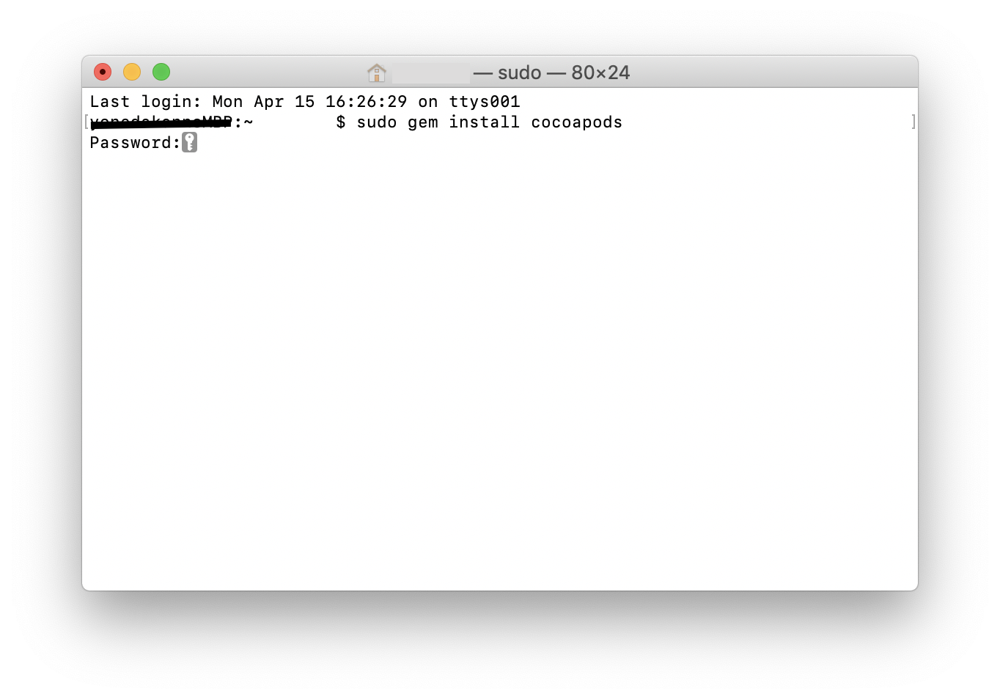

# CocoaPodsをインストールしよう

1. ターミナル（またはiTerm）を開いてください
2. 以下のコマンドを入力し、実行してください。  
	```
	sudo gem install cocoapods
	```
	
	
	
3. 上記コマンドを実行すると、パスワードを聞かれるので入力してEnterキーを押下してください。  
入力しても何の文字も画面に表示されないと思いますが、セキュリティのため画面に表示されないだけで、入力はできているので気にせず入力してください

	
	
4. CocoaPodsのインストールが完了したら以下のコマンドを入力し、実行してください。  
以下のコマンドでPCでCocoaPodsが使えるようにセットアップをします。  
	```
	pod setup
	```